# iOS自动化测试之Appium的安装和使用

## 一、前言
因为需要配合测试同学处理自动化测试方面的东西，所以记录下来自己关于`Appium`的安装和使用，但是主要是关于安装的，因为安装真是遇到了很多坑，另外，我只是关注iOS App的测试，所以这里没有测试Android。

Appium 是一个开源工具，用于自动化 iOS 手机、 Android 手机和 Windows 桌面平台上的原生、移动 Web 和混合应用。
Appium的核心是 **客户端+服务端** 架构。所以需要下载客户端和服务端。

- 关于Appium: http://appium.io/docs/cn/about-appium/intro/
- GitHub地址：https://github.com/appium/appium-desktop

## 二、Appium Desktop
对于`Appium Desktop`，有2种安装方式，命令行和安装包，我这里直接去GitHub下载安装包：
Github地址：https://github.com/appium/appium-desktop

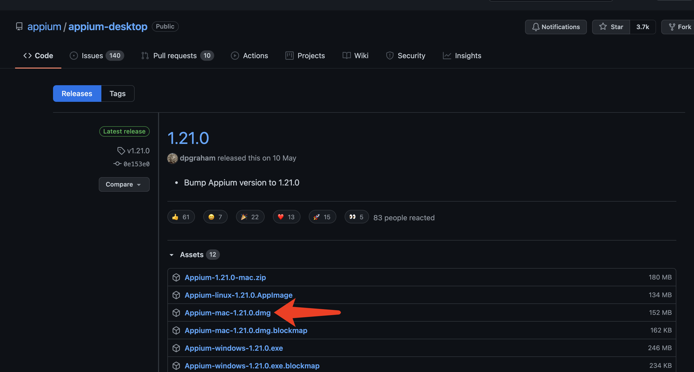

在使用之前，需要阅读一遍`Appium`的官方文档，理解里面的一些概念。文档里是有中文的。
文档地址：https://github.com/appium/appium/tree/master/docs

## 三、使用iOS模拟器

推荐这个，比较方便，配置环境简单，需要电脑上安装好`Xcode`+`Appium`即可。
启动`Appium`之后，来到此页面：

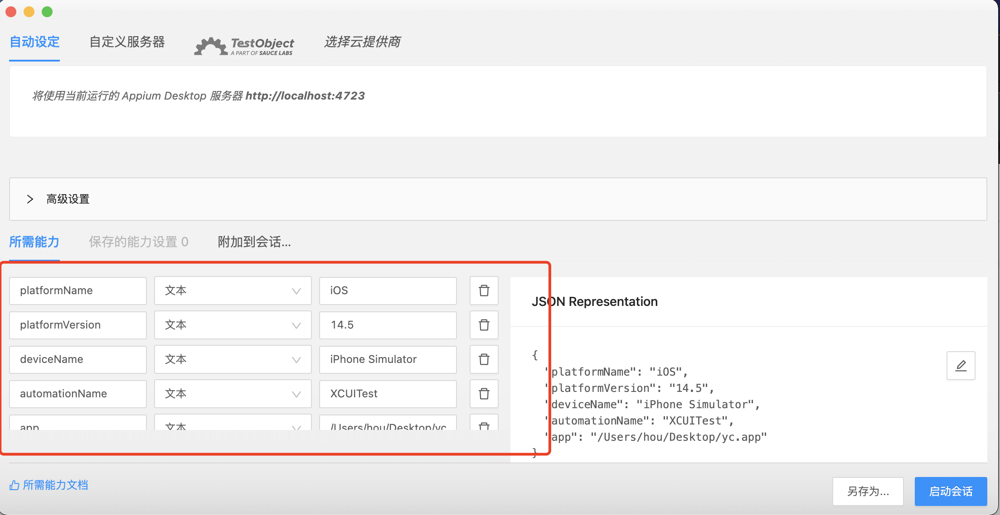

在这里输入5个字段即可：
- `platformName`固定值：`iOS`
- `platformVersion`固定值：`iPhone Simulator`
- `automationName`固定值：`automationName`
- `platformVersion`模拟器系统版本号，打开iOS模拟器在关于里能看到
- `app`：要安装到模拟器里面的安装包地址，需要是绝对路径，经测试，需要是`.app`结尾的安装包

> 这些能力字段，官方文档是有解释和举例的。

填写完毕之后，点击启动会话，即可自动打开模拟器。都填写完毕后的例子：
```json
{
    "platformName": "iOS",
    "deviceName": "iPhone Simulator",
    "automationName": "XCUITest",
    "platformVersion": "14.5",
    "app": "/Users/hou/Desktop/name.app"
}
```

> 注意：`app`字段的安装包，对于iOS开发而言，很容易得到这个文件，iOS项目工程在模拟器运行成功，就可以在Xcode的工程目录里找到它。

## 四、使用iOS真机

### 4.1 Doctor（可选）
这一步是可选的， 只是为了方便排查问题，不想装也没有问题，不过如果iOS和Android都需要自动化测试的话，建议安装一下。
`appium-doctor`安装（依赖`npm`，所以需要有装过`node`）:

```shell
npm install appium-doctor -g
```

安装后执行`appium-doctor --ios`指令，可以查看与iOS相关配置是否完整。比如我执行的结果：

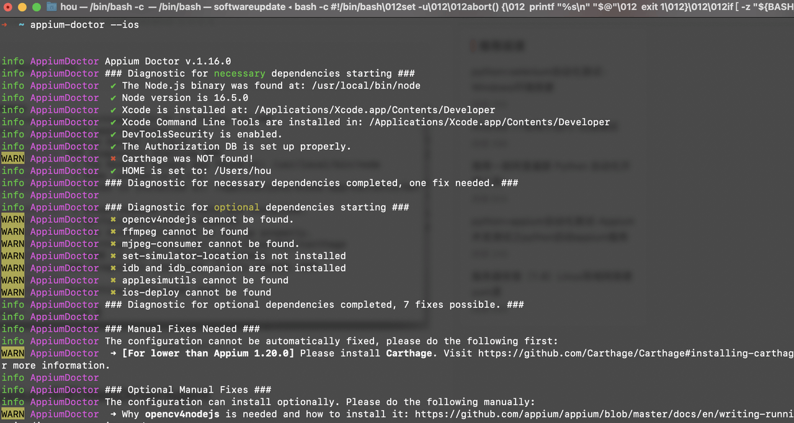

### 4.2 Homebrew

`homebrew`是 Mac OS 下最优秀的包管理工具，没有之一。去官网首页，上面有安装的命令。已经安装过的不用管这个。

```shell
# homebrew官网地址：
https://brew.sh/index_zh-cn
```

### 4.3 Python3（一般不用自己装）
安装Python3，目前Mac系统会自带两个版本的Python2和Python3，不用自己再安装了，真想自己安装可以使用brew管理和安装：
```shell
# 安装之前，先看看系统是否已经安装过Python3了
brew install python3
```

### 4.4 idevice（可选）
`libimobiledevice`是一个使用原生协议与苹果iOS设备进行通信的库。通过这个库我们的 Mac OS 能够轻松获得 iOS 设备的信息，安装命令：
```shell
brew install libimobiledevice
```

`libimobiledevice`的一些使用方法：
```PowerShell
# 查看 iOS 设备日志
idevicesyslog
# 查看链接设备的UDID
idevice_id --list
idevice_id -l
# 查看设备信息
ideviceinfo
# 获取设备时间
idevicedate
# 获取设备名称
idevicename
# 端口转发
iproxy XXXX YYYY
# 屏幕截图
idevicescreenshot
```

> 这里之所以说是可选的，是因为如果装了Xcode，通过Xcode的集成工具，也能拿到设备信息和列表。命令是：`instruments -s devices`。或者在Xcode的`Window`-->`Devices and Simulators`也可以看到。

### 4.5 安装Carthage

`Carthage`是一款iOS项目依赖管理工具，与`Cocoapods`有着相似的功能，可以帮助你方便的管理三方依赖。它会把三方依赖编译成framework，以framework的形式将三方依赖加入到项目中进行使用和管理。
`WebDriverAgent`本身使用了`Carthage`管理项目依赖，因此需要提前安装`Carthage`。命令：
```PowerShell
brew install carthage
```
### 4.6 获取WebDriverAgent

`WebDriverAgent`是 Facebook 推出的一款 iOS 移动测试框架，能够支持模拟器以及真机。
`WebDriverAgent`在 iOS 端实现了一个`WebDriver server`，借助这个 server 我们可以远程控制 iOS 设备。你可以启动、杀死应用，点击、滚动视图，或者确定页面展示是否正确。
Clone下项目，Github地址是：
```PowerShell
https://github.com/facebookarchive/WebDriverAgent
```

使用GUI或者命令Clone：
```PowerShell
git clone https://github.com/facebook/WebDriverAgent.git
```

下载项目之后，使用命令进行操作，确保之前已经安装过 Carthage：
```PowerShell
cd WebDriverAgent
./Scripts/bootstrap.sh
```

**上面这种办法我自己试了试是不行了，我是使用下面这种：**
先安装好`Appium`，电脑-应用程序->`Appium.app`->右键-显示包内容->Contents，然后搜索`WebDriverAgent.xcodeproj`，如下图：

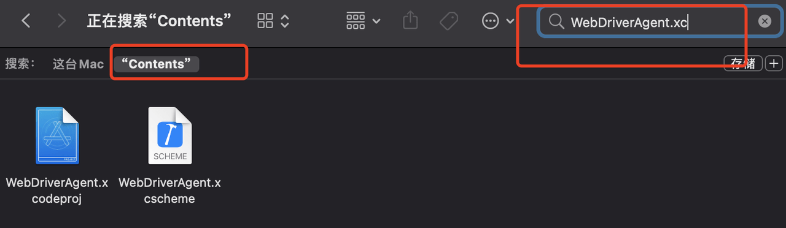

搜到之后，对文件进行右键，如下图：

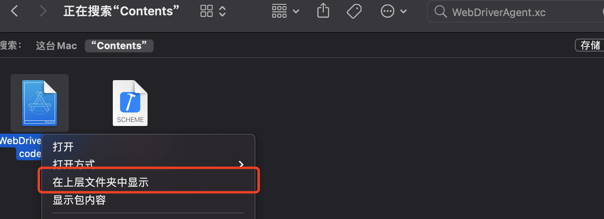

然后将新打开的文件，全部复制到一个新的文件夹（比如自己主页目录下）去，例如：
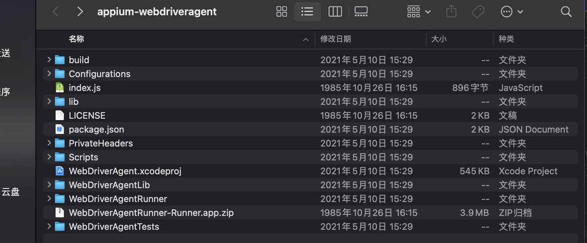

### 4.7 编译WebDriverAgent

使用Xcode打开`WebDriverAgent`工程，配置好证书之后，点击Xcode的`Product`->`Test`，然后就会运行到手机上， 控制台会输出手机的服务端口号：
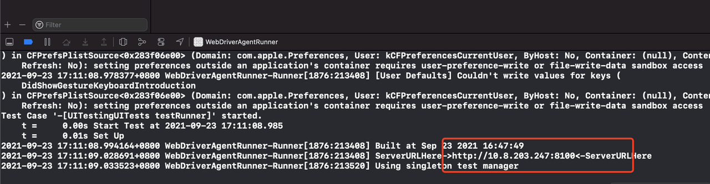

这里我遇到**一个坑**，这个地址，直接输入到电脑浏览器里， 是能得到一个JSON的，这样才是正确的，但是我浏览器怎么都得不到，而且明明是同一个网络的。后来我的办法是使用了`iproxy`进行了端口转发，过程是:

```PowerShell
# 1.安装 usbmuxd
brew install usbmuxd
# 2.获取手机的udid
idevice_id -l
# 3.设置端口转发
# 第一个8900：为电脑端的端口 第二个8100：为手机端webdriveragent服务的端口 
# 最后的数字：为自己手机的序列号
iproxy 8900 8100 -u 743430xxxxxxxxd9bc99
```

这时，我在电脑浏览器输入地址就可以得到JSON了，需要注意的是，端口号的问题。比如你替换了端口，那么你浏览器输入的地址就是：`http://127.0.0.1:8900`

这里我参考的文章：https://codetosurvive1.github.io/posts/webdriver-agent-usb.html

这个坑的解决：我后来查看了Xcode项目，发现是项目的开发者账号问题，在解决了开发者账号和`bundleId`之后，已经正常了，浏览器输入Xcode输出的地址，可以看到JSON。

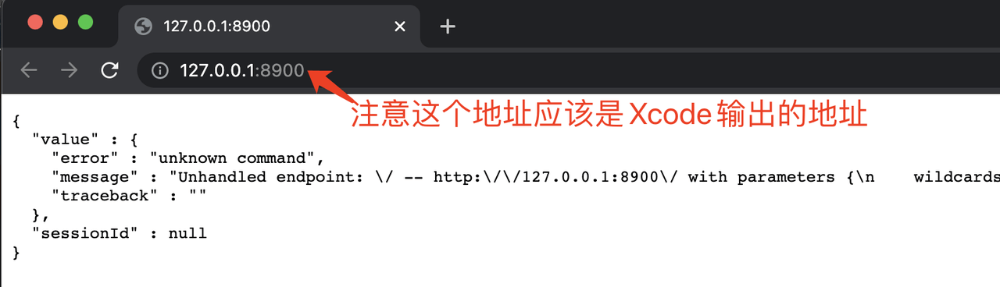

一定要检查下图中标出来的开发者账号和bundleId。


### 4.8 编译WebDriverAgent

在启动Xcode项目`WebDriverAgent`之后，并且安装到真机之后，打开Appium，启动服务，来到这个页面，输入下面的的能力字段，应该是就可以连接到真机了。

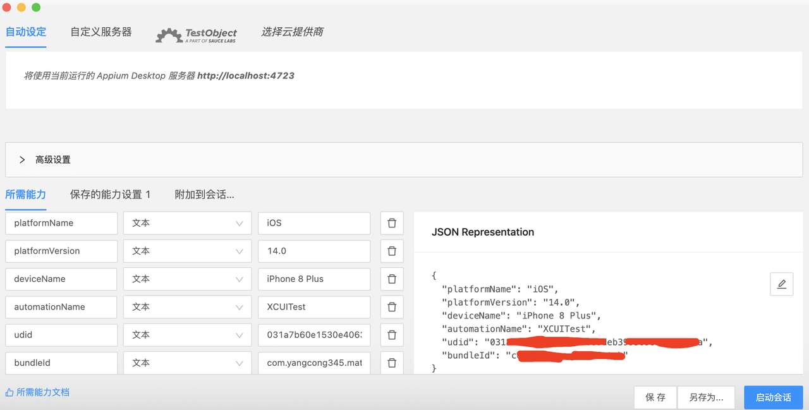

例如我填写的JSON：
```json
{
    "platformName": "iOS",
    "platformVersion": "14.0",
    "deviceName": "iPhone8",
    "automationName": "XCUITest",
    "bundleId": "com.xxxx.xx",  // 要测试App的bundleId
    "udid": "xxexxx"  // 真机的udid，如果电脑只链接了一个真机，可以填写auto
}
```

## 五、Appium使用

Appium使用我没太深入研究，因为我主要是配合测试同学的，不过Appium的Github上，是有中文文档的，全部看一遍，简单的录制和脚本还是很容易上手的。

5.1 打开Appium
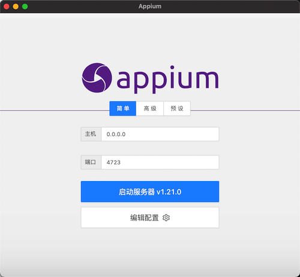

`Host`不用管，不填写就是本机，跟填`127.0.0.1`是一样的。点击`启动服务器`。

> 注意，在Appium的菜单-->视图-->语言。是切换成中文显示的。

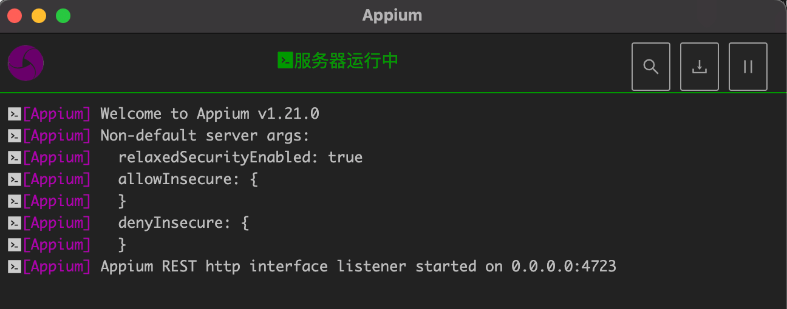

点击右上角的 放大镜🔍，进入主配置界面 填写设备信息即可
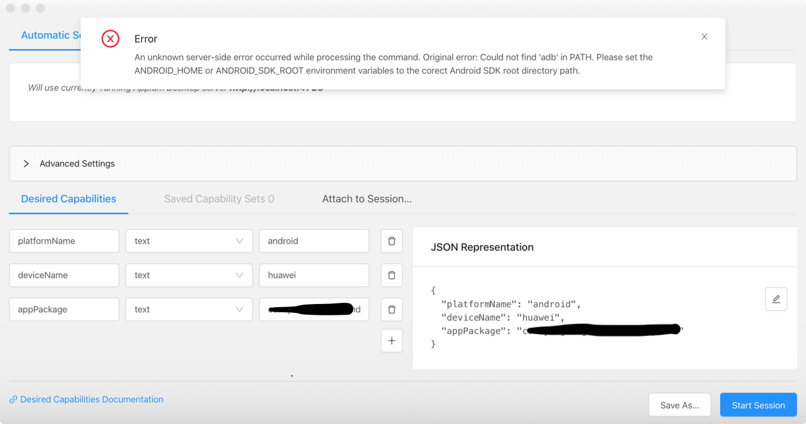

如上图，在启动之后，如果环境配置有问题，会有提示信息的，一般情况下，安装提示解决就可以，不过在启动Appium之前，建议通过`appium-doctor`验证环境都是通过的。

## 六、遇到过的坑

### ✖ Error running xcrun simctl

修改Xcode命令行设置：Xcode > Preferences > Locations 
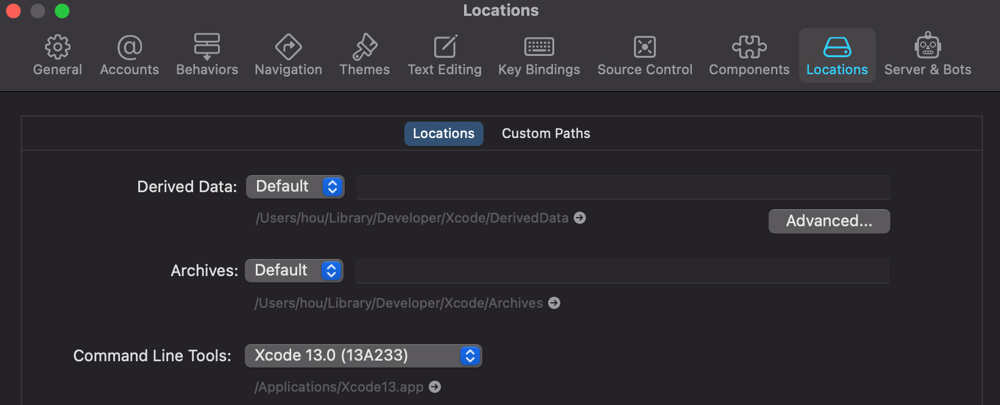
✔ Xcode is installed at: /Applications/Xcode.app/Contents/Developer
✔ Xcode Command Line Tools are 

### ✖ Carthage was NOT found!
使用Homebrew安装Carthage即可。

### ✖ opencv4nodejs cannot be found.
下载cmake：`https://cmake.org/download/`
安装后配置环境变量
```PowerShell
"/Applications/CMake.app/Contents/bin/"
sudo cnpm -g install opencv4nodejs --unsafe-perm=true --allow-root --loglevel silly
cnpm install opencv4nodejs 
```

### ✖ ffmpeg cannot be found
下载FFmpeg：`https://ffmpeg.zeranoe.com/builds/`，然后配置环境变量

### ✖ mjpeg-consumer cannot be found.
安装：
```PowerShell
sudo cnpm i -g mjpeg-consumer --unsafe-perm=true --allow-root
```

### ✖ set-simulator-location is not installed
```PowerShell
brew install lyft/formulae/set-simulator-location
```

### ✖ idb and idb_companion are not installed
```PowerShell
brew tap facebook/fb        
brew install idb-companion        
pip3.8 install fb-idb  # 和自己的py版本一致
```

### ✖ applesimutils cannot be found  
```PowerShell
brew tap wix/brew
brew install applesimutils
```

### ✖ ios-deploy cannot be found
```PowerShell
sudo cnpm install -g ios-deploy --unsafe-perm=true --allow-root
```

### ✖ bundletool.jar cannot be found
下载文件，配置环境变量
http://appium.io/docs/en/writing-running-appium/android/android-appbundle/

### ✖ gst-launch-1.0 and/or gst-inspect-1.0 cannot be found
```PowerShell
brew install gstreamer gst-plugins-base gst-plugins-good gst-plugins-bad gst-plugins-ugly gst-libav
```

最后使用`appium-doctor`验证环境配置。

**END。**
*我是小侯爷。*
*在帝都艰苦奋斗，白天是上班族，晚上是知识服务工作者。*
*如果读完觉得有收获的话，记得关注和点赞哦。*
*非要打赏的话，我也是不会拒绝的。*