# Godot3编译和使用iOS插件

本文是自己在研究学习Godot时的笔记。

## 一、使用插件

## 1.1 在Godot里使用的情况

一个iOS插件需要一个 `.gdip` 配置文件, 一个二进制文件, 它可以是 `.a` 静态库, 也可以是 .`xcframework` 包含 `.a` 静态库, 可能还有其他依赖关系. 要使用它, 需要:
- 1.将插件的文件复制到Godot项目的 `res://ios/plugins` 目录中. 你也可以将文件分组在一个子目录中, 比如 `res://ios/plugins/my_plugin`
- 2.Godot编辑器自动检测并导入 `res://ios/plugins` 及其子目录中的 `.gdip` 文件.
- 3.可以通过进入`Project`-> `Export`... ->`iOS`, 在选项卡中, 滚动到`Plugins`部分, 找到并激活检测到的插件.

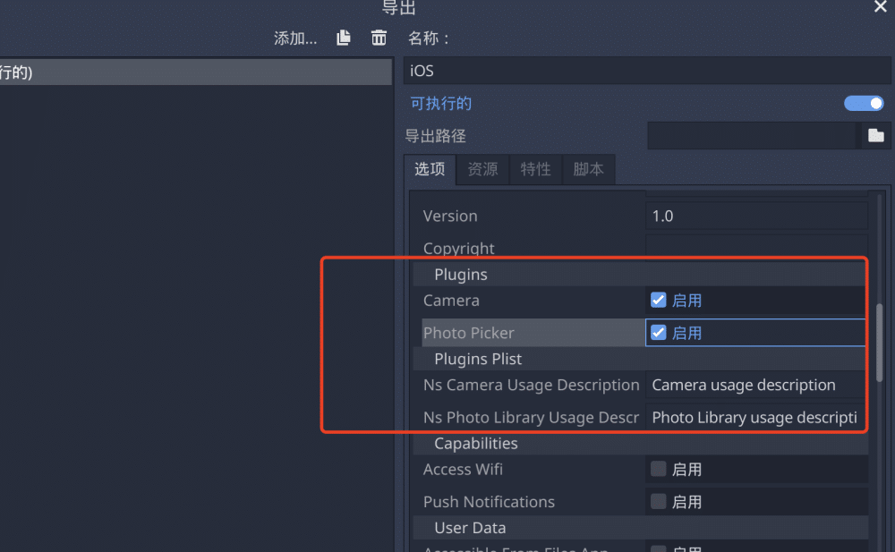

在Godot项目里面的iOS插件目录：

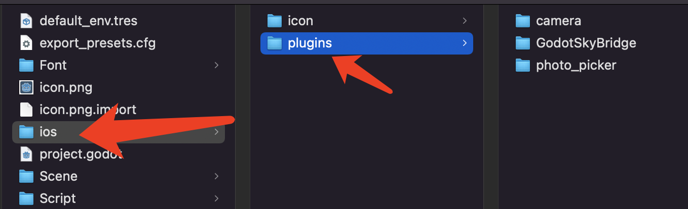

注意，自己创建的`.gdip`文件，注意下面的问题：

```makefile
[config]
name="GodotSkyBridge"  # 插件的名称
binary="GodotSkyBridge.xcframework"  # 千万注意别写错xcframework的名字

initialization="godot_iosbridge_init"  # 两个函数是代码写的，这里不能写错
deinitialization="godot_iosbridge_deinit"

[dependencies]  # 如果有依赖的情况
linked=[]
embedded=[]
system=[]
capabilities=[]
files=[]
[plist]  # 隐私key之类的情况，会加到info.plist里面
```

## 1.2 在iOS工程里使用的情况

我当前就是这种情况，我并不需要将插件放到Godot工程里面，而是将插件打包成`xcframework`放在iOS工程里面，在工程运行时，让Godot引擎加载插件即可。

例如在iOS工程的`dummy.cpp`文件内容如下：

```
// Godot Plugins
void godot_ios_plugins_initialize();
void godot_ios_plugins_deinitialize();
// Exported Plugins

// Plugin: GodotSkyBridge
extern void my_plugin_init();
extern void my_plugin_deinit();

// Use Plugins
void godot_ios_plugins_initialize() {
	my_plugin_init();
}

void godot_ios_plugins_deinitialize() {
	my_plugin_deinit();
}
```

`dummy.cpp`文件为Godot引擎所需的插件入口文件，会在引擎启动时调用。这样的好处时，可以暴漏代码的`.h`头文件，原生能直接和Godot引擎通信，例如工程结构：


## 二、创建iOS插件

### 2.1 编译Godot头文件

下载下面官方的iOS插件仓库，以为里面有现成的脚本和例子。（==注意所需分支==）

iOS插件仓库：[https://github.com/godotengine/godot-ios-plugins](https://github.com/godotengine/godot-ios-plugins)

仓库的下载可以直接下载对应`release`代码，或者使用git命令下载，例如：
```shell
$ git clone --recursive https://github.com/godotengine/godot-ios-plugins.git godot-ios-plugins
```

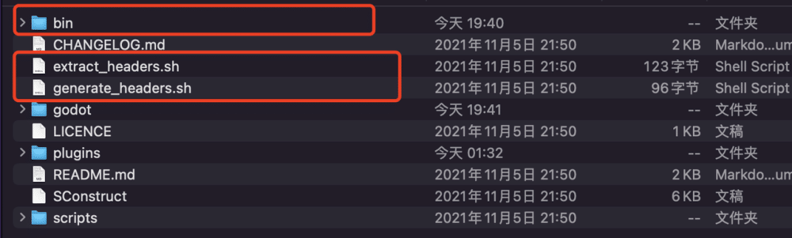

下载好仓库代码之后，是没有红色框的东西的。
- a.如果直接下载的仓库源码，`godot`文件夹会是空的，需要自己再下载Godot的源码并放到godot文件夹下
- b.使用上面`git`命令下载的代码，godot文件夹会自动拉取对应的Godot源码
- c.将`extract_headers.sh`和`generate_headers.s`h这2个脚本，从`scripts`文件夹里面拷贝到外面的根目录下，如上图的红色框。(其实不复制出来也可以，这里只是为了突出这些脚本的重要性)
- d.终端来到这个根目录下，执行脚本：

```shell
$ cd xxxx_path # 仓库目录
$ ./generate_headers.sh  # 注意下面的说明
$ ./extract_headers.sh
```
需要注意的是：执行`./generate_headers.sh`之后，会开始编译Godot的源码，没必要编译完毕，执行大概十秒就直接停掉就行。执行`./extract_headers.sh`之后，仓库根目录就会多一个`/bin`文件夹，里面接下来所需的Godot头文件

A.脚本`generate_headers.sh`内容如下：
```shell
#!/bin/bash
cd ./godot && \
    ./../scripts/timeout scons platform=iphone target=release_debug

# 从脚本可以看出来，其实是在 scons 构建iPhone平台的目标文件
# 注意
```

B.脚本`extract_headers.sh`内容如下：
```shell
#!/bin/bash

rsync -a -m -R --include '*/' --include '*.h' --include '*.inc' --exclude '*' ./godot ./bin/extracted_headers
```

### 2.2 创建和设置Xcode工程

创建静态库工程，我这里随便起个名字叫`GodotSkyBridge`：
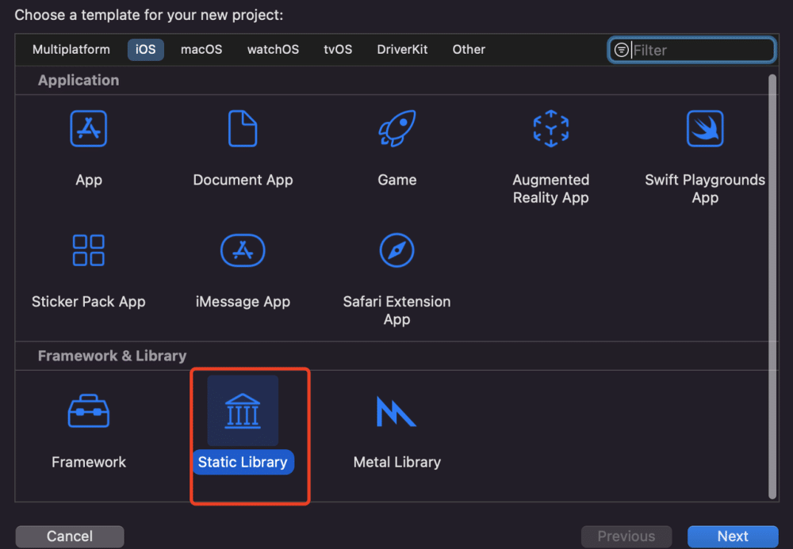

设置iOS的版本：
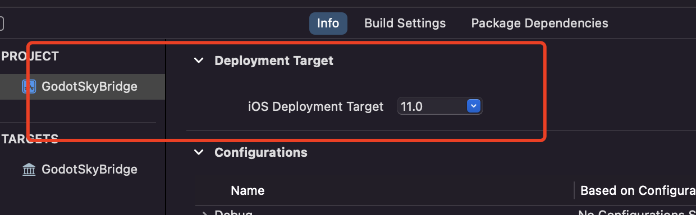

设置架构：
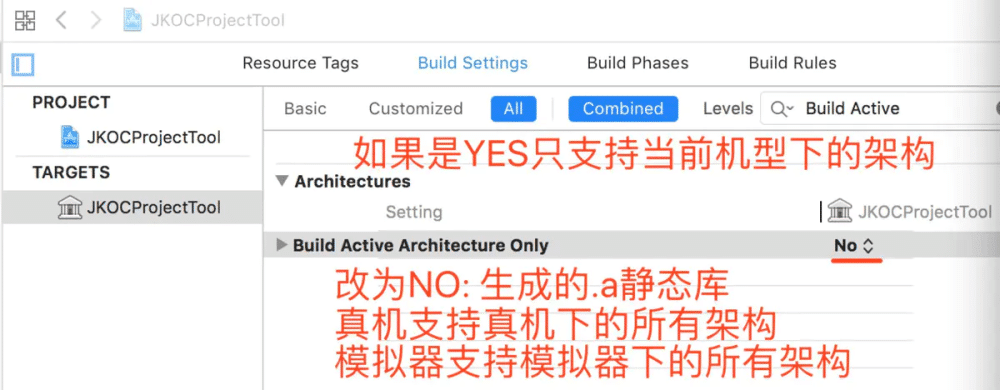

将生成好的Godot头文件拖到项目里，简单粗暴：
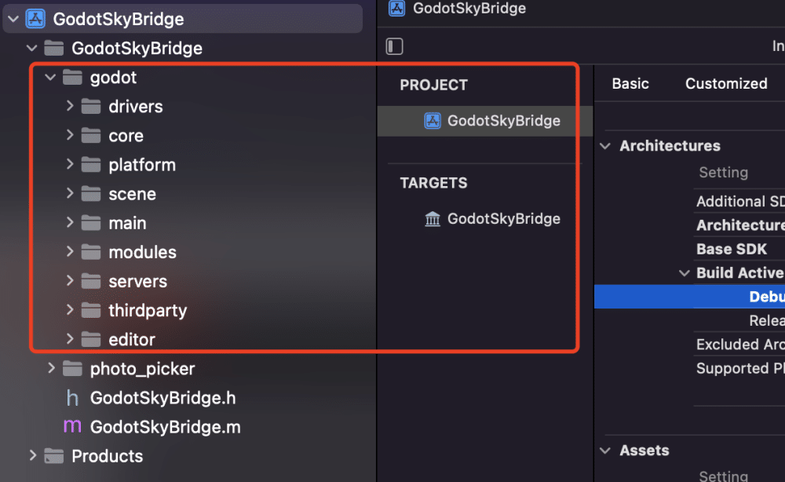

设置`HEADER_SEARCH_PATHS`:
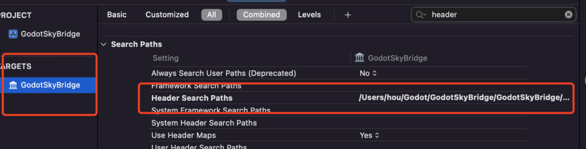

这里的值，简单的办法是，选中工程里面的Godot目录，在Xcode左侧属性里复制即可：
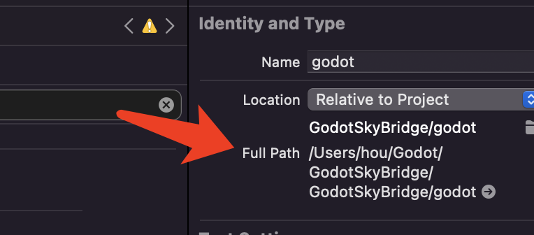

此时直接编译一下，会成功，其实已经生成`.a`文件了，但是可能不知道在哪里。有2个办法：
**2.2.1** 在下图中，直接复制，粘贴到文本工具里，会有`.a`的路径：
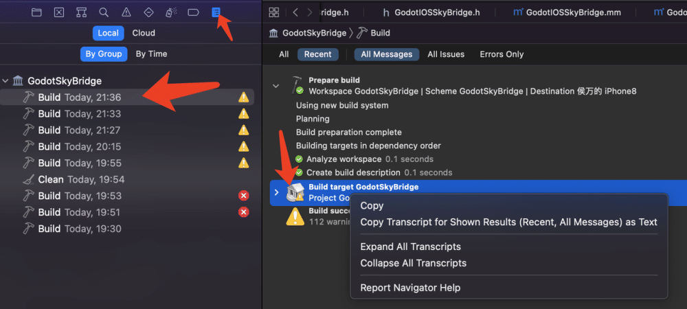

**2.2.2** 第二种办法是：打开项目的`project.pbxproj`，搜索`productRefGroup`，将`productRefGroup`上面一行的`mainGroup`的值，复制给`productRefGroup`，再保存一下，`Xcode`就自动刷新出来了。

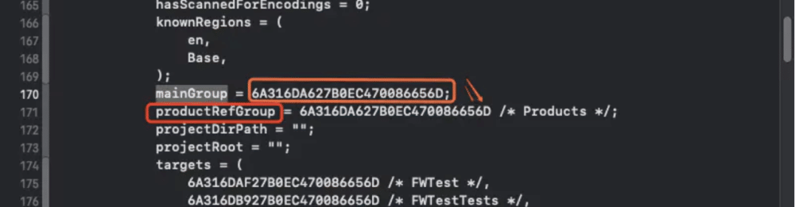

开始敲代码之前，还需要设置一下`Other C Flags`：

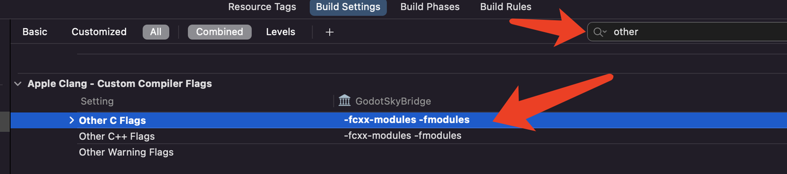

增加 `-fcxx-modules` 和 `-fmodules`，如果你需要支持调试就还有 `-DDEBUG`

### 2.3 导出静态库方案A

（我不推荐此方案）敲完代码，选择`Scheme`，分别设置`Release`和`Debug`，进而拿到`.a`文件：

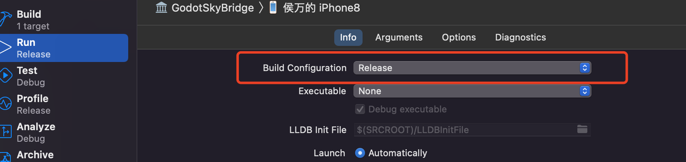

我将2个`.a`复制到了一个单独的文件夹，并重命名了：
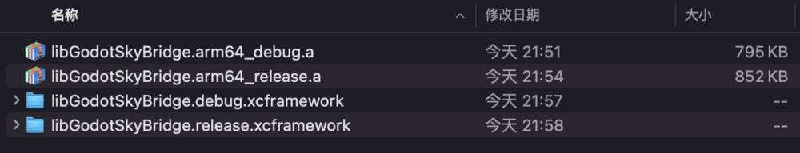

执行下面的命令。将`.a`文件转为了`.xcframework`文件：

```shell
# debug文件
$ xcodebuild -create-xcframework -library libGodotSkyBridge.arm64_debug.a -output libGodotSkyBridge.debug.xcframework
# release文件
$ xcodebuild -create-xcframework -library libGodotSkyBridge.arm64_release.a -output libGodotSkyBridge.release.xcframework
```

可以通过`lipo -info`命令查看.a的架构信息：

```shell
$ lipo -info libGodotSkyBridge.arm64_release.a 
Non-fat file: libGodotSkyBridge.arm64_release.a is architecture: arm64
```

> 😄这部分可以参考iOS的[静态库的创建和使用](https://www.jianshu.com/p/d79f6c866fdb)

### 2.4 导出静态库方案B

在`2.3`的方案里面，需要在工程的`setting`里面设置很多参数，一旦有错误，就在Godot里面使用不了，下面使用脚本的方案：
从官方的 **[godot-ios-plugins](https://github.com/godotengine/godot-ios-plugins)** 项目下载下来，注意分支。将写好的代码。放到plugins里面，注意建单独的文件夹:
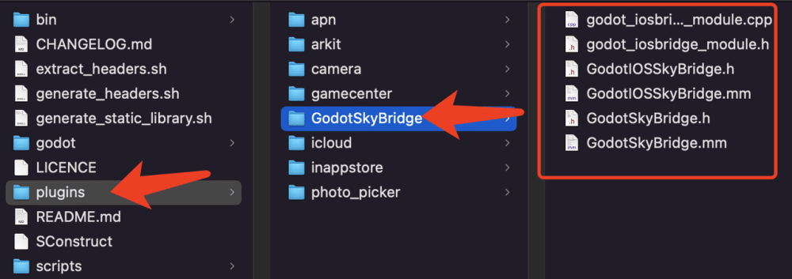

修改项目根目录下面的`SConstruct`脚本内容，让脚本知道我们增加了一个自己的库：
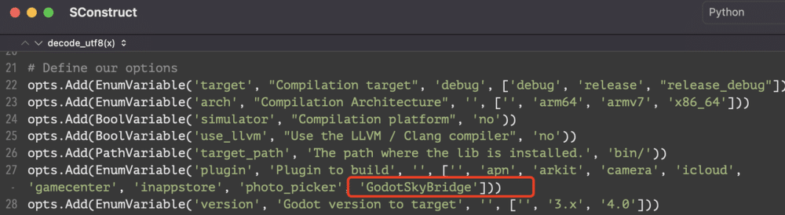

将`generate_static_library.sh`从scripts拷贝到项目的根目录下。然后在终端执行，注意加参数：

```shell
$ cd xxx
$ ./generate_static_library.sh GodotSkyBridge release 3.x

# 三个参数 插件名 编译类型 Godot版本
```

> 我在执行脚本之前，在仓库目录里面的godot是有内容的，也就是godot的头文件，可以在`2.3`里面看看怎么生成头文件。

备份`generate_static_library.sh`脚本内容：
```shell
#!/bin/bash
set -e

# Compile static libraries

# ARM64 Device
scons target=$2 arch=arm64 plugin=$1 version=$3
# x86_64 Simulator
scons target=$2 arch=x86_64 simulator=yes plugin=$1 version=$3

# Creating a fat libraries for device and simulator
# lib<plugin>.<arch>-<simulator|iphone>.<release|debug|release_debug>.a
lipo -create "./bin/lib$1.x86_64-simulator.$2.a" \
    "./bin/lib$1.arm64-iphone.$2.a" \
    -output "./bin/$1.$2.a"
```

脚本执行完毕，会在仓库根目录下，生成`bin/`文件夹里面，

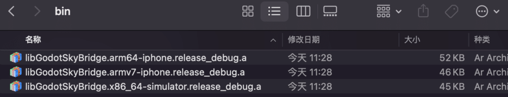

将`.a`生成`.xcframework`，例如只将`arm64`和`x86_64`合并：
```shell
$ cd bin
$ xcodebuild -create-xcframework -library libGodotSkyBridge.arm64-iphone.release_debug.a -library libGodotSkyBridge.x86_64-simulator.release_debug.a -output GodotSkyBridge.debug.xcframework
```

生成的`.xcframework`如下图所示：
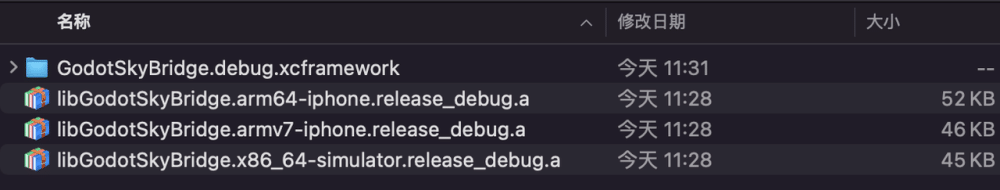

## 三.将Godot项目结合原生项目

### 3.1 Godot导出iOS项目情况
Godot导出的iOS项目结构如下：
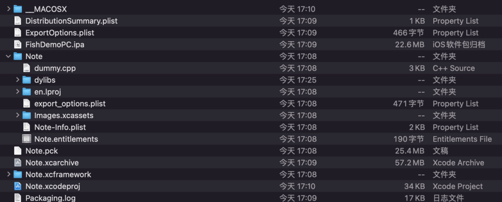

使用Xcode打开之后，如下图所示，注意观察红框里面的内容：
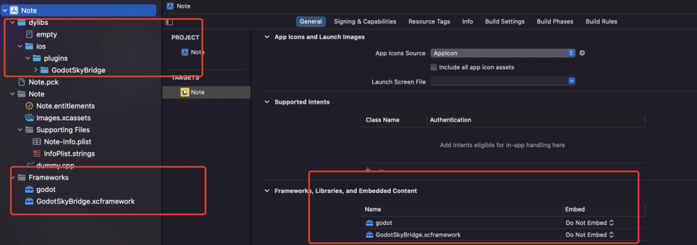


### 3.2 新建的Xcode工程+Godot工程
两个步骤：
- A.新建`Xcode`工程，设置版本号，`Pod`依赖，并且能正确编译
- B.来到新建项目的根目录下，处理如下：

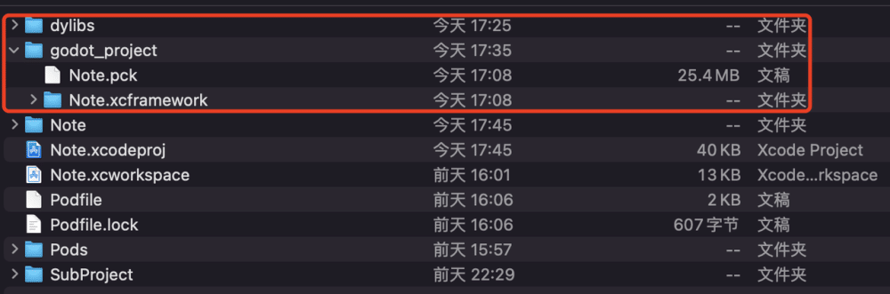

其中`dylibs`是直接从Godot导出的复制过来的，`godot_project`是自己新建的，并将`.pck`和Godot引擎的`xcframework`给复制过来了。
将`dylibs`和`godot_project`导入到Xcode里面，注意结构和选择：

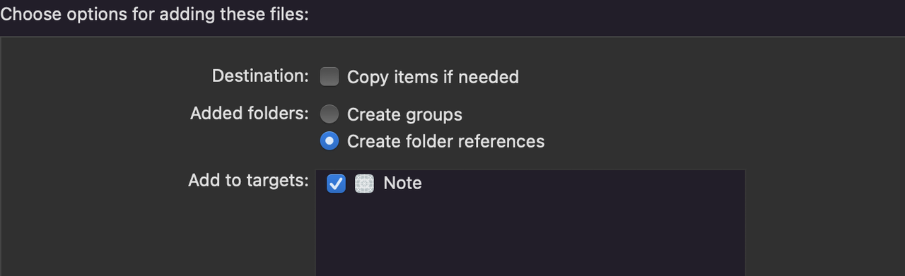

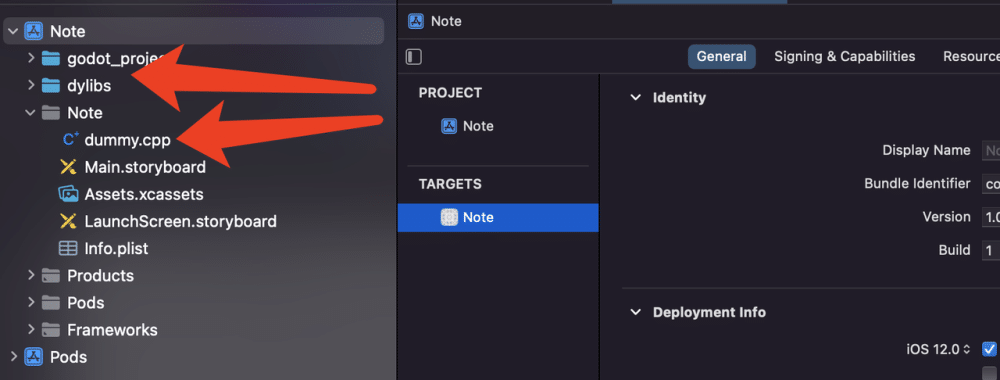

正确之后，两个文件夹的颜色应该是蓝色的，此时删除`AppDelegate`、`ViewController`和`main.m`三个文件。并把Godot导出的`dummy.cpp`也导入Xcode里面。
此时还是无法启动工程的，去下图那里，导入库即可，这些库都在`dylibs`和`godot_project` 2个文件夹里面，其实可以直接拖拽的方式到这里。

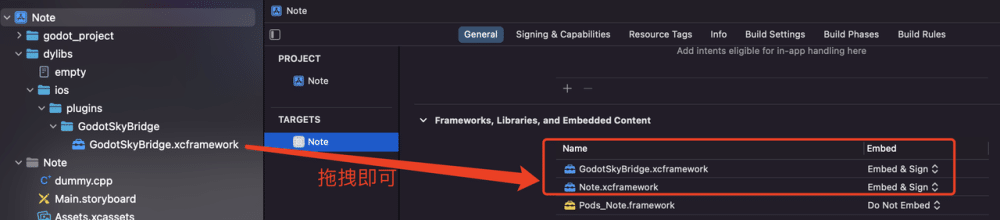

最后在`Info.plist`里面增加字段，告诉Godot引擎，怎么启动Godot游戏：

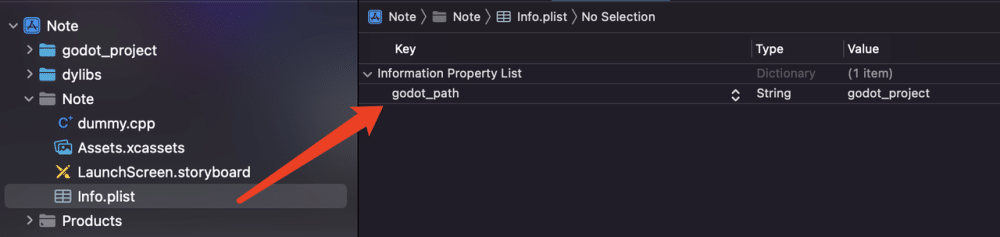

此时可以运行iOS工程了，结合最初使用插件的部分，就可以对引擎进行高度的定制化。


