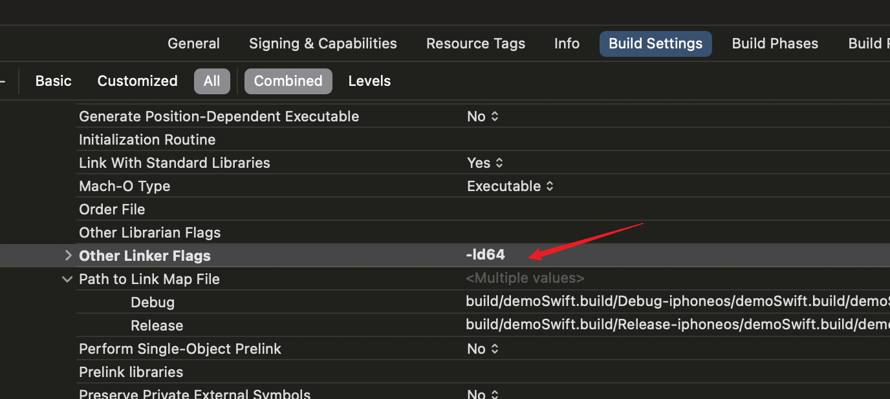
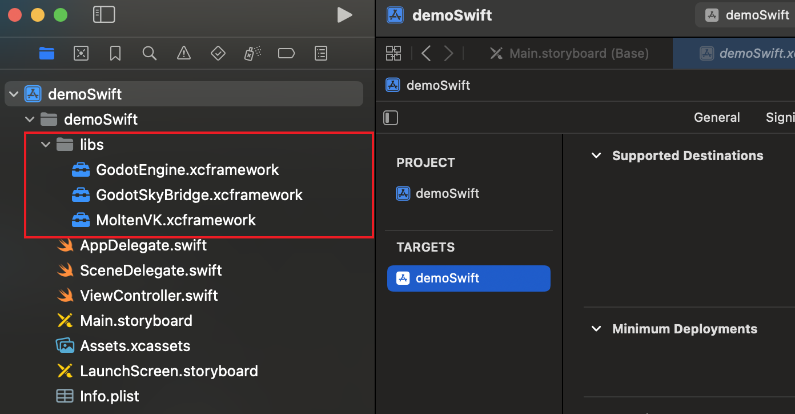
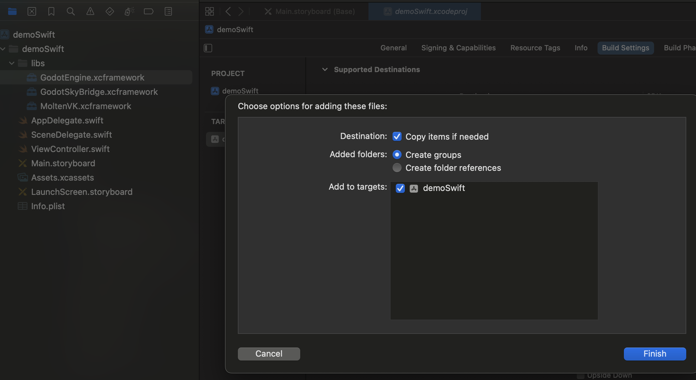
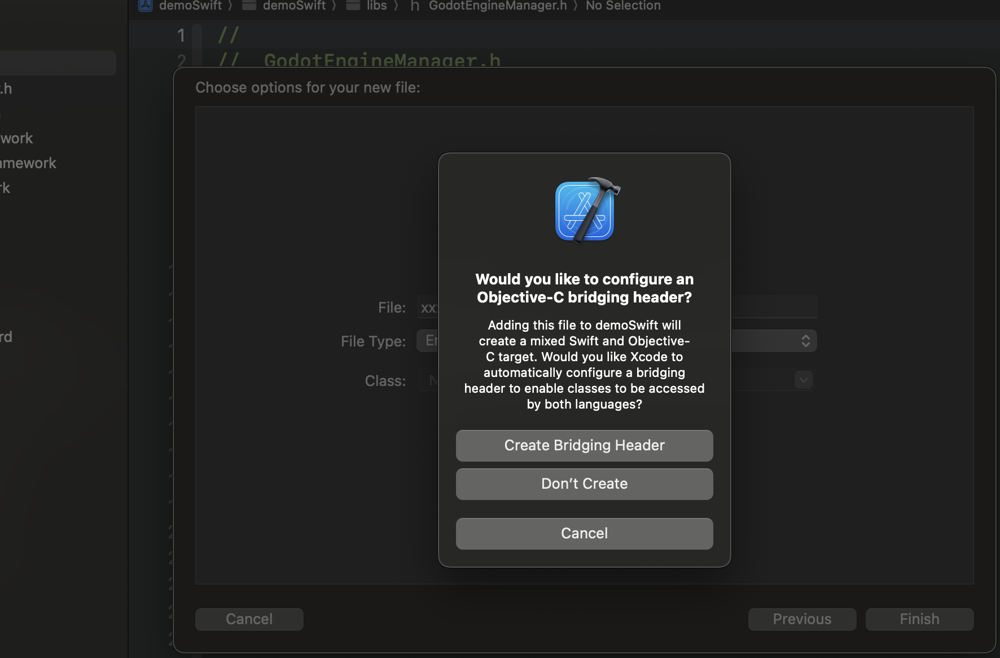
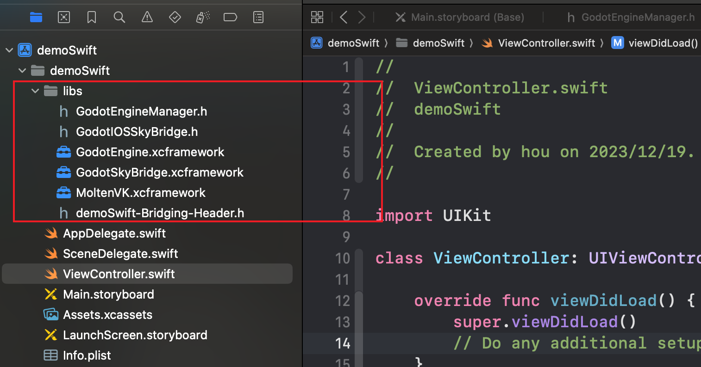
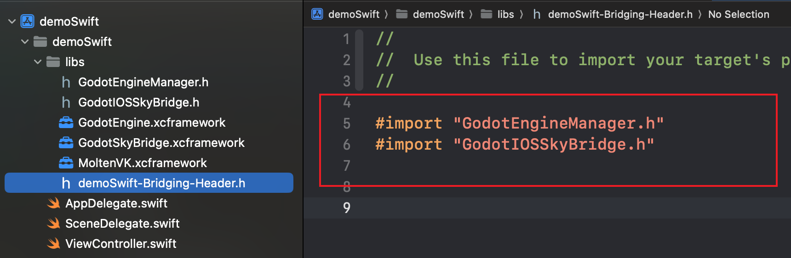
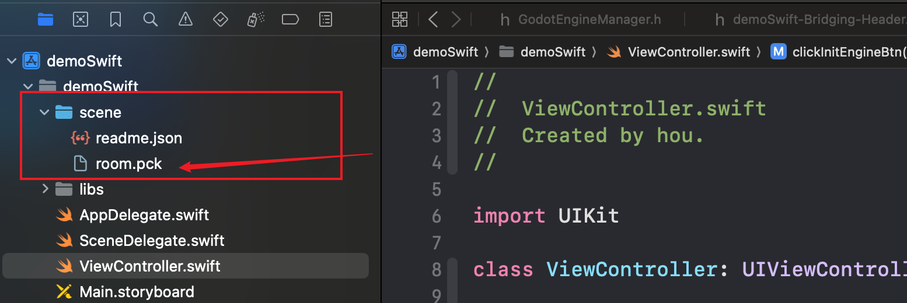

## Swift项目集成SDK

### 1.前提

在添加`xcframework`库之前，需要在`Xcode`的`Build Setting`中，`Other Linker Flags`添加敏一个参数：`-ld64`，如下图：

> `-ld64`是用于指定链接器使用`ld64`，`ld64`是苹果开发的一个`Mach-O`文件格式的链接器，用于在`macOS`和`iOS`系统上进行可执行文件和动态库的链接。链接器的作用在如下的流程里面：源码->预处理器->编译器->汇编器->机器码->**链接器**->可执行文件



### 2.添加库

如下图，在Demo中，新建一个`libs`文件夹，将3个`.xcframework`拖进项目里面，此时直接可以编译通过。

> 编译需要选择真机模式，`GodotEngine.xcframework`暂时不支持模拟器



### 3.添加头文件

此时为了引用这些库，直接添加2个头文件：`GodotIOSSkyBridge.h`和`GodotEngineManager.h`。因为是Swift工程，为了引用C语言文件，需要创建`Bridging-Header`文件。

> 随便添加一个Objc文件，Xcode就会自动提示需要添加`Bridging-Header`文件，点击添加即可。

<center> 👇导入2个`.h`文件👇 </center>



<center> 👇创建`Bridging-Header`文件👇 </center>



<center> 👇最终`libs`目录文件👇 </center>




`libs`目录文件分别是：
- `GodotEngine.xcframework` 引擎的核心framework
- `GodotSkyBridge.xcframework` 用于引擎和原生通信的桥，设计成了插件的形式
- `MoltenVK.xcframework`引擎依赖`Vulkan`绘图API
- `GodotEngineManager.h`引擎暴露的头文件
- `GodotIOSSkyBridge.h`通信桥暴露的头文件
- `demoSwift-Bridging-Header.h`Swift项目和C调用的Bridging


### 4.引用

在`Bridging-Header`里面`import`头文件之后，即可在Swift代码中调用。



此时编译一下项目，应该是可以通过的。

### 5.场景资源

场景资源有2种方式获取，一是直接放到App的包(`Bundle`)里面，这种方式会让包体积变大；二是运行时下载到App沙盒目录里面。

如图所示，这里将场景数据文件`room.pck`放到了项目中：



> 运行Demo也可以查看使用沙盒的方式，其实仅仅是传参路径而已


### 6.使用SDK

核心就是2个类的使用：
- `GodotIOSSkyBridge`用于和场景进行通信
- `GodotEngineManager`引擎的管理：初始化、生命周期、暂停启动等

> 需要注意的是，当App退到后台(Click Home)，或者`viewDidDisappear(:)`时，引擎会自动暂停的，为了更好的电池性能。

`GodotIOSSkyBridge`通信单例类的使用比较简单，采用代理模式，比如：

```swift
override func viewDidLoad() {
    super.viewDidLoad()
    GodotIOSSkyBridge.shared().listener = self
}

extension ViewController: GodotBridgeProtocol {
    
    /// Godot --> iOS原生   不需要应答 或者 需要异步应答 消息体里面做出区分
    /// 参数`message`是一个JSON字符串
    func get_godot_message(_ message: String?) {
        guard let msgJson = message else { return }
        
    }
    
    /// Godot --> iOS原生   需要应答  同步应答
    /// 参数`message`是一个JSON字符串
    func get_godot_sync_message(_ message: String?) -> String {
        return ""
    }
}
```

> Demo的演示是将代理类给了`ViewController`，在开发中也可以在当前项目新建一个单例类专门进行处理通信

因为引擎会在运行时获取当前屏幕的分辨率、尺寸等信息，所以目前需要在`AppDelegate`中实现`window`属性，用于`[UIApplication.AppDelegate window]`

```swift
class AppDelegate: UIResponder, UIApplicationDelegate {
    var window: UIWindow? {
        set { }
        get {
            var tempWindow: UIWindow?
            if #available(iOS 15, *) {
                tempWindow = UIApplication.shared.connectedScenes
                            .map({ $0 as? UIWindowScene })
                            .compactMap({ $0 })
                            .first?.windows.first
            } else {
                tempWindow = UIApplication.shared.windows.first
            }
            return tempWindow
        }
    }
    // ....
}
```


