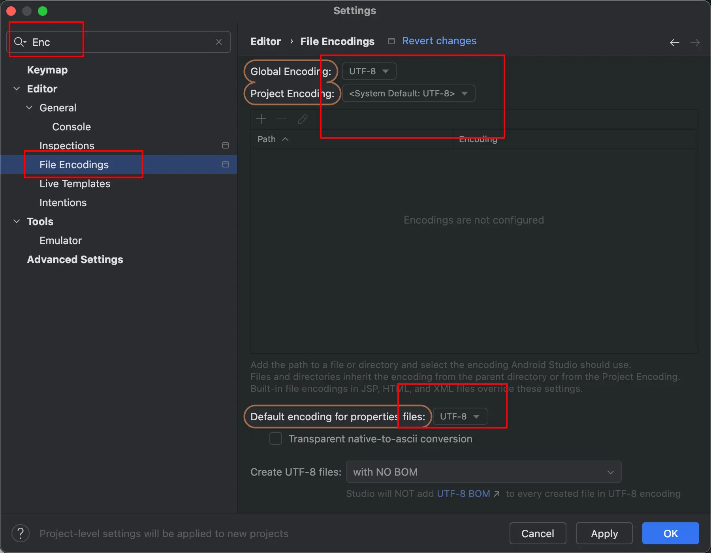
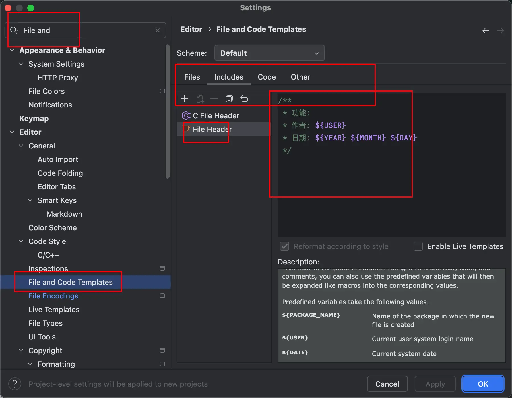
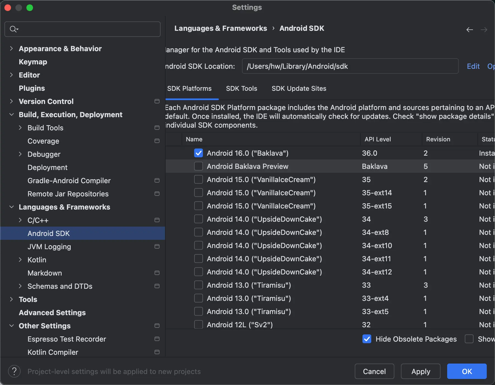
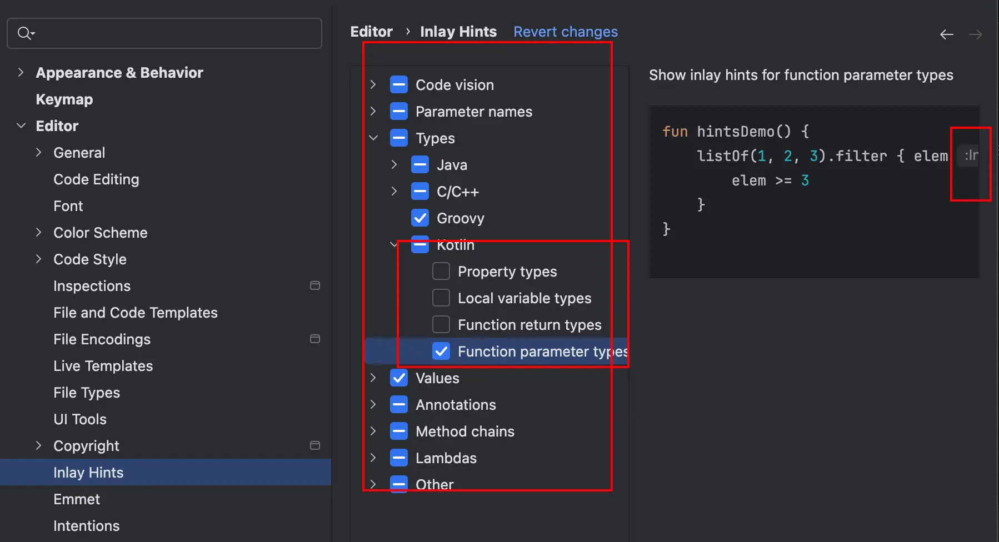
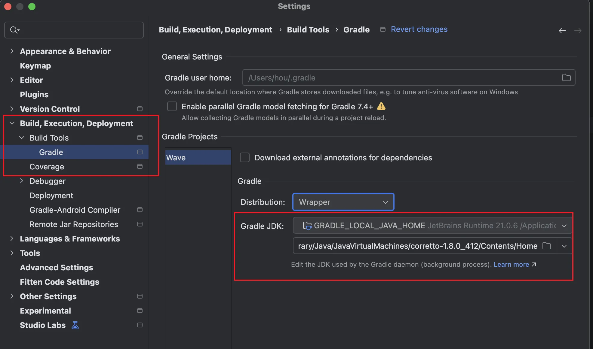
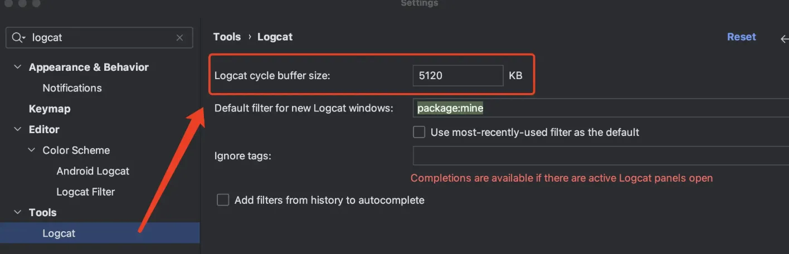

## Mac环境和软件配置

### 1.安装Xcode

- 打开App Store，搜索`Xcode`，安装最新版本的`Xcode`。

安装完成后，运行`Xcode`，并在弹出的窗口中，点击`Agree`同意协议，然后等待安装完成。

打开终端，输入以下命令，安装Xcode命令行工具：
```sh
xcode-select --install
```

### 2.安装上网工具

这里自行查询。下面的一些App和一些终端命令，需要用到上网。


### 3.安装常用软件

| 软件 | 下载方式 |
| --- | --- |
| Google Chrome | `https://www.google.com/chrome/` |
| Visual Studio Code | `https://code.visualstudio.com/` |
| 360压缩大师 | App Store |
| 微信 | App Store |
| `SnippetsLab`代码仓库 | App Store |
| `CotEditor`文本编辑 | App Store |
| `Snipaste`截图软件 | `https://zh.snipaste.com/` |
| `VLC`视频播放 | `https://www.videolan.org/vlc/` |
| NTFS for Mac | 先去希捷硬盘的官网，再找下载链接 |
| Sourcetree | `https://www.sourcetreeapp.com/`(\n 要先安装好`Xcode`和命令行工具(`xcode-select --install`) |


### 4.终端安装`Oh My Zsh`
配置自己习惯使用的终端主题之后，打开`Oh My Zsh`的官网，执行对应的安装脚本即可：

 - https://ohmyz.sh/


### 5.安装Homebrew
打开`Homebrew`的官网，找到安装命令即可：
 - https://brew.sh/

安装命令执行完毕后，注意看输出，大概需要根据输出再执行几个命令，进行终端的环境配置。例如
```sh
# 下面只是示例，具体还是看安装brew的输出提示
echo >> ~/.zprofile
echo 'eval "$(/opt/homebrew/bin/brew shellenv)"' >> ~/.zprofile
eval "$(/opt/homebrew/bin/brew shellenv)"
```

然后，输入以下命令，验证是否安装成功：
```sh
brew --version
```

### 6.Java和Android Studio

#### 6.1 安装Java
下载`Java SDK`：

- `OpenJDK-Java-SDK`的下载网址：
  - https://jdk.java.net/archive/

- `Oracle-Java-SDK`的下载网址：
  - https://www.oracle.com/java/technologies/downloads/

- 微软`OpenJDK-Java-SDK`的下载网址：
  - https://learn.microsoft.com/java/openjdk

- `Azul-Java-SDK`的下载网址：
  - https://www.azul.com/downloads/?package=jdk

一般情况下，下载JDK安装之后，会自动配置好环境变量，不需要额外设置，验证如下：
```sh
java -version
```

其中`Azul-Java-SDK`下载`dmg`文件，安装目录是：
```
/Library/Java/
/Library/Java/JavaVirtualMachines/
```

备注：
`which`命令可以用来查找并显示命令的完整路径。例如，如果你想查找`java`命令的位置，你可以在终端中输入：
```sh
which java
```

#### 6.2 安装Android Studio
下载`Android Studio`：

- 下载地址：https://developer.android.com/studio


`Android Studio`一些配置：

👇🏻将项目文件的字符编码设置为`UTF-8`：

<p align="center">
  
</p>


👇🏻可以设置项目文件的头部注释：

<p align="center">
  
</p>

👇🏻可以管理`Android SDK`版本和`SDK Tools`
<p align="center">
  
</p>

👇🏻设置`Android Studio`的类型推断和提示：
<p align="center">
  
</p>

👇🏻设置项目`Gradle`的JDK版本，默认是`Android Studio`自带的`JDK`版本，一般比较高，可以根据项目的情况，选择本地安装的`JDK`版本：
<p align="center">
  
</p>


👇🏻设置`Logcat`的缓冲区大小:
<p align="center">
  
</p>


`Android Studio`的外观字体设置：`Settings` --> `Appearance & Behavior` --> `Appearance`


`Android Studio`的编辑器字体设置：`Settings` --> `Editor` --> `Font`


### VS Code 插件推荐
- Chinese (Simplified) (简体中文) Language Pack for Visual Studio Code
- vscode-icons
  - 让文件和文件夹更好看
- Markdown All in One
- Reactjs code snippets
- px to rem & rpx & vw (cssrem)
- Auto Rename Tag
  - 编写HTML等时，自动修改标签名称
- vscode-styled-components
  - 编写React组件时，高亮styled-components代码


### 常用AI编程助手

- fittentech
  - https://code.fittentech.com/

- 通义灵码
  - https://lingma.aliyun.com/

- CodeGeeX
  - https://codegeex.cn/

- 腾讯云代码助手
  - https://copilot.tencent.com/

- 字节跳动Trea
  - https://www.trae.cn/

- AI工具集合导航网站
  - https://ai-bot.cn/

