# Swift奇趣漫谈

## 一、前言

这个系列的文章，是记录自己在学习和使用Swift的过程中，遇到的一些奇怪或者有趣的知识点，有些地方甚至和自己的直觉是相反的。在这个过程中，自己会结合汇编、SIL中间代码，源码等角度去探索。

Swift是完全开源的语言，[Swift主页地址](https://swift.org/)，主要采用C++编写，Swift编译过程如下：

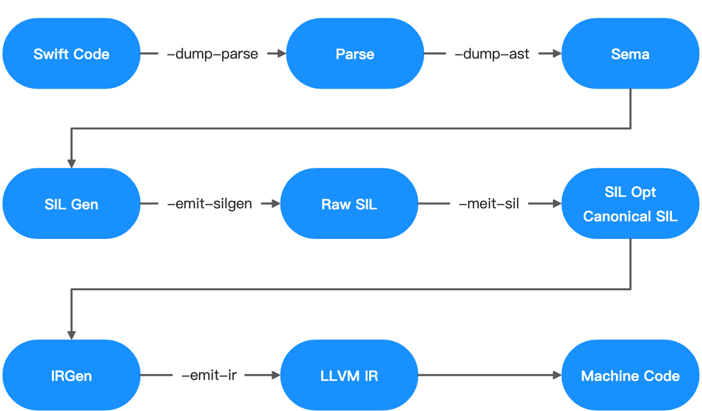

如上图所示，Swift编译流程是：
SwiftCode代码 -> Swift AST语法树 -> Raw Swift IL特有中间代码 -> Canonical Swift IL特有简洁中间代码 -> LLVM IR中间代码 -> Assembly汇编代码 -> Executable二进制

所以我们了解和学习Swift的方式有很多，比如阅读源码，分析SIL中间语言、查看汇编代码等。比如新建一个`main.swift`，可以按照下面的指令，生成对应的中间代码：
```Shell
# 生成语法树
swiftc -dump-ast main.swift
# 生成最简介的SIL代码
swiftc -emit-sil main.swift
# 生成LLVM IR代码
swiftc -emit-ir main.swift -o main.ll
# 生成汇编代码
swiftc -emit-assembly main.swift -o main.s
```

## 二、汇编和调试

### 2.1 寄存器和内存

通常，CPU会先将内存中的数据存储到寄存器中，然后再对寄存器中的数据进行运算。
假设内存中有块红色空间的值是3，现在想把它的值加1，并将结果存储到蓝色空间，汇编过程是：

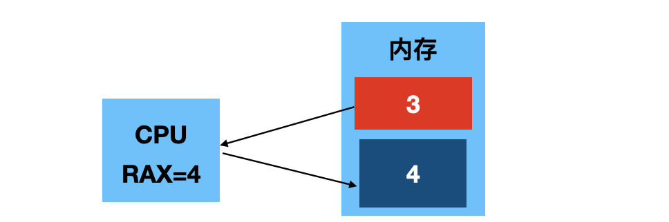

对应的汇编伪代码是：
```perl
// 1.CPU会先将红色内存空间的值，放到寄存器中：
movq 红色内存空间, %rax
// 2.然后让 rax 寄存器和1相加
addq $0x1, %rax
// 3.最后将值赋值给内存空间
movq %rax, 蓝色内存空间
```

### 2.2 汇编基础

汇编有很多种类，常见的有 Intel汇编(Windows派系)、AT&T汇编(Unix派系)、ARM汇编等。
但是，在iOS开发中，最主要的汇编语言是：
- **AT&T汇编** -> iOS模拟器  (M1芯片的电脑未知，猜测是ARM汇编)
- **ARM汇编**  -> iOS真机设备

常见的汇编指令(注意：**AT&T**带有操作数长度和`%`)

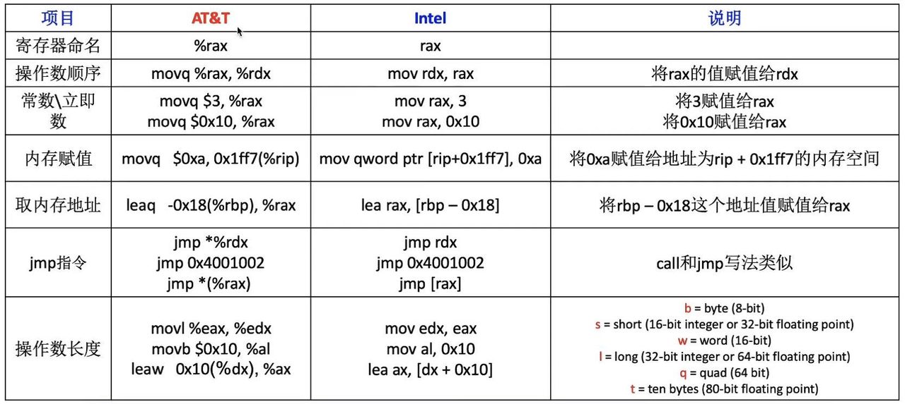

这里需要注意`movq`和`leaq`的区别(类似值类型和引用类型的感觉)：
```shell
# 将 rbp-0x18 指向内存地址的值，取出来赋值给 rax
movq -0x18(%rbp),  %rax
# 将 rbp-0x18 指向内存地址，直接赋值给 rax
leaq -0x18(%rbp),  %rax
```

**有16个常用的寄存器**(加粗为常见的)
- **rax**, rbx, rcx , **rdx**, **rsi**, **rdi**, rbp, rsp
- r8, r9, r10, r11, r12, r13, r14, r15

**寄存器的具体用途规律：**
- rax、rdx常作为函数的返回值使用
- rdi、rsi、rdx、rcx、r8、r9 等寄存器常作为函数的参数使用
- rsp、rbp用于栈操作

**rip作为指令指针：**
- 存储着CPU下一条要执行的指令的地址
- 一旦CPU读取一条指令、rip会自动指向下一条指令（存储下一条指令的地址）

小技巧：除外上面列出来的寄存器，还有很多其他寄存器。其中r开头的寄存器，都是64位寄存器(8字节)，e开头的寄存器都是32位寄存器(4字节)，ax、bx、cx开头都是16位寄存器(2字节)，ah/al/bh/bl开头都是8位寄存器(1个字节)

**`Xcode`打断点，进入汇编显示页面的方法：**
Xcode菜单栏-->Debug-->Debug Workflow-->Always Show Disassembly

### 2.3 LLDB常用指令
LLDB是Xcode默认的调试器。

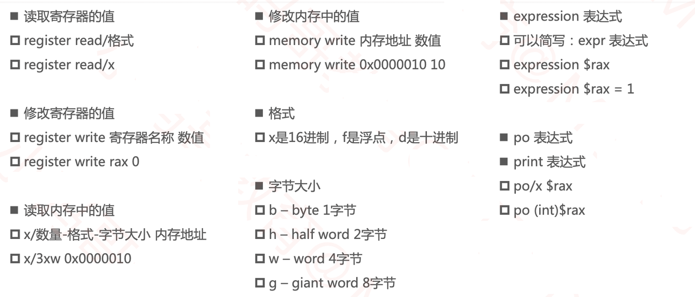

举例子来说:
```Delphi
register read rax  // 读取rax寄存器地址
register read // 当前可用的寄存器
x/3xw 0x00007fff816a7330  // 读取内存中的值
// 3组数据 x:16进制 w:4个字节为一组
```

### 2.4 LLDB断点调试

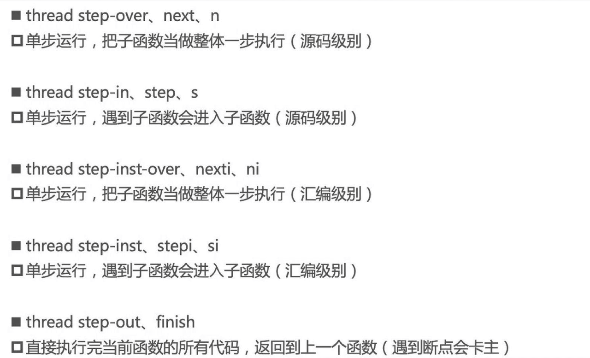

在真机开发过程中，有个内存地址规律：
内存地址格式为：`0x4bdc(%rip)`，一般是全局变量、全局区(数据段)
内存地址格式为：`-0x78(%rbp)`，一般是局部变量、栈空间
内存地址格式为：`0x10(%rax)`，一般是堆空间

## 三、汇编举例

==**3.1**== 通过汇编，发现`sizeof()`的本质是编译器关键字，而不是函数。
```objc
int main(int argc, const char * argv[]) {
  int c = sizeof(int);
  int b = 5;  // 此处打断点
  return 0;
}
```
打断点进入汇编指令的截图：
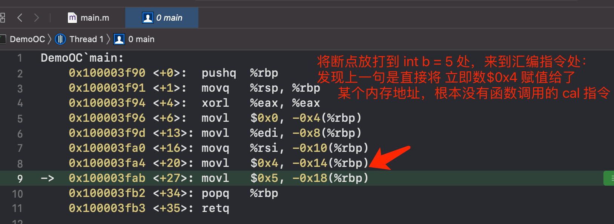

==**3.2**== Swift里面`inout`的运行汇编截图：
```swift
var a = 5
func test(_ number: inout Int) {
  number = 8
}
test(&a)  // 断点处
```
运行，进入汇编指令页面：
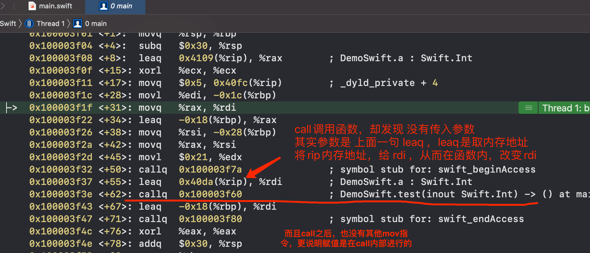

继续跟进汇编指令，进入`callq`里面：
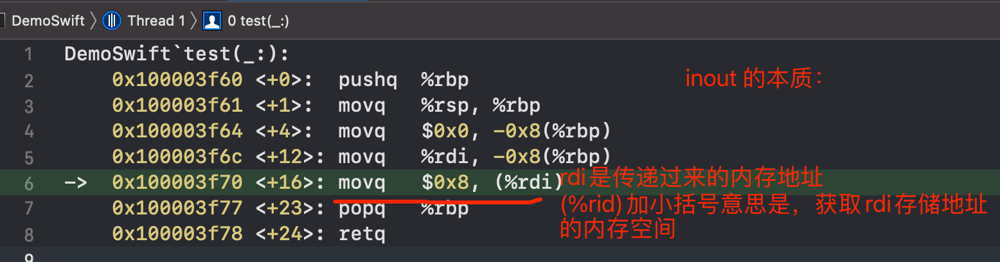

如果，去掉`inout`，将函数改造之后，再对比汇编指令：
```swift
var a = 5
func test(_ number: Int) {
}
test(a)  // 断点处
```
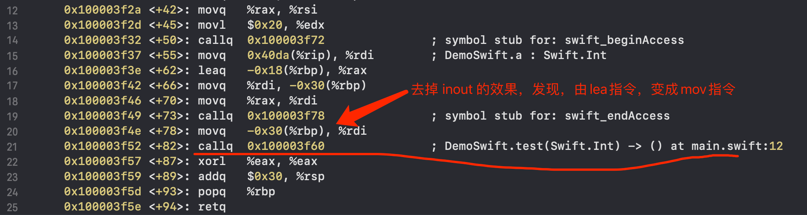
`mov`指令直接将a的值，赋值给了形参。`lea`指令将a的内存地址传递到了函数内部。说明了`inout`的工作原理。

==**3.3**== Swift是有默认的main函数的，只是不用自己去写，当我们进入断点之后，能看到汇编页面的顶部有main方法的入口：
```Delphi
DemoSwift`main:  // 进入汇编，看到main调用
  0x100003f00 <+0>: pushq %rbp
  0x100003f01 <+1>: movq  %rsp, %rbp
```

==**3.4**== 所有的函数(方法)不管有没有返回值，编译后，都会有`return`的，这也是`call`指令和`jump`指令的关键区别，代码演示：

```swift
func testFunc() {
  let a = 5
  let b = 6
  let c = a + b
}
testFunc()
let a = 5  // 断点位置
```
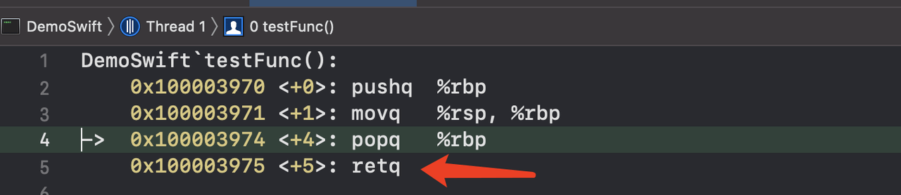

- 从另外的角度，函数运行之后，需要回到调用函数的位置，所以必然有`ret`指令。
- `call`指令是调用函数，必然会有`ret`指令回来继续执行。
- `jump`是直接跳到对应的指令执行，不会再回来。

## 四、Swift奇趣漫谈

开始步入正题...

### 4.1 Swift的函数重载

1.返回值类型 和 函数重载无关，下面三个函数，同时存在，是可以编译通过的。
```swift
func sum(v1: Int, v2: Int) -> Int { 1 }
func sum(v1: Int, v2: Int) -> Double { 1.0 }
func sum(v1: Int, v2: Int) { }
```

奇怪点来了😭：虽然编译通过了，但是如果调用，就会报错：
```swift
func sum(v1: Int, v2: Int) -> Int { 1 }
func sum(v1: Int, v2: Int) -> Double { 1.0 }
func sum(v1: Int, v2: Int) { }

// ❌报错：Ambiguous use of 'sum(v1:v2:)'
sum(v1: 10, v2: 20)
```

### 4.2 函数重载和默认参数

当函数带有默认参数值， 和函数重载一起使用时，会有奇怪的地方，代码：
```swift
func sum(v1: Int, v2: Int) -> Int { v1 + v2 }
func sum(v1: Int, v2: Int, v3: Int = 10) -> Int { v1 + v2 + v3 }
// 会调用谁？ 结果是什么？
print( sum(v1: 10, v2: 20) )
```

奇怪点：首先，上面是编译通过的，但是从调用角度来说，2个函数都是对的，不过结果却是`30`，调用了第一个函数。对于开发者而言，其实是有歧义的。

### 4.3 省略参数标签和可变参数
当省略参数标签和可变参数一起出现时，会调用谁呢？代码：
```swift
func sum(_ v1: Int, _ v2: Int) -> Int {
  print("调用了 -- sum1")
  return v1 + v2
}
func sum(_ numbers: Int...) -> Int {
  print("调用了 -- sum2")
  var total = 0
  for item in numbers {
    total += item
  }
  return total
}
print( sum(10, 20) )
```
上面的代码，从调用侧来看，调用上下两个函数都是正确的，但是结果是`调用了 -- sum1`，那么这是为什么呢？

### 4.4 函数重载总结
当我们把这几个函数放到一起，也是能编译通过的，但是最后调用了谁呢？这个读者可以自己去试试：
```swift
func sum(_ numbers: Int...) -> Int {
    print("sum2")
    var total = 0
    for item in numbers {
        total += item
    }
    return total
}

func sum(_ v1: Int, _ v2: Int) -> Int {
    print("sum1")
    return v1 + v2
}

func sum(_ v1: Int, _ v2: Int, _ v3: Int = 10) -> Int {
    print("sum3")
    return v1 + v2
}

print( sum(10, 20) )  // 你猜会调用哪个函数？
```

**解释**：关于Swift的函数重载，Swift内部到底怎么选择执行哪个函数的？Swift在执行重载解析时，类型检查器会对每个重载的函数，进行打分，找到一个分数最高的来执行，至于打分的标准，在下面的源码里，规则有很多，比如：非泛型的得分高于泛型的。

源码地址：
https://github.com/apple/swift/blob/main/lib/Sema/CSRanking.cpp


> 需要注意的是：Swift的这种带有歧义的函数重载，在C++里面是通不过编译的。

### 4.5 Swift内联函数
如果开启了编译器优化（Release模式默认会开启优化），编译器会自动将某些函数变成内联函数.
- `Inline Function` 其实就是将函数体调用展开成函数体

但是，即使开启了编译器优化，有些函数还是不会被内联：
- 函数体比较长，比如超过500行
- 包含递归调用（尾递归除外）
- 包含动态派发

主动开启编译器优化：`optimization`
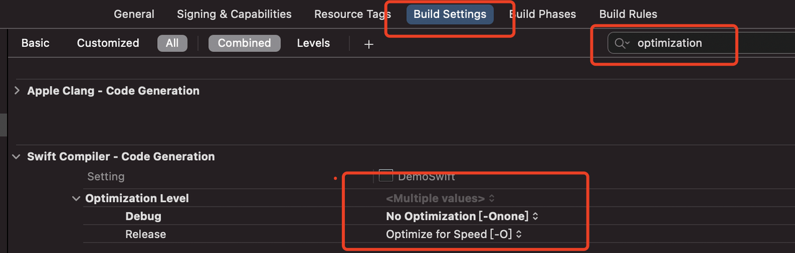

关于函数内联的2个关键字：
```swift
// 永远不会被内联，即使开启了编译器优化
@inline(never) func test1() {}
// 开启编译器优化后，即使代码很长，也会被内联（递归调用、动态派发的函数除外）
@inline(__always) func test2() {}
```

### 4.6 枚举的初始化
Swift的枚举是值类型，`struct`也是值类型，那么二者有哪些区别呢？比如下面的代码：
```swift
enum MyEnum {
    case test1(Int, Int, Int)
    case test2
}

struct MyStruct {
    let age: Int
}

let e = MyEnum.test1(2, 3, 4)  // 断点处
let p = MyStruct(age: 5)
```
运行进入断点，在汇编指令页面，我发现了神奇的对比：
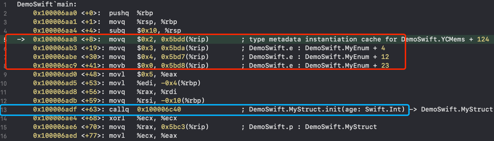
枚举**enum**没有初始化方法，而结构体**struct**是有初始化方法的。也就是我们创建`enum`变量时，系统识别到是枚举类型后，开启内存，直接开始`mov`指令初始化内存。而`struct`是需要`call`指令调用`init`初始化方法的。

关于识别`Metadata`的相关内容，可以看看下面两篇文章：
- [初探Swift底层Metadata](https://juejin.cn/post/6919034854159941645)
- [Swift Hook 新思路 -- 虚函数表](https://zhuanlan.zhihu.com/p/372965714)

### 4.7 枚举关联值和原始值的内存区别
**枚举关联值**(Associated Values)：枚举的成员值和其他类型的值，关联存储在一起：
```swift
enum Date {
  case digit(yeaer: Int, month: Int, day: Int)
  case desc(String)
}
var d1 = Date.digit(yeaer: 2021, month: 10, day: 1)
d1 = .desc("2021-10-01")

// 利用case模式，可以获得关联值，比如当是`Date.digit`类型，拿到year
if case let .digit(yeaer: year, month: _, day: _) = d1 {
    print(year)
}
```

**枚举原始值**(Raw Values)：枚举成员可以使用相同类型的默认值预先对应，这个默认值叫做：原始值，注意，如果原始值类型是String、Int，Swift会**自动分配**原始值。
```swift
enum Grade: String {
  case perfect = "A"
  case great = "B"
  case good = "C"
}
print(Grade.great)
print(Grade.perfect.rawValue)  // rawValue获取原始值
```

枚举关联值和原始值的内存对比：
```swift
// 1.关联值
enum Password {
  case number(Int, Int, Int, Int)
  case other
}

var pwd = Password.number(1, 2, 3, 4)
pwd = .other

print( MemoryLayout.size(ofValue: pwd) ) // 33 实际用到的内存空间大小
print( MemoryLayout.stride(ofValue: pwd) ) // 40 系统分配占用的空间大小，会内存对齐
print( MemoryLayout.alignment(ofValue: pwd) ) // 8 内存对齐参数

print("---------------")

// 2.原始值
enum Names: Int {
  case xiaoMing = 2, xiaoHong = 5, xiaoHou = 6, XiaoLi = 9
}

let name = Names.XiaoLi

print( MemoryLayout.size(ofValue: name) ) // 1 实际用到的内存空间大小
print( MemoryLayout.stride(ofValue: name) ) // 1 系统分配占用的空间大小，会内存对齐
print( MemoryLayout.alignment(ofValue: name) ) // 1 内存对齐参数
```
==结论：==
原始值 是固定死的，可以通过代码`switch`判断返回，所以不用占存储内存。
关联值 是要要外面传入的，是会变化的，必须得存起来，是会占用内存的。
- 1个字节存储成员值
- N个字节存储关联值（N取占用内存最大的关联值），任何一个`case`的关联值都共用这N个字节

我们可以查看内存，来验证我们的结论，使用Xcode的`Debug`->`Debug Workflow`->`View Member`工具，来查看内存：
```swift
/// 获得变量的内存地址
func memPtr<T>(ofValue v: inout T) -> UnsafeRawPointer {
    if MemoryLayout.size(ofValue: v) == 0 {
        return UnsafeRawPointer(bitPattern: 0x1)!
    }
    return withUnsafePointer(to: &v) { UnsafeRawPointer($0) }
}

enum TestEnum {
    case test1, test2, test3
}
var t = TestEnum.test1
print(memPtr(ofValue: &t))  // 打印内存地址，复制粘贴到`View Member`中查看内存
print("--------我是分割线，为了方便断点--------")

t = .test2
print("--------我是分割线，为了方便断点--------")

t = .test3
print("--------我是分割线，为了方便断点--------")
```
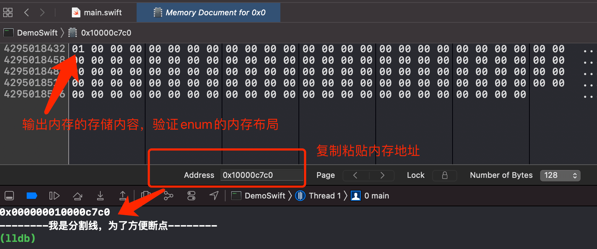

相应的，我们使用相同的办法，验证**关联值**类型枚举的内存：
```swift
enum TestEnum {
    case test1(Int, Int, Int)
    case test2(Int, Int)
}

var t = TestEnum.test1(5, 6, 7)
print(memPtr(ofValue: &t))
print("--------我是分割线，为了方便断点--------")

t = .test2(8, 9)
print("--------我是分割线，为了方便断点--------")
```
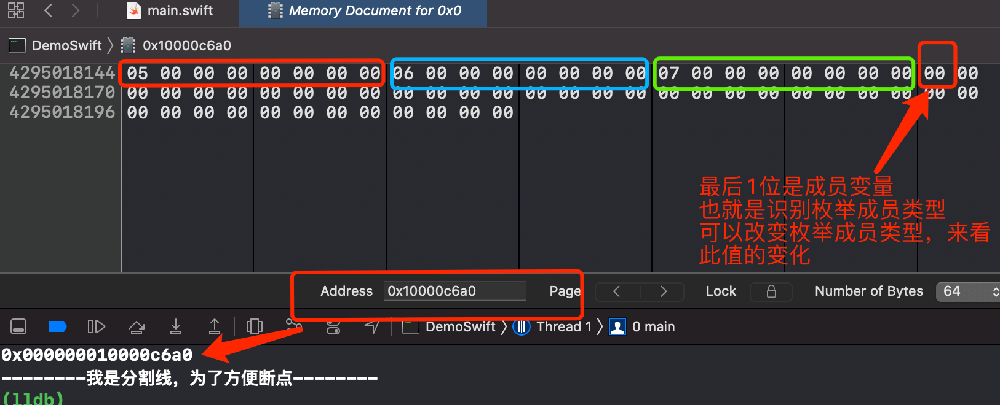

> 注意，因为模拟器CPU是小端模式，所以内存是从低到高的倒着布局

### 4.8 ??和if-let配合使用
这算是小技巧，在一些第三方库中，能看到下面代码的写法，当想同时判断2个`Optional`时，下面的写法比较简洁：
```swift
let a: Int? = 1
let b: Int? = 2
let c = a ?? b ?? 3  // c是Int, 1

let a: Int? = nil
let b: Int? = 2
if let c = a ?? b { // 类似于 if a != nil || b != nil
  print(c)
}
if let _ = a ?? b { } // 或者这种奇怪的代码
```

==结论：== `??`返回值类的类型，就看 最后一个`??`后面的变量类型，和后一个变量类型一致。

### 4.9 多重可选项
观察代码如下：
```swift
let num1: Int? = 10
let num2: Int?? = num1 // 注意，这里的??不是空合并运算符
let num3: Int?? = 10
```
问题：num2和num3的区别是什么？比如`print(num2 == num3)`结果是什么？
代码修改之后：
```swift
let num1: Int? = nil
let num2: Int?? = num1 // 注意，这里的??不是空合并运算符
let num3: Int?? = nil

// 下面分别输出什么？
print(num2 == num3)
print( (num2 ?? 1) ?? 2 )
print( (num3 ?? 1) ?? 2 )
```

对于上面的问题，我们需要理解`Optional`的本质，我们都知道`Optional`的本质就是枚举：
```swift
public enum Optional<Wrapped> : ExpressibleByNilLiteral {
    case none
    case some(Wrapped)
}
```

所以，我们可以通过使用LLDB指令`frame variable -R`或者`fr v -R`查看区别(后者只是前者的缩写)。打上断点，在控制台，可以查看指令的介绍：
```shell
help frame
help frame variable
```
运行打断点的截图：
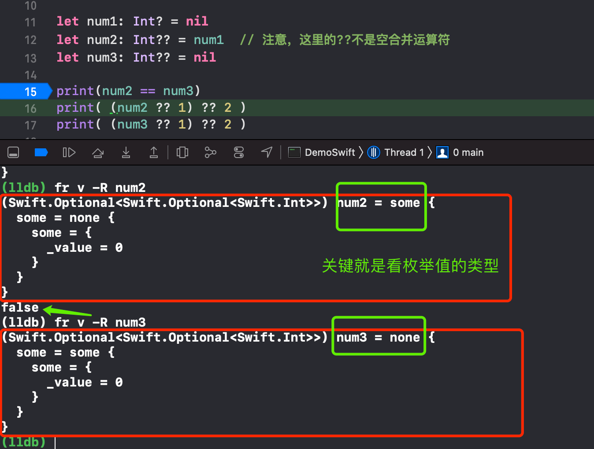

如果使用盒子的方式去理解，就是下面的图，注意盒子颜色的含义：
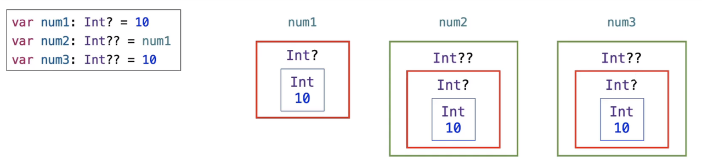
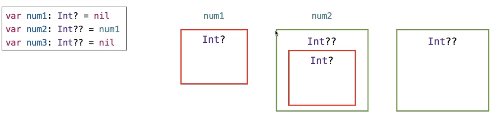

### 4.10 结构体初始化器的下面2种写法，是否一样？
```swift
struct Point {
  var x: Int = 5
  var y: Int = 6
}

struct Point {
  var x: Int
  var y: Int

  init() {  // 写出来了init()
    x = 5
    y = 6
  }
}
```

结论：二者写法完全等价。可以通过汇编指令查看，二者汇编指令是完全一致的。

### 4.11 Swift类的初始化过程
```swift
class Person {
  let age: Int
  init(age: Int) { self.age = age }
}

let p = Person(age: 18)  // 断点
```

通过进入汇编指令页面， 一步一步跟进，发现一个Swift类初始化，必然经过下面的步骤：
- 1.Class.init()
- 2.Class.__allocating_init()
- 3.libswiftCore.dylib： swift_allocObject
- 4.libswiftCore.dylib： swift_slowAlloc
- 5.libsystem_malloc.dylib: malloc

在Mac、iOS中的`malloc`函数分配的内存大小，总是16的倍数。同时，不管是Swift还是OC，初始化类，在堆空间开辟内存，最终都是调用的`malloc`函数。

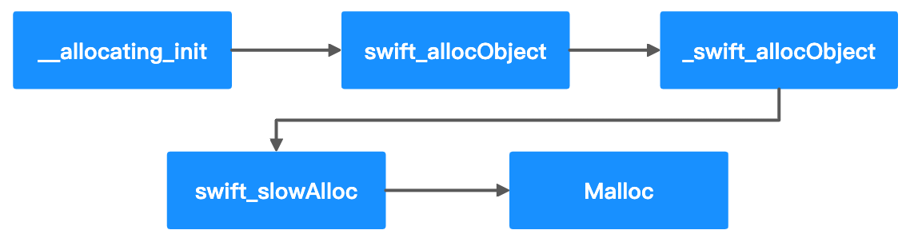

### 4.12 Swift的超类
下面代码分别输出什么？
```swift
class Person {}
class Student: Person {}

print( class_getInstanceSize(Person.self) ) // 16
print( class_getSuperclass(Student.self)! ) // Person
print( class_getSuperclass(Person.self)! ) // _TtCs12_SwiftObject
```

结论：纯Swift类，是有个共同的隐藏的基类：`Swift.SwiftObject`
这个Swift源码里也可以得到证明：
https://github.com/apple/swift/blob/master/stdlib/public/runtime/SwiftObject.h

> 完...等攒够一波，再输出第二篇...

**END。**
*我是小侯爷。*
*在帝都艰苦奋斗，白天是上班族，晚上是知识服务工作者。*
*如果读完觉得有收获的话，记得关注和点赞哦。*
*非要打赏的话，我也是不会拒绝的。*