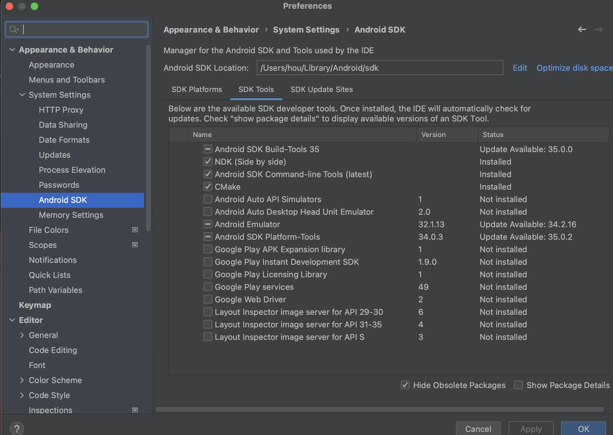

## 1.编译Godot源码for安卓

### 1.1 安装Android Studio

安装Android Studio，并配置一些必配的工具包，例如`build-tools`、`cmake`、`mdline-tools`等

<p align="center">
  
</p>


### 1.2 配置环境变量

`Godot 4.1` 以下(例如`Godot3.x`)环境变量增加`ANDROID_SDK_ROOT=<android_sdk_path>`：
```sh
# 例如在 .zshrc 文件中，增加
export ANDROID_SDK_ROOT=/path/to/Android/sdk
```

`Godot 4.1` 以上(例如`Godot4.3`)环境变量增加`ANDROID_HOME=<android_sdk_path>`：
```sh
# 例如在 .zshrc 文件中，增加
export ANDROID_HOME=/path/to/Android/sdk
```

> 设置 SDK 和环境变量后，需要重启终端。

### 1.3 Scons

进入`Godot`源码根目录：

```sh
# 查看编译支持的平台
scons platform=list

# 尝试编译
scons platform=android target=template_debug arch=arm64

# 第一次执行，可能会下载Android NDK 以及检查 Java 版本之类的。
# 如果报错，按照提示处理即可。
```

其他编译的指令：
```sh
# -j<num> 使用几个CPU核心去编译，下面是6核
# CPU打满去编译： --jobs=$(sysctl -n hw.logicalcpu)
scons platform=android target=template_debug arch=arm64 -j6

# 比如不包含 openxr 模块
scons platform=android target=template_debug arch=arm64 builtin_openxr=no -j6
```

### 1.4 so和AAR文件

编译之后，会在源码根目录`/platform/android/java/lib/libs/`目录中，生成`debug`或者`release`的`libgodot_android.so`文件。

然后需要生成`.aar`文件，进入`/platform/android/java/`目录下，执行下面的命令：
```sh
# 执行这些命令，最好翻墙，大概率会下载Gradle、NDK等

./gradlew copyDebugAARToBin
./gradlew copyReleaseAARToBin
```

这会将构建的 `AAR` 复制到 `godot/bin` 目录


```c
#if defined(IOS_ENABLED)
// iOS代码
#else

#endif // IOS_ENABLED

#if defined(ANDROID_ENABLED)
// Android代码
#else
#endif
```


# 安卓SDK路径
export ANDROID_HOME="/Users/hou/Library/Android/sdk"
export ANDROID_SDK_ROOT="/Users/hou/Library/Android/sdk"

菜鸟5
https://github.com/zhangjie960702/cainiao5
https://github.com/faithyee-89/Cainiao5-Kotlin


Godot4的口袋工厂SDK对接
https://github.com/Abab-bk/FlowerAD


编译godot for android
https://docs.godotengine.org/zh-cn/4.x/contributing/development/compiling/compiling_for_android.html
https://docs.godotengine.org/zh-cn/3.5/development/compiling/compiling_for_android.html


为Windows和Android平台编译Godot
https://blog.csdn.net/feiyunw/article/details/121861944

Android Studio¶ 导入项目¶
https://docs.godotengine.org/zh-cn/4.x/contributing/development/configuring_an_ide/android_studio.html


【Godot教程】4.2版本的v2安卓插件开发流程

https://www.bilibili.com/video/BV1rC4y1v7g1/?spm_id_from=333.337.search-card.all.click&vd_source=3be0b4b7dfb83b2e6f32cd3467e19aca


让你的Android 应用内嵌上 Godot 游戏，香不香

https://www.bilibili.com/video/BV1T64y197EU/?spm_id_from=333.337.search-card.all.click&vd_source=3be0b4b7dfb83b2e6f32cd3467e19aca


https://www.bilibili.com/video/BV1vh41167pP/?spm_id_from=333.788.recommend_more_video.0&vd_source=3be0b4b7dfb83b2e6f32cd3467e19aca

Android打包-java环境搭建-生成apk文件-godot4.x-232-236

https://www.bilibili.com/video/BV1we4y1E7Em/?spm_id_from=333.337.search-card.all.click&vd_source=3be0b4b7dfb83b2e6f32cd3467e19aca


实践_godot_android_插件
https://www.bilibili.com/video/BV15v421i79F/?spm_id_from=333.337.search-card.all.click

https://www.bilibili.com/video/BV1pz421f7mx/?spm_id_from=333.337.search-card.all.click


