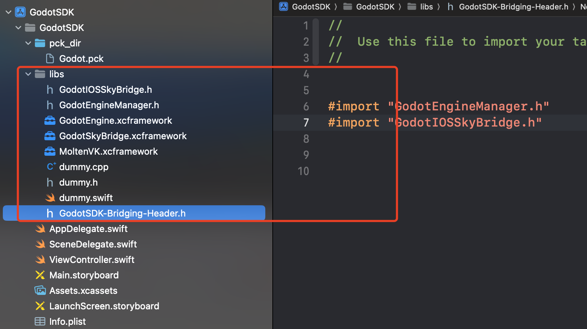

## 1.Compile the `.a` file
去`GitHub`下载对应`Releases`的包

本文下载的是：
[**4.1.3-stable.zip**](https://github.com/godotengine/godot/archive/refs/tags/4.1.3-stable.zip)

下载之后，解压。

```shell
$ cd godot-4.1.3-sdk  # 进入解压godot源码根目录
$ scons platform=list  # 查看支持的编译平台

$ scons list  # 这是一个错误指令，但是会输出当前的编译环境信息
scons: Reading SConscript files ...
Automatically detected platform: macos
Auto-detected 12 CPU cores available for build parallelism. Using 11 cores by default. You can override it with the -j argument.
Building for macOS 10.13+.
MoltenVK found at: /Users/hou/VulkanSDK/1.3.250.1/MoltenVK/MoltenVK.xcframework/macos-arm64_x86_64/
Building for platform "macos", architecture "x86_64", target "editor".
Checking for C header file mntent.h... no
scons: done reading SConscript files.
scons: Building targets ...
[Initial build] scons: *** Do not know how to make File target `list' (/Users/hou/Desktop/godot-4.1.3-sdk/list).  Stop.
scons: building terminated because of errors.
[Time elapsed: 00:00:08.372]
```

> 对于有哪些命令参数以及参数默认值，可以看源码根目录的`SConstruct`文件内容。

开始编译：
```shell
# -j<num> 使用几个CPU核心去编译，下面是6核
$ scons p=ios target=template_debug arch=arm64 builtin_openxr=no -j6

# CPU打满去编译： --jobs=$(sysctl -n hw.logicalcpu)
# 会在源码根目录，生成`bin`文件夹，生成的`.a`文件名为:
# libgodot.ios.template_debug.arm64.a
```

## 2.For SDK

Go to the following directory:
    - `/platform/ios/`

**==2.1==** 
Remove `app_delegate`，Delete the following files，删除的文件可以临时放到一个地方，后面可能需要复制里面的代码:

```
app_delegate.h
app_delegate.mm

godot_app_delegate.h
godot_app_delegate.m
```

**==2.2==** 
Rename the `controller` name，防止跟别人项目里重名:

```
view_controller.h
view_controller.mm

ViewController -> GodotEngineViewController
```

**==2.3==** 
Remove `main.m`
```
platform/ios/main.m
```

**==2.4==** 
Add File `GodotEngineManager`

```
GodotEngineManager.h
GodotEngineManager.mm
```

处理适配`GodotEngineManager.mm`里面的方法实现，主要是`godot_ios.mm`里面的`main`方法

```objc
int ios_main6() {
    NSString *appPath = [NSBundle mainBundle].bundlePath;
    char *fargv[64];
    fargv[0] = (char *)[appPath cStringUsingEncoding:NSUTF8StringEncoding];
    fargv[1] = (char *)"--path";
    fargv[2] = (char *)"godot_project";
    
    os = new OS_IOS();

    // We must override main when testing is enabled
    int argc = 3;
    char **argv = fargv;
    TEST_MAIN_OVERRIDE

    Error err = Main::setup(fargv[0], 2, &fargv[1], false);

    if (err == ERR_HELP) { // Returned by --help and --version, so success.
        return 0;
    } else if (err != OK) {
        return 255;
    }

    os->initialize_modules();

    return 0;
}
```

为了在`GodotEngineManager.mm`里引用，还新建了`godot_ios.h`文件，为了暴露`int ios_main6()`方法。

**==2.5==** 

改造`view_controller.mm`：
 - `Controller`生命周期
 - 删除`godotLoadingOverlay`

改造`os_ios.mm`
 - 移除`AppDelegate`引用
 - 改成`GodotEngineManager`引用

改造`ios.mm`
 - 移除`AppDelegate`引用
 - 改成`GodotEngineManager`引用

改造`display_server_ios.mm`
 - 移除`AppDelegate`引用
 - 改成`GodotEngineManager`引用

**==2.6==** 

添加文件`engine_manager_cpp`
```
engine_manager_cpp.h
engine_manager_cpp.mm

# fix
/core/config/project_settings.cpp

```

**==2.7==** 
处理`/platform/ios/SCsub`文件，将添加的文件加到里面

**==2.8==**
如果在`/platform/ios/api/api.cpp `里面提前把通信桥给加进去，集成反而就简单了一步骤
例如`api.h`内容：
```c
#ifndef IOS_API_H
#define IOS_API_H

#if defined(IOS_ENABLED)
extern void godot_ios_plugins_initialize();
extern void godot_ios_plugins_deinitialize();

extern void godot_iosbridge_init();
extern void godot_iosbridge_deinit();
#endif

void register_ios_api();
void unregister_ios_api();

#endif // IOS_API_H
```

`api.cpp`内容：
```c
#include "api.h"

#if defined(IOS_ENABLED)

void register_ios_api() {
	godot_ios_plugins_initialize();
    godot_iosbridge_init();
}

void unregister_ios_api() {
	godot_ios_plugins_deinitialize();
    godot_iosbridge_deinit();
}

#else

void register_ios_api() {}
void unregister_ios_api() {}

#endif // IOS_ENABLED
```


**==2.9==** 
编译一下试试，看看是否有遗漏或者报错的地方


## 3.xcframework
编译之后，进入`bin`目录，会生成一个`.a`文件
```sh
$ cd bin
$ ls
libgodot.ios.arm64.a
$ xcodebuild -create-xcframework -library libgodot.ios.arm64.a -output GodotEngine.xcframework

```

## 4.Use SDK

### 4.1 引入SDK



上图里，新建了一个名为`GodotSDK`的空iOS工程，选择的`Swift`开发语言和`storyboard`，最低支持`iOS 13`.

然后新建了`libs`文件，将图中的文件拖进去即可。
- `MoltenVK.xcframework`和`dummy.x`文件可以从Godot工程随便导出一个iOS工程里面拿到。
  
在OC为基础的项目中，可以将`AppDelegate.m`改名为`AppDelegate.mm`来省去`dummy.cpp`文件。
在Swift项目中，直接增加`dummy.cpp`文件即可。

> 注意在`AppDelegate.m`或`AppDelegate.swift`里面，实现一个`window`方法，目前引擎源码里可能有地方在调用，暂未找到调用的地方，例如
```swift
var window: UIWindow? {
    set { }
    get {
        var twindow: UIWindow?
        if #available(iOS 13, *) {
            if #available(iOS 15, *) {
                twindow = UIApplication.shared.connectedScenes
                            .map({ $0 as? UIWindowScene })
                            .compactMap({ $0 })
                            .first?.windows.first
            } else {
                twindow = UIApplication.shared.windows.first
            }
        } else {
           twindow = UIApplication.shared.keyWindow
        }
        return twindow
    }
}
```

### 4.2 初始化引擎

在App启动后，比如`AppDelegate`里面或者，即将使用3D空间之前，或者下载好3D资源之后，再初始化引擎。

> 初始化引擎的前提是，已下载好`Godot`导出的`pck`或者`zip`文件。


