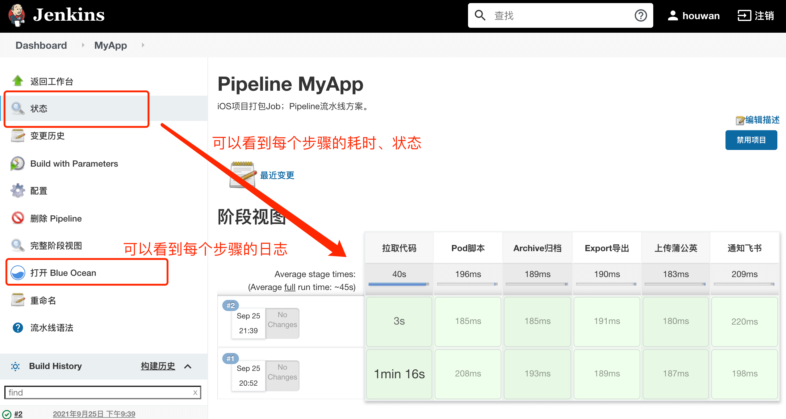
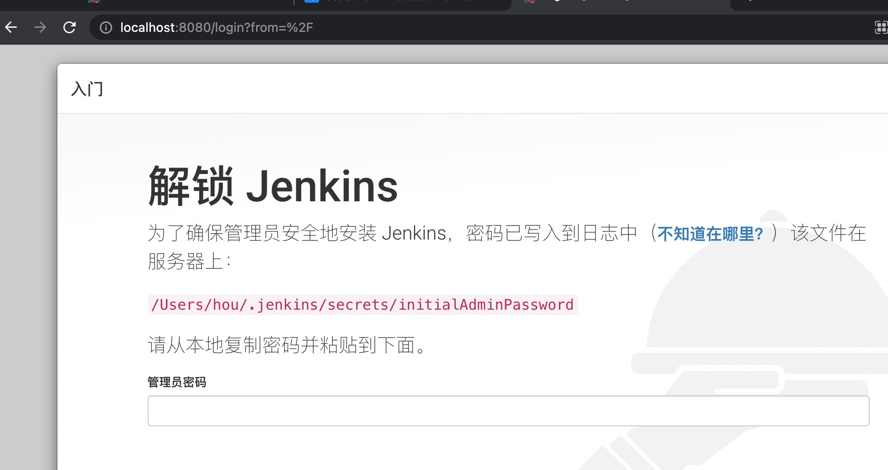
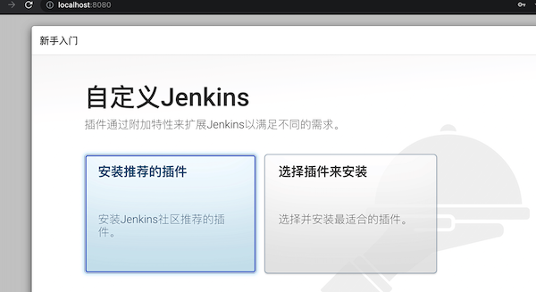
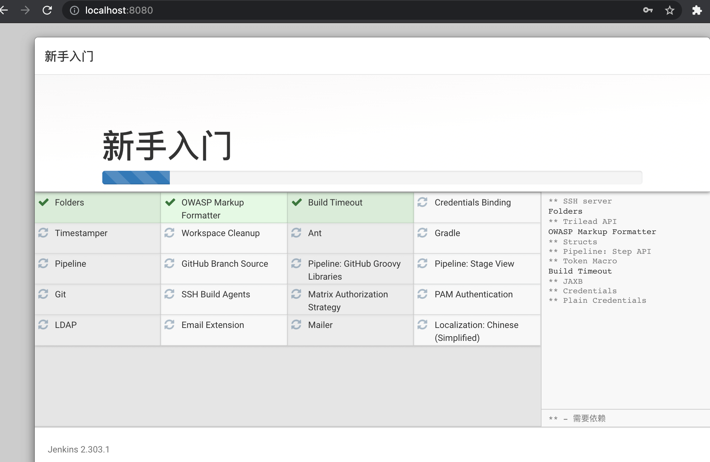
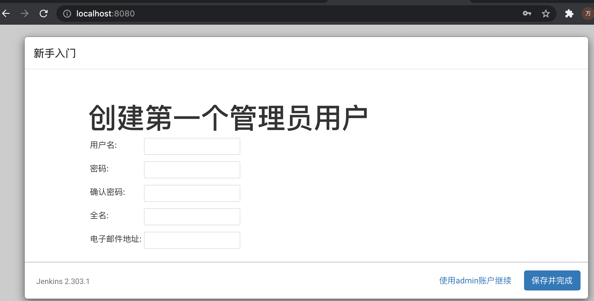
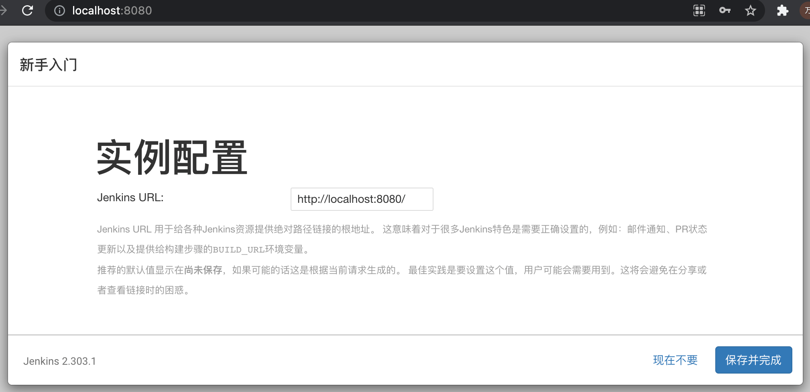
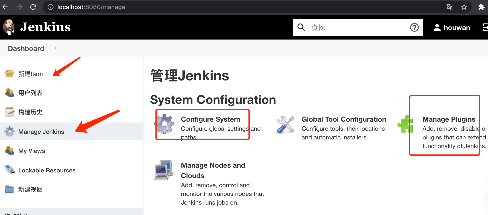
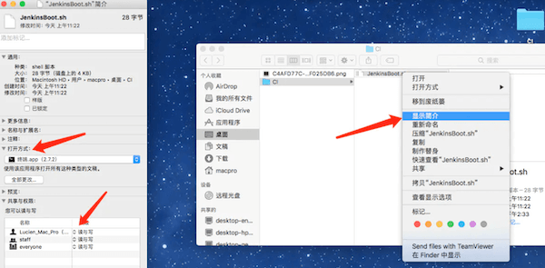

iOS使用Jenkins的Pipeline持续集成


## 一、前言

### 1.1 iOS打包经历

对于iOS打包，不管是给测试还是上传到 App Store，自己大致经历过下面的阶段：

- 1.在Xcode里面，点击 Product -> Archive，等待整个工程 Archive 后，然后在自动弹出的 Organizer 中进行选择，根据需要导出 Ad hoc，App Store等类型的 ipa 包。

- 2.自己封装`xcodebuild`命令的脚本，可能是`Python`或者`Shell`，打包直接运行脚本即可。

- 3.后来开始使用优秀的`fastlane`自动化工具集。

- 4.不管是自己写脚本还是`fastlane`，都是命令行工具，将这封装成Mac App进行图形化操作，不过后来感觉挺折腾的，测试和开发都得装这套工具和Mac App

- 5.使用Jenkins管理，创建对应的Job，使用对应的插件，方便了很多。

- 6.因为使用的是Jenkins的插件，想精细化的控制打包过程，就不好操作，比如想知道每一步的耗时就不方便，经过调研，就想到了使用`Pipeline`进行步骤的控制

### 1.2 打包需求

随着项目越来越大，打包时间也越来越长，如果在打包某个步骤出现异常，就得重新来一遍，特别耗时、也不能清晰看到具体哪一步了。整个打包流程，大致可以分为：
- 1.Git拉取代码
- 2.执行`Pod install`脚本
- 3.编译归档`xcodebuild archive`
  - 3.1 一般会先`xcodebuild clean`
- 4.导出ipa`xcodebuild -exportArchive`
- 5.处理`dSYMs`文件和`ipa`文件，比如上传到蒲公英
- 6.通知开发和测试

现在的需求就是：
- 1.打包时，可以随时知道当前到上面哪一步了；
- 2.打包失败了，会自动重试，并且不必从头开始；
- 3.打包之后，获取上面6大步骤的耗时报告；
- 4.打包之前，可以方便选择Git分支

所以就有了使用Jenkins的`Pipeline`进行持续集成，最终的效果如下图：




### 1.3 Pipeline脚本

Pipeline脚本有2种写法，声明式和Groovy脚本式，经过调研我建议如下：
- 1.总体声明式
- 2.声明式里包含Groovy脚本式处理复杂的条件
- 3.使用`shell`和`Python`处理每个步骤的任务
  - 3.1 `shell`和`Python`通过JSON和Groovy脚本通信

### 1.4 参考文章
- [Jenkins的Pipeline脚本在美团餐饮SaaS中的实践](https://tech.meituan.com/2018/08/02/erp-cd-jenkins-pipeline.html)
- [Jenkins进阶和精通视频教程](https://www.idevops.site/index)
- [Jenkins教程文档](http://docs.idevops.site/jenkins/)
- [Jenkins实践文档](https://github.com/zeyangli)

## 二、Mac安装

Jenkins的官网是：
https://www.jenkins.io/

依赖的东西：
- `Java`环境
- `brew`包管理（如果使用这种方式）
- `Git`

### 2.1 安装`Java`环境
去Oracle官网安装，Jenkins是需要Java8的。下载地址是：
https://www.oracle.com/java/technologies/downloads/

我这次下载的是Java11版本。安装之后的效果是：
```shell
$ java --version
java 11.0.12 2021-07-20 LTS
Java(TM) SE Runtime Environment 18.9 (build 11.0.12+8-LTS-237)
Java HotSpot(TM) 64-Bit Server VM 18.9 (build 11.0.12+8-LTS-237, mixed mode)
```

### 2.2 安装Jenkins
Jenkins的安装方式有很多，下面是Jenkins官网的安装介绍：
https://www.jenkins.io/zh/doc/book/installing/

这里选择`brew`的方式安装：

安装最新版本：
```shell
brew install jenkins
```

安装 LTS 版本(推荐)
```shell
brew install jenkins-lts
```

当前`brew`的版本是：
```shell
$ brew --version
Homebrew 3.2.12
Homebrew/homebrew-core (git revision 7c474ba2ee; last commit 2021-09-18)
```

安装完之后，会有提示信息：
```shell
🍺  /usr/local/Cellar/openjdk@11/11.0.12: 679 files, 297.9MB
==> Installing jenkins-lts
==> Pouring jenkins-lts--2.303.1.all.bottle.tar.gz
==> Caveats
Note: When using launchctl the port will be 8080.

To start jenkins-lts:
  brew services start jenkins-lts
Or, if you don't want/need a background service you can just run:
  /usr/local/opt/openjdk@11/bin/java -Dmail.smtp.starttls.enable=true -jar /usr/local/opt/jenkins-lts/libexec/jenkins.war --httpListenAddress=127.0.0.1 --httpPort=8080
==> Summary
🍺  /usr/local/Cellar/jenkins-lts/2.303.1: 8 files, 72.3MB
==> Caveats
==> jenkins-lts
Note: When using launchctl the port will be 8080.

To start jenkins-lts:
  brew services start jenkins-lts
Or, if you don't want/need a background service you can just run:
  /usr/local/opt/openjdk@11/bin/java -Dmail.smtp.starttls.enable=true -jar /usr/local/opt/jenkins-lts/libexec/jenkins.war --httpListenAddress=127.0.0.1 --httpPort=8080
```

从提示信息可以得出：
```shell
# 启动jenkins
$ brew services start jenkins-lts
# 不带后台任务的启动
$ /usr/local/opt/openjdk@11/bin/java -Dmail.smtp.starttls.enable=true -jar /usr/local/opt/jenkins-lts/libexec/jenkins.war --httpListenAddress=127.0.0.1 --httpPort=8080
# 安装信息
/usr/local/Cellar/jenkins-lts/2.303.1: 8 files, 72.3MB
```

## 三、配置
开始之前，建议阅读一遍官网的安装配置介绍：
https://www.jenkins.io/zh/doc/book/installing/

几篇不错的安装和配置过程：
- [mac 进行Jenkins + gitlab + fir + shell 自动化打包持续集成(针对ios)](https://www.jianshu.com/p/c0d69bfaf449)
- [Mac Jenkins的安装和使用（一）](https://www.jianshu.com/p/897b9a8fb210)
- [Mac环境下如何配置Jenkins](https://www.jianshu.com/p/b4efe5a3b442)


### 3.1 初始化配置
使用`brew`安装之后，按照提示，启动Jenkins服务：
```shell
# 启动Jenkins服务
$ brew services start jenkins-lts
# 执行命令之后，输出内容是：
==> Tapping homebrew/services
Cloning into '/usr/local/Homebrew/Library/Taps/homebrew/homebrew-services'...
remote: Enumerating objects: 1434, done.
remote: Counting objects: 100% (313/313), done.
remote: Compressing objects: 100% (228/228), done.
remote: Total 1434 (delta 121), reused 241 (delta 79), pack-reused 1121
Receiving objects: 100% (1434/1434), 423.60 KiB | 1.27 MiB/s, done.
Resolving deltas: 100% (597/597), done.
Tapped 1 command (35 files, 523.3KB).
==> Successfully started `jenkins-lts` (label: homebrew.mxcl.jenkins-lts)
```

1.启动成功，浏览器输入`http://localhost:8080/`长这样子：

需要输入**管理员密码**，不过已经提示密码的在哪里了，安装红色提示输入即可。

这里可以直接命令查看即可，比如上图中的：
```shell
$ cat /Users/hou/.jenkins/secrets/initialAdminPassword
```

2.来到插件初始化页面，直接推荐安装即可，反正后面可以卸载和安装。


推荐安装插件-->开始下载和安装：



3.安装插件之后，会自动来到管理员账号页面：


```
name: houwan
pwd: hou1234
email: 136557493@qq.com
```

4.点击继续，来到**实例配置**页面：

这里填写的是`http://localhost:8181/`，不过后面发现，如果对公网开放的话，这里好像不用管，也可以在Jenkins管理里面修改。

5.完事就进入了 Jenkins 的主页，可以管理和创建Job了，当然也有插件的管理。


### 3.2 开机自启动Jenkins
1.创建shell脚本：
```shell
# 使用 brew 开启动jenkins服务
brew services start jenkins-lts
# 其实也可以查看 jenkins-lts 的介绍：
# jenkins-lts --help

# 直接执行下面的命令也是开启Jenkins服务的
# jenkins-lts

# 相应的，使用了brew services管理服务的一些常见命令
# brew services --help
# brew services list
# brew services start xxx
# brew services stop xxx
# brew services restart xxx

# 具体 brew services 原理，搜索 launchctl 即可
# https://www.cnblogs.com/gujiande/p/9359184.html
```

2.设置打开方式与读取权限，如图:


3.增加执行权限
```shell
# 注意路径
chmod +x /Users/macpro/Desktop/CI/JenkinsBoot.sh
```

4.加入用户登录项：系统偏好设置->用户与群组->登录项，把`JenkinsBoot.sh`加入并打钩。

### 3.3 Jenkins插件
Jenkins插件比较容易出问题，插件之间一般有版本依赖问题，如果某个插件版本出现问题，可能造成其他插件不好使，可以从下面的网址，下载对应的插件版本：
http://updates.jenkins-ci.org/download/plugins/

### 3.4 几个必装的Jenkins插件
在开始创建Job之前，需要先安装好下面几个插件：(可以先搜索一下，有的Jenkins可能已经帮你安装了，注意下面插件的顺序)
- Git plugin
- SSH Credentials Plugin
- Pipeline
- Pipeline: Build Step
- Pipeline: Declarative
- Blue Ocean
- i18n for Blue Ocean
- Timestamper
- Xcode integration

### 3.5 Git凭证
在创建Job之前，需要先配置Git凭证，如下图：


参考链接：
https://www.cnblogs.com/jingmu/articles/11062852.html


## 四、开始Pipeline

开始之前，最好认真阅读一遍官方的教程：
整体：https://www.jenkins.io/zh/doc/
语法：https://www.jenkins.io/zh/doc/book/pipeline/syntax

Pipeline:
- Jenkins的Pipeline通过`Jenkinsfile`进行描述（类似于Dockerfile）
- `Jenkinsfile`是Jenkins的特性（pipeline as code）
- Pipeline是Jenkins的核心功能，提供一组可扩展的工具。
- 通过Pipeline的DSL语法可以完成从简单到复杂的交付流水线实现。

Jenkinsfile:
- 有2种书写方式：declarative pipeline 声明式 和 scripted pipeline 脚本式
- 声明式是jenkins流水线更友好的特性。
- 脚本式的流水线语法，提供更丰富的语法特性。
- 声明式里面也可以嵌入脚本式。

Pipeline演示:
一条流水线通过`Jenkinsfile`描述，`Jenkinsfile`文件组成，其每个部分的功能含义是：
- 使用`agent{}`，指定node节点/workspace（定义好此流水线在某节点运行）
- 指定`options{}`运行选项（定义好此流水线运行时的一些选项，例如输出日志的时间）
- 指定`stages{}`（stages包含多个`stage`，stage包含`steps`。是流水线的每个步骤)
- 指定`post{}`（定义好此流水线运行成功或者失败后，根据状态做一些任务）

```groovy
#!groovy
String workspace = "/opt/jenkins/workspace"

pipeline {
    // 指定运行此流水线的节点
    agent { 
        node { 
          label "master"  // 指定运行节点的标签或者名称
          customWorkspace "${workspace}"  // 指定工作目录（可选）
        } 
    }
    
    options {
        timestamps()  // 日志会有时间
        timeout(time: 1, unit: 'HOURS')  // 流水线超时时间
        disableConcurrentBuilds()  // 禁止并行
    }

    // 流水线的阶段，一个或者多个
    stages {
        // 阶段1 获取代码
        stage("GetCode"){
            steps{
                script{
                    println("Git获取代码")
                }
            }
        }
        stage("Build"){
            steps{
                timeout(time: 20, unit:"MINUTES"){
                    script{
                        println("运行构建-编译")
                    }
                }
            }
        }
    }
    post {
        always {
            script{
                println("流水线结束后，经常做的事情")
            }
        }
        success {
            script{
                println("流水线成功后，要做的事情")
            }
        
        }
        failure {
            script{
                println("流水线失败后，要做的事情")
            }
        }
        aborted {
            script{
                currentBuild.description = "\n 流水线被取消"
            }
        }
    }
}
```

## 五、iOS和Pipeline

未完...


