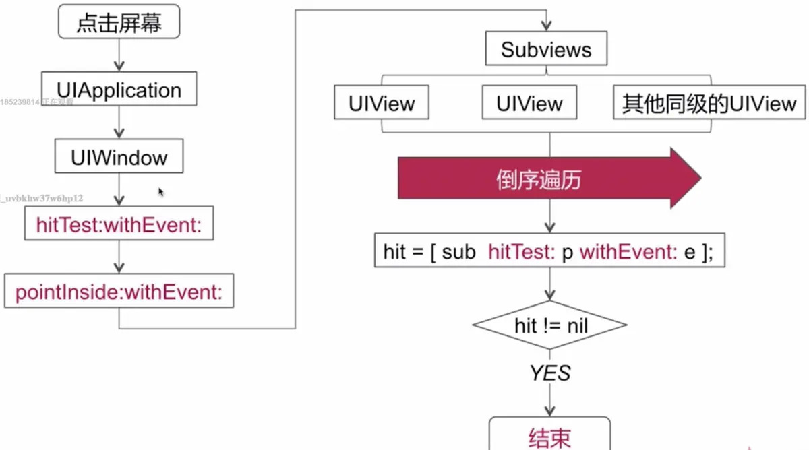
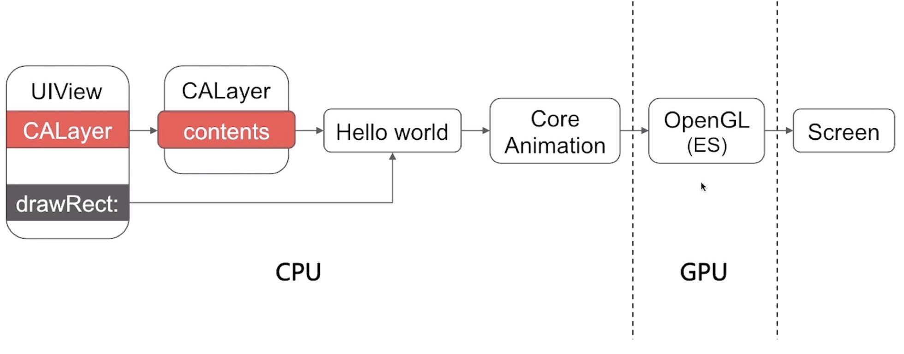
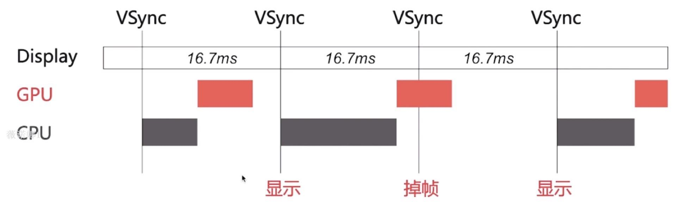
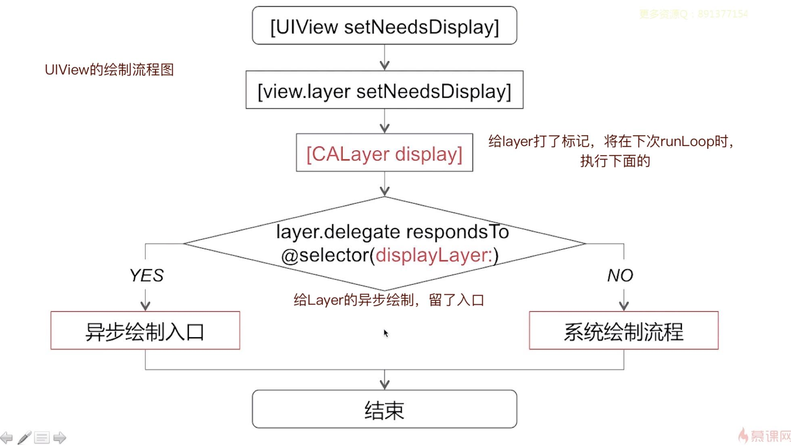

## 一.UI视图

### 1.1 UITableView相关

**A.Cell的重用机制**
`UITableView`通过重用Cell来达到节省内存，提高性能的目的，它的实现过程是，当屏幕上的Cell数量超越屏幕高度，滑动`UITableView`时，系统会将滑出屏幕外的Cell放到重用队列中，当有新的Cell即将要滑入屏幕时，就会先从重用队列中查询是否有可以重用的Cell，如果有，就拿过来用，如果没有就创建一个来使用。

*扩展*：重用机制，虽然很简单，但是日常工作中，却可以大量应用，比如模型的复用：当页面的refresh下拉刷新，我们一般是将当前dataArray清空掉，重新创建模型，但是其实我们可以新建一个缓存数组，来重复使用这些模型对象，提高内存的使用效率。

### 1.2 UI数据源同步

问题描述：在子线程网络请求的过程中，用户执行在主线程的删除操作，引发的请求网络后刷新UI而删除数据还存在的问题？

答：这个问题的本质是，多线程对数组的操作，线程同步问题，有很多解决办法。
比如`YYKit`里面使用线程安全的数组(`YYThreadSafeArray`)，它的思路是封装`NSMutableArray`，使用GCD信号量`dispatch_semaphore_t`的办法，对数组的增删等操作时进行加锁。由于读写操作都使用了同一个信号量进行控制，可以得知此方案对可变数组的多线程操作是串行的，可以保证可变数组在多线程下访问的安全。（读和写，不能同时）。

也可以使用GCD的`dispatch_barrier_async`栅栏方案实现一个多读单写的数组。实现在写入时，不能有其他操作。读取的时候可以并行读取。


总而言之，线程安全会牺牲一些性能，具体场景问题，具体分析即可。

```
线程同步问题，可以参考使用GCD，不过会降低性能。
https://www.jianshu.com/p/ac99295585a1

YYKit里面的例子`YYThreadSafeArray`:
https://www.jianshu.com/p/9082d66fff3c
```

### 1.3 UI事件源传递&响应

**A.UIView和CALayer的关系**
1.从框架来说：`CALayer`属于`QuartzCore`框架，`UIView`属于`UIKit`框架.
2.从功能来说：
- 2.1 UIView为CALayer提供内容，负责处理触摸等事件，参与响应链
- 2.2 CALayer负责显示内容contents的渲染、动画等

3.从继承关系来分析两者：UIView : UIResponder，CALayer : NSObject
4.从设计上讲，体现了设计原则里面的单一职责.

详细参考：https://www.jianshu.com/p/e5cc76bf800b

**B.UI事件传递与视图响应链**



先是事件的传递，然后是事件的响应链，两部分：
1.事件的传递：
在iOS中，能够响应事件的对象都是`UIResponder`的子类对象。
1.1 当手指操作屏幕时，会产生`UITouch`对象和`UIEvent`对象。
1.2 这两个对象产生后会被传递到`UIApplication`管理的一个事件队列中
1.3 App的`UIWindow`会在视图层次结构中找到一个最合适的View来处理触摸事件，也就是事件会从父控件传给子控件，从`UIWindow`到`UIView`的过程
1.4 事件从父控件传给子控件的过程中，关键方法是`hitTest:withEvent:`
1.5 如果没有找到合适的子view，那么就会将UIWindow作为响应者

2.开始视图响应链：
2.1 通过事件传递，找到了响应的View，判断view是否能响应处理事件，不能则继续往上`superView`
2.2 如果view的控制器存在，就传递给控制器处理；如果控制器不存在，则传递给它的父视图
2.2 在视图层次结构的最顶层，如果也不能处理收到的事件，则将事件传递给UIWindow对象进行处理
2.3 如果UIWindow对象也不能处理，则将事件传递给UIApplication对象
2.4 如果UIApplication也不能处理该事件，则将该事件丢弃

3.需要注意的几点：
3.1 事件的传递过程中，查找合适view的两个核心方法是：
``` 
hitTest:withEvent:
pointInside:withEvent:
```

3.2 在递归遍历子View的过程中，是采用的倒序遍历，最后添加的view，最先被遍历
3.3 在事件响应链中，判断判断一个对象是否能响应处理这个事件，核心方法是：`toouchXX`等几个方法。
3.4 只有继承了UIResponder的对象才能接受并处理事件，我们称之为“响应者对象”。而几个`toouchXX`方法其实就是`UIResponder`类里面的方法。

详情：https://www.jianshu.com/p/32f8c16c90ac

**B1.事件的传递和响应的区别：**
事件的传递: 是从上到下（父控件到子控件）
事件的响应: 是从下到上（顺着响应者链条向上传递：子控件到父控件)

- 1、当一个事件发生后，事件会从父控件传给子控件，也就是说由UIApplication -> UIWindow -> UIView -> initial view
   以上就是事件的传递，也就是寻找最合适的view的过程。
- 2、接下来是事件的响应。首先看initial view能否处理这个事件，如果不能则会将事件传递给其上级视图（inital view的superView）；如果上级视图仍然无法处理则会继续往上传递；一直传递到视图控制器viewController，首先判断视图控制器的根视图view是否能处理此事件；如果不能则接着判断该视图控制器能否处理此事件，如果还是不能则继续向上传递；
- 2.1（对于第二个图视图控制器本身还在另一个视图控制器中，则继续交给父视图控制器的根视图，如果根视图不能处理则交给父视图控制器处理）；一直到window，如果window还是不能处理此事件则继续交给Application处理，如果最后application还是不能处理此事件则将其丢弃
- 3、在事件的响应中，如果某个控件实现了`touchesXX`方法，则这个事件将由该控件来接受，如果调用了`[super touchesXX]`;就会将事件顺着响应者链条往上传递，传递给下一个响应者；接着就会调用下一个响应者的`touchesXX`方法

如何做到一个事件多个对象处理：
因为系统默认做法是把事件上抛给父控件，所以可以通过重写自己的`touches`方法和父控件的`touches`方法来达到一个事件多个对象处理的目的。
```objc
- (void)touchesBegan:(NSSet *)touches withEvent:(UIEvent *)event {
    // 1.自己先处理事件...
    NSLog(@"do somthing...");
    // 2.再调用系统的默认做法，再把事件交给下一个响应者处理
    [super touchesBegan:touches withEvent:event];
}
```


**C.应用圆形按钮 | 只响应部分区域等**
代码省略，思路的核心是下面2个方法：
```
hitTest:withEvent:
pointInside:withEvent:
```

### 1.4 UI卡顿&掉帧原因

**A.iOS图像显示原理**


**GPU渲染机制**：CPU 计算好显示内容提交到 GPU，GPU 渲染完成后将渲染结果放入帧缓冲区，随后视频控制器会按照 VSync 信号逐行读取帧缓冲区的数据，再经过数模转换后传递给显示器显示：

CPU的工作过程：
1.Layout(UI布局、文本计算)
2.Display(绘制, draw方法)
3.Prepare(图片解编码)
4.Commit(提交位图)

GPU的渲染管线处理过程：
1.顶点着色，2.图元装配，3.光栅化，4.片段着色，5.片段处理

https://www.jianshu.com/p/c1bd4e49455d
https://www.jianshu.com/p/91d5cf01187c?utm_campaign=hugo

CPU/GPU向`Buffer`(Frame Bufffer帧缓存区)中生成图像，屏幕从`Buffer`中取图像，刷新后显示。

> 这是一个典型的 **生产者-消费者** 模型。

帧率就是GPU每秒生成的图片(向帧缓存区)，刷新率就是屏幕的刷新率，帧率和刷新率一致就会不卡顿。

**B.iOS掉帧原因**


GPU 通常有一个机制叫做垂直同步V-Sync，VSync信号以固定的时间间隔获取帧缓存区的内容并显示到屏幕上，在每一个VSync信号间隔中，CPU负责视图的创建、布局计算、图片解码、文本绘制等内容，紧接着GPU将计算好的内容进行变换、合成、渲染，随后 GPU 会把渲染结果提交到帧缓冲区去。如果在一个 VSync 时间内，CPU 或者 GPU 没有完成内容提交，则那一帧就会被丢弃，等待下一次机会再显示，而这时显示屏会保留之前的内容不变。这就是界面卡顿的原因。

**C.iOS掉帧优化、滑动优化方案**
https://www.jianshu.com/p/69a122f2bb80
0.先简述为什么iOS掉帧、卡顿
1.对CPU而言:
  对象的创建、调整、销毁、放子线程、重复使用
  预排班（布局计算、文本计算），放子线程(减少主线程压力，提高CPU利用率)
  预渲染（文本的异步绘制、图片的编解码）
2.对GPU而言：
  纹理渲染（减少离屏渲染，少使用透明度，合理使用圆角，阴影）
  视图混合（减少视图层级）

### 1.5 UI绘制原理&异步绘制

**A.UIView的绘制原理（过程）**


1.当调用`UIView`的`setNeedsDisplay`方法时并不会立即绘制视图，它会先调用视图所对应的的`layer`的同名方法`setNeedsDisplay`方法，相当于在当前视图上打上了个脏标记，然后在当前`runloop`将要结束时调用`CALyer`的`display`方法，最后才会进入绘制流程当中。
2.在调用`CALyer`的`display`方法时，首先会先判断是否响应`layer`的`displayLayer`代理方法，如果不响应则进入系统绘制流程，当响应时，则进入异步绘制入口。

**B.什么是异步绘制？**

异步绘制，就是可以在子线程把需要绘制的图形，提前在子线程处理好。将准备好的图像数据直接返给主线程使用，这样可以降低主线程的压力。
通过系统的`[layer.delegate displayLayer:]`这个入口来实现异步绘制。
- 代理负责生成对应的`Bitmap`位图
- 设置该`Bitmap`为`layer.contents`属性的值

其实这个方法的API注释也写的很明白了：
```objc
/* If defined, called by the default implementation of the -display
 * method, in which case it should implement the entire display
 * process (typically by setting the `contents' property). */
- (void)displayLayer:(CALayer *)layer;
```

而设置`layer.contents`属性，除了`CGImage`之外，也可以是`Core Graphics`框架绘制的位图

### 1.6 UI离屏渲染

**A.什么是离屏渲染**
离屏渲染（Off-Screen Rendering）的概念，起源于GPU，它是指GPU在当前屏幕缓冲区以外，开辟新的缓冲区进行渲染操作。与之对应的是 在屏渲染.

*在屏渲染(On-Screen Rendering)，指GPU的渲染操作是在当前显示的屏幕缓冲区中进行*

> 注：从硬件角度来说的解决办法有双重缓存(Double Buffer)，三重缓存(Triple Buffer)

**B.哪些操作会触发离屏渲染？**
1.光栅化，`layer.shouldRasterize = YES`
2.遮罩，`layer.mask`
3.圆角，需同时设置`layer.masksToBounds = YES`、`layer.cornerRadius`大于0
考虑通过 CoreGraphics 绘制裁剪圆角，或者叫美工提供圆角图片
4.阴影，`layer.shadowXXX`，如果设置了`layer.shadowPath`就不会产生离屏渲染

**C.为何要避免离屏渲染**
触发离屏渲染时，会增加GPU的工作量，可能会造成GPU和CPU的耗时，超过16.7ms，可能会导致视图的卡顿和掉帧。

**D.优化离屏渲染**
- 对于view的圆形边框,如果没有backgroundColor，可以放心使用cornerRadius来做
- 对于所有的阴影，使用`shadowPath`来规避离屏渲染
- 应用第三方库`AsyncDisplayKit`(Texture)作为主要渲染框架
- 对于图片的圆角，提前美工或者`CoreGraphics.Kit`给裁剪好圆角
- 自己管理渲染过程