## 三.Runtime相关

### 3.1 数据结构
https://www.jianshu.com/p/ce97c66027cd

**A.objc_object**
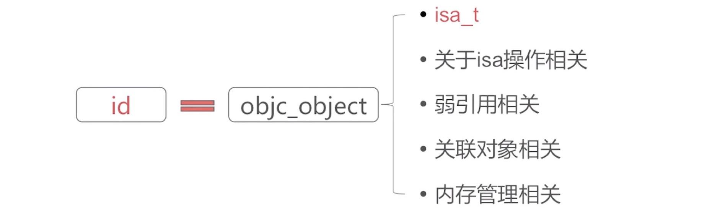

**B.objc_class**
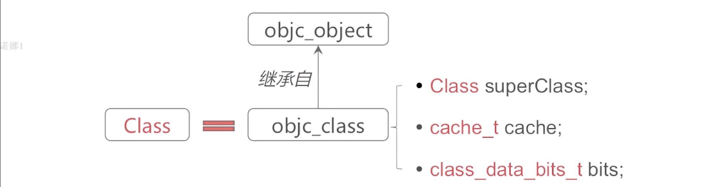

**C.isa指针**
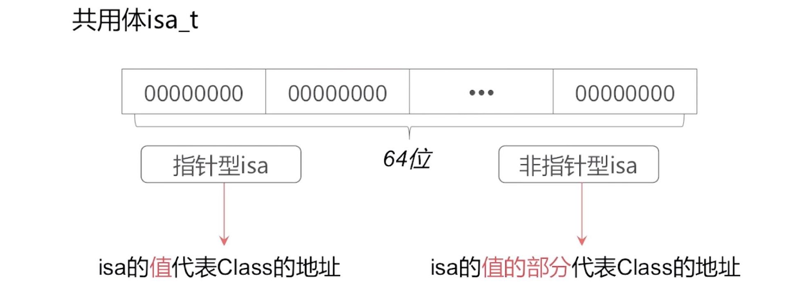

关于实例对象，isa指向类对象
  - 实例 --> isa --> Class

关于类对象，其指向元类对象
  - Class --> isa --> MetaClass

他们的代码结构示例：
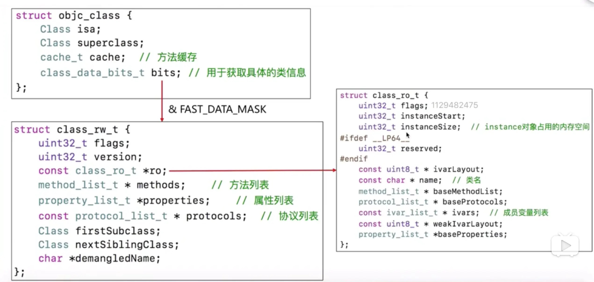

> 关于C++里面struct能继承，这点需要和Swift里面的struct区分好，在C++里面struct是可以继承、多态的，基本和class一样，区别是struct它默认的数据访问控制是public的；而class作为对象的实现体，它默认的成员变量访问控制是private的

**D.cache_t**
用于快速查找方法执行函数，是可增量扩展的哈希表结构，是局部性原理的最佳应用，结构如下(数组):

IMP就是函数指针，指向函数的实现

> 局部性原理是指访问的存储单元都趋于聚集在一个较小的连续区域中，提高查询效率

**E.class_data_bits_t**

`class_data_bits_t`主要是对`class_rw_t`的封装
`class_rw_t`代表了类相关的读写信息，是对`class_ro_t`的封装
`class_ro_t`代表了类相关的只读信息

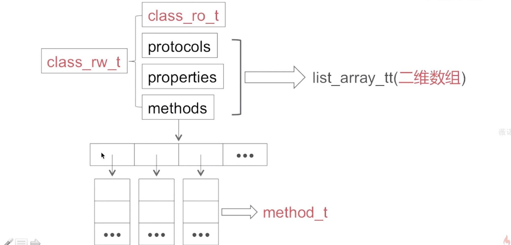

`class_ro_t`的结构：
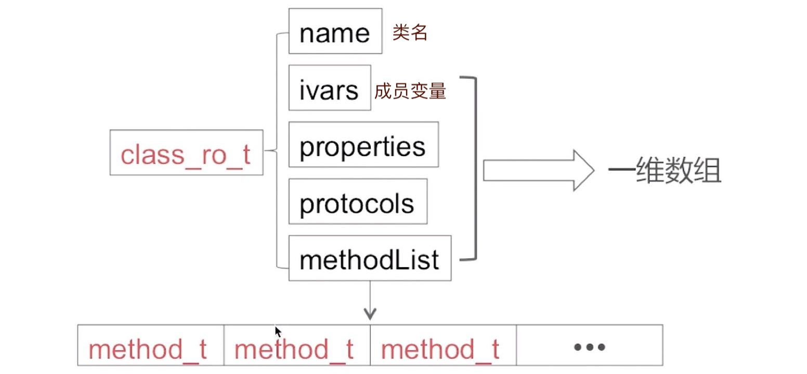

**F.method_t**
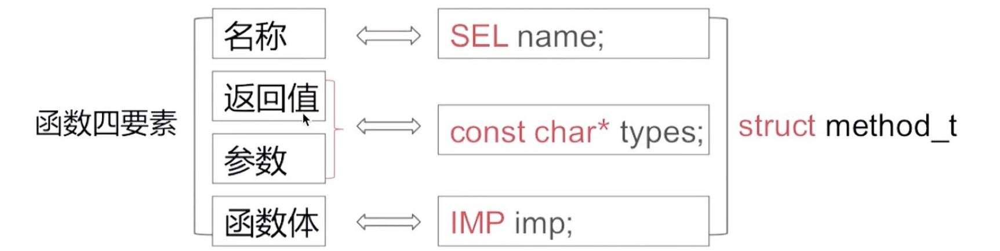

**G.Runtime关键结构体的关系图**
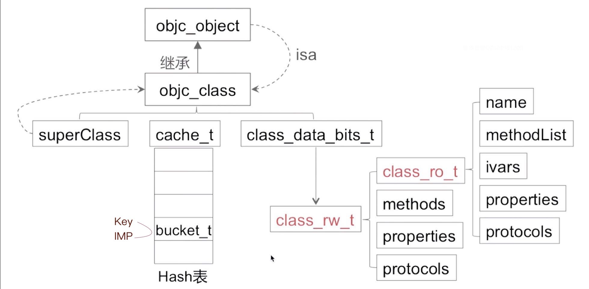

总结：
1.`isa`是一个存储了所属类的地址.

2.对于属性，我们得出了属性是由实例变量+`setter`+`getter`组成

3.`isa`的指向我们可以总结为:对象->类对象->元类->根元类->根元类。根元类继承于`NSObject`，它的`isa`指向自身.

4.在内存中，类对象与元类的存储是紧密挨在一起的.

5.`class_ro_t`是**编译期**生成的，它存储了当前类在编译期就已经确定的属性、方法以及协议，它里面是没有分类中定义的方法和协议的。

6.`class_rw_t`是在**运行时**生成的，它在`realizeClass`中生成，它包含了`class_ro_t`。它在`_objc_init`方法中关于dyld的回调的`map_images`中最终将分类的方法与协议都插入到自己的方法列表、协议列表中。它不包含成员变量列表，因为成员变量列表是在编译期就确定好的，它只保存在`class_ro_t`中。不过，`class_rw_t`中包含了一个指向`class_ro_t`的指针。

7.所有的实例方法和属性的setter、getter方法都存放在类对象的`class_rw_t`的方法列表中.

8.`class_data_bits_t`中只有一个bits，它通过哈希算法可以得到`class_rw_t`，`class_rw_t`存储了类的方法列表、属性列表、协议列表；而成员变量存放在`class_ro_t`中。实例方法存放在类对象的方法列表中，类方法存放在元类的方法列表中。

### 3.2 对象&类对象&元类对象
**类对象**存储实例方法列表等信息，它通过`isa`指针找到自己的元类对象
**元类对象**存储类方法列表等信息
**实例对象**通过`isa`指针，找到自己的**类对象**
对于任意**元类对象**，它的`isa`指针都指向根元类对象
而类对象&元类对象都是`objc_class`结构类型

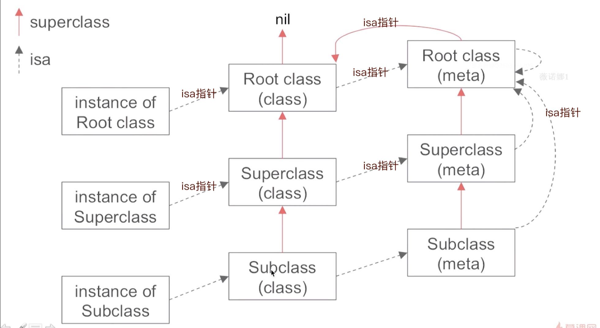

**A.请问下面输出什么?**
```c
@interface Son : Father
@end

@implementation Son
- (instancetype)init {
    if (self = [super init]) {
        NSLog(@"%@", NSStringFromClass([self class]));
        NSLog(@"%@", NSStringFromClass([super class]));
    }
    return self;
}
@end
```
https://www.jianshu.com/p/77cfb9abd453

OC代码在编译后，会变成runtime的`objc_msgSend`和`objc_msgSendSuper`；而`super`关键字会转为`objc_super`结构体，这个结构体的结构如下：
```c
struct objc_super {
    id receiver;  // 指向当前类，其实就是self
    Class superClass;  // 指向父类
}
```
首先是`[self class]`，变成`objc_msgSend`，参数1是`Son`，参数2是方法的`selector`，而方法的`selector`开始依次往上找，所以是`Son`。
其次`[super class]`，转换成`objc_msgSendSuper`的方法，参数1是`objc_super`结构体，先从结构体的`superClass`找selector，也就是Father中找`class`，没有，然后去Father的父类找，找到了，然后内部变成调用函数`objc_msgSend`了，参数1是还是Son，参数2是方法的`selector`.

啰嗦这么多，其实总结一句话：这两行调用的同一个方法，返回值肯定是一样的。

备注：
其实上面的代码，跟下面的输出结果是一样的原因：
```objc
NSLog(@"%ld", [self hash]);
NSLog(@"%ld", [super hash]);
```

**B.OC中`meta-class`指的是什么?**
当向一个对象发送一条消息的时候，运行时会在对象的类的方法列表中查找这条消息是否存在。
当向一个类发送一条消息的时候，运行时会在类的**元类**的方法列表中查找这条消息是否存在。
`meta-class`是类对象的类，每个类都有自己单独的`meta-class`。类方法函数存在`meta-class`中。
注意：所有`metaclass`中isa指针都指向根`metaclass`。而根`metaclass`则指向自身。


### 3.3 消息传递
核心方法A:
```c
void objc_msgSend(void /* id self, SEL op, ... */ )
// 比如下面的调用
[self class] // 转换为
objc_msgSend(self, @selector(class))
```

核心方法B:
```c
void objc_msgSendSuper(void /* struct objc_super *super, SEL op, ... */ )
// 关于结构体 objc_super
struct objc_super {
  /// Specifies an instance of a class.
  _unsafe_unretained id receiver;
  Class superClass;  // 指向父类
}
```

其实`super`是编译器关键字，编译后，会将super转为`objc_super`结构体，其中属性`receiver`其实就是`self`的地址(当前对象)

消息传递查找过程：
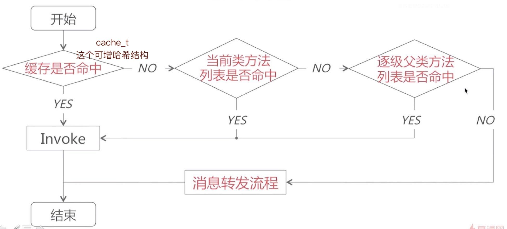

*Invoke 调用/呼吁*

1.先在本类的`cache_t`方法缓存中查找，哈希算法，命中返回`imp`
2.在当前类的method list中查找，命中返回`imp`
3.从父类中查找，重复1和2
4.依旧没有找到，进入消息转发流程
5.如果方法转发成功，万事大吉，否则崩溃报错。

> 注意：从源码中发现: 如果在父类中找到了要执行的方法，也会缓存到当前类的`cache_t`中

### 3.4 消息缓存查找

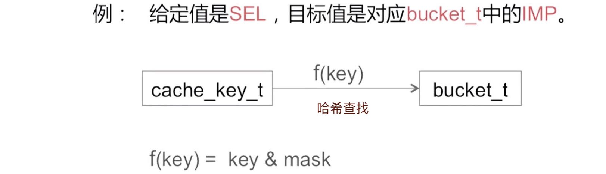

在当前类的方法列表中查找方法：
1.对于**已排序好**的列表，采用**二分查找**算法查找方法对应执行函数
2.对于**没有排序**的列表，采用**一般遍历**查找方法对应执行函数

经过上面的查找方法过程之后，没找到对应的SEL,会继续走消息转发流程(三步曲):

### 3.5 消息转发
消息转发流程：
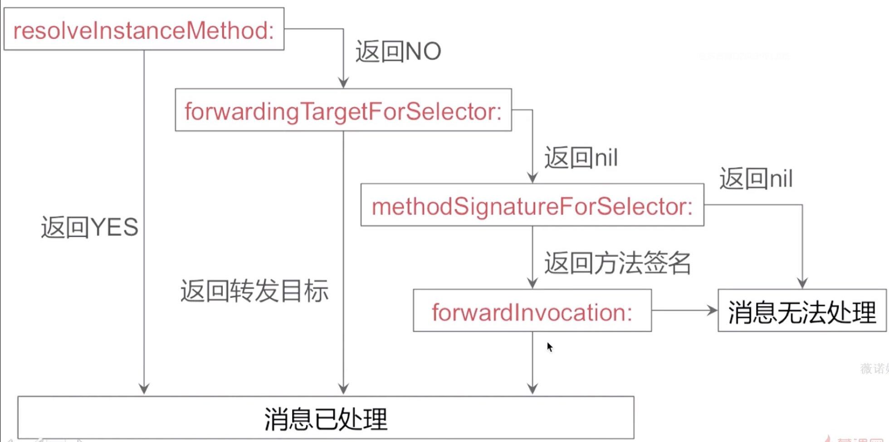

对应代码：
```c
+ (BOOL)resolveInstanceMethod:(SEL)sel {
    if (sel == @selector(test)) {
        NSLog(@"resolveInstanceMethod:");
        return NO;
    }
    return [super resolveInstanceMethod:sel];
}

- (id)forwardingTargetForSelector:(SEL)aSelector {
    if (aSelector == @selector(test)) {
        NSLog(@"forwardingTargetForSelector:");
        return nil;
    }
    return [super forwardingTargetForSelector:aSelector];
}

- (NSMethodSignature *)methodSignatureForSelector:(SEL)aSelector {
    if (aSelector == @selector(test)) {
        NSLog(@"methodSignatureForSelector:");
        // v 代表返回值是void类型  @代表第一个参数类型是id，即self
        // : 代表第二个参数是SEL类型的，即 @selector(test)
        return [NSMethodSignature 
        signatureWithObjCTypes:"v@:"];
    }
    return [super methodSignatureForSelector:aSelector];
}

- (void)forwardInvocation:(NSInvocation *)anInvocation {
    NSLog(@"forwardInvocation:");
}
```

上面就是OC动态方法决议过程：
动态方法解析`+resolveInstanceMethod:`
备用接收者`-forwardingTargetForSelector:`
完整转发和消息签名`-forwardInvocation:`

### 3.6 Method-Swizzling

**A.方法交换代码示例**
https://www.jianshu.com/p/41324b5fbdd2
https://blog.csdn.net/a17737812427/article/details/107846655
```c
+ (void)load {
    // 获取A方法
    Method a = class_getInstanceMethod(self, @selector(test));
    // 获取B方法
    Method b = class_getInstanceMethod(self, @selector(otherTest));
    // 交换两个方法的实现
    method_exchangeImplementations(a, b)
}

- (void)test {
} 

- (void)otherTest {
    [self otherTest];
} 
```

上面代码中，可以会对`otherTest`方法感到奇怪，会感觉会发死循环，其实不会，因为`test`和`otherTest`已经交换了方法实现，当调用`test()`方法时，会走到`otherTest`方法的实现，在`otherTest()`中只有调用`otherTest:`才会走到原来`test`方法的实现。

**B.方法交换的原理**
原理其实很简单，在OC里面，方法在runtime层是`objc_method`结构体，定义如下: (回忆一下方法的四要素)
```objc
typedef struct objc_method *Method;
typedef struct objc_method {
    SEL method_name;  // 方法名
    char *method_types;  // 参数类型
    IMP method_imp;  // 指向方法具体实现的函数指针
};
```

同样的，`SEL`也是一个结构体`objc_selector`，不过源码中没给出具体结构，但是通过打印，可以猜出：依据每一个方法的名字、参数序列，生成一个唯一的整型标识(Int类型的地址)，这个标识就是SEL。
```objc
- (NSInteger)maxIn:(NSInteger)a theOther:(NSInteger)b {
    return (a > b) ? a : b;
}
NSLog(@"SEL=%s", @selector(maxIn:theOther:));
// 输出：SEL=maxIn:theOther:

SEL sel1 = @selector(maxIn:theOther:);
NSLog(@"sel : %p", sel1);
// 输出：sel : 0x100002d72
```

**结论**：OC通过消息调用一个对象的方法时，首先会根据`SEL`，找到方法列表里面的`objc_method`，拿到里面的`IMP`，查找到对应方法的实现，执行方法。(注:这个是正常过程，不包含`cache_t`这种方法缓存查找)

而`method swizlling`的作用，便是修改`method`中`SEL`和`IMP`的对应关系(IMP函数指针指向)，

> 注意：Method-Swizzling黑魔法，在架构层可以适当使用，但是业务层最好禁止使用，

### 3.7 动态添加方法

**A.动态添加方法示例**
```c
// 添加方法的实现
void testIMP (void) {
    NSLog(@"testIMP invoke");
}

// 动态添加方法的函数
class_addMethod(self, @selector(test), testImp, "v@:")
```

### 3.8 动态方法解析

1.动态运行时语言，将函数决议推迟到运行时。
2.编译时语言在编译期进行函数决议。

OC的动态性，表现在：
1.动态类型。 如id类型，运行时决定接收者。
2.动态绑定。让代码在运行时判断需要调用什么方法，而不是在编译时。
3.动态载入。让程序在运行时添加代码模块以及其他资源。用户可以根据需要加载一些可执行代码和资源，而不是在启动时就加载所有组件。可执行代码中可以含有和程序运行时整合的新类。

> Python也是动态语言，跟OC有相似的地方。纯Swift是强类型、静态语言

**A.[obj foo]和objc_msgSend()函数之间有什么关系?**
一个OC编写的调用方法，在经过编译之后，就会变成`objc_msgSend()`函数的调用，开始了runtime的消息传递调用过程.

**B.runtime如何通过Selector找到对应的IMP地址?**
Runtime的消息传递机制的过程，先查找当前类的缓存`cache_t`，缓存命中返回IMP地址，否则查找当前类的方法列表，遍历命中则返回IMP地址，否则通过当前的类的`superClass`指针，逐级查找父类的方法缓存`cache_t`和方法列表。

备注1：对于已排序的方法列表，采用二分法查找；对于未排序的方法列表，采用一般遍历查找。
备注2：方法列表数组里，装的是`objc_method`类型，里面有`IMP`属性（回忆一下方法四要素)

**C.能否向编译后的类中增加实例变量**
编译后的类，不能增加实例变量。不过动态添加的类，是可以动态增加实例变量的。

因为编译后的类已经注册在Runtime中，类结构体中的`objc_ivar_list`实例变量的链表和`instance_size`实例变量的内存大小已经确定，所以不能向存在的类中添加实例变量。

运行时创建的类是可以添加实例变量，调用`class_addIvar`函数。但是得在调用`objc_allocateClassPair`之后，`objc_registerClassPair`之前，原因同上。