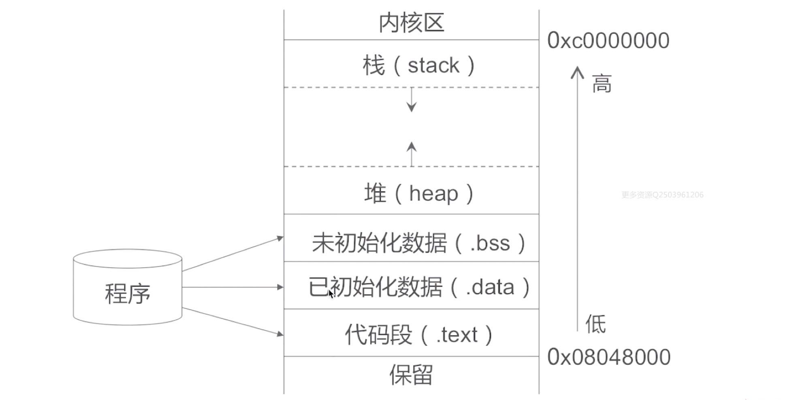
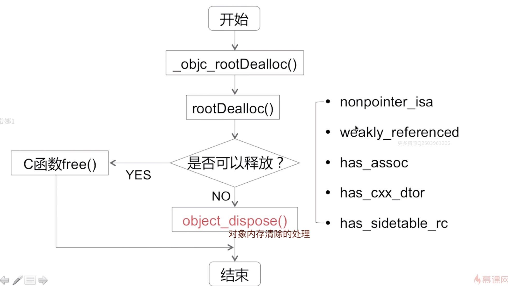
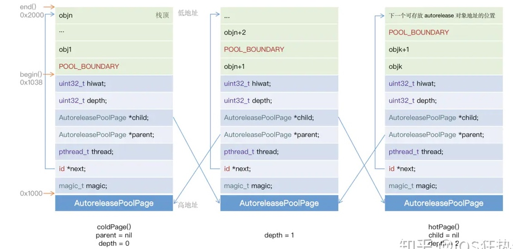

## 四.内存管理

### 4.1 内存布局
iOS的内存整体布局:


栈(stack): 方法调用
堆(heap): 通过`alloc`、`copy`等分配的对象
bss: 未初始化的全局变量
data: 已初始化的全局变量等
text: 程序代码

**代码区**：存放程序的二进制代码(即CPU执行的机器指令)，并且是只读的。
**数据区**：分为常量区和静态区。
 - 常量区：存放常量(程序在运行的期间不能够被改变的量，例如: 10，字符串常量”abcde”
 - 静态区：静态变量和全局变量的存储区域是一起的，一旦静态区的内存被分配, 静态区的内存直到程序全部结束之后才会被释放

**堆区**：由程序调用`malloc()`函数来主动申请的，需使用`free()`函数来释放内存
**栈区**：存放函数内的局部变量，形参和函数返回值。栈区之中的数据的作用范围过了之后，系统就会回收自动管理栈区的内存。

### 4.2 内存管理方案
https://www.jianshu.com/p/f683ada6d304

iOS在内存管理方案，大体有三种：
- TaggedPointer (一些系统的小对象，比如`NSNumber`，为了内存优化，简单理解为披着对象的值类型，其指针的值不再是地址，而是真正的值。)
- NONPOINTER_ISA (64位架构下的iOS对象方案)
- 散列表(弱引用表 & 引用计数表等)

*TaggedPointer: 已标记的指针*

> 并不是对象的引用计数都直接存储在引用计数表RefcountMap中的， 而是对象的引用计数溢出时，才会移到引用计数表中。

散列表是`SidTables()`结构，包含N个`SidTable`结构，每个`SidTable`包含三部分:
- `spinlock_t`  自旋锁，用于上锁/解锁SideTable
- `RefcountMap`  引用计数表，是一个哈希表
- `Weak_table_t` 弱引用表，是一个哈希表，是OC中`weak`功能实现的核心数据结构

**A:为什么散列表要设计成包含很多个小`SidTable`而不是一个大表？**
答: 因为假如都放在一个大表中，当操作一个对象的引用计数时，可能是在不同的线程中，就得给表数据加锁，造成严重的效率问题。对此苹果引用了**分离锁**的概念，就可以可以并发操作多个对象的引用计数。

### 4.3 数据结构
**A.spinlock_t自旋锁**
`spinlock_t`自旋锁，是"忙等"的锁，只的是如果当前锁已被其他线程获取，当前线程就会不停探测是否已被释放。自旋锁适用于轻量访问。

*spin: 旋转/转动*

**B.引用计数表是通过什么实现的？**
通过hash表来实现的。通过hash表来实现的目的是提高查找效率，提高效率的原因是因为插入、和查找都是通过同一个哈希函数得到的内存地址值。

备注：
1.`retainCount`获取的引用计数值要比对象的真实值多1，最小为1。
2.`alloc`的对象引用计数为0。

https://www.jianshu.com/p/17817e6efaf5
https://www.jianshu.com/p/0ecd91dc34aa

### 4.4 ARC和MRC
MRC：手动引用计数
ARC：自动引用计数
ARC是编译器LLVM(编译器)在合适的位置，自动为我们插入`retain`和`release`操作，还需要和Runtime共同协作的结果。

*retain：保持,拥有*

### 4.5 引用计数
`alloc`实现:
经过一系列调用，最终调用了C函数的`calloc`.此时并没有设置引用计数为1.为什么此时调用`retainCount`返回1，是因为获取引用计数时，源码显示，变量初始化为了1。

`retain`实现：
找到`SideTables()`中引用计数的表（2次哈希查找），增加1，并重写赋值到`SideTables()`

`release`实现：
和`retain`正好相反。

`dealloc`实现：


*备注，对象在哪个线程销毁的，就会在哪个线程调用dealloc，并不一定是在主线程dealloc*

**A.当为使用关联对象的技术给类添加实例变量，那么在对象的dealloc方法中，是否有必要对它的关联对象进行移除操作?**
答: 不需要，因为从dealloc内部源码中可以得知，它会自动判断对象是否有关联对象，有的话就会调用移除操作，所以不需要程序员手动移除。

**B.为什么weak属性，会在引用计数为0的时候，自动置为nil?**
答: 当对象被废弃之后，dealloc方法的内部实现中，会调用清除弱引用的方法，而在这个清除弱引用的方法中，会通过哈希算法，来查找被废弃对象在弱引用表中的位置，来提取它的弱引用数据表，然后进行for循环遍历，并置为nil.
因为从类dealloc内部源码中可以得知，它会判断对象是否有弱引用指针，有的话，会将指向该对象的弱引用指针置为nil.置为nil的核心函数是`weak_clear_no_lock()`

**C.alloc创建的对象，它的引用计数为多少?**
```
// 这个NSObject对象的引用计数是多少？
NSObject *obj = [[NSObject alloc] init];
```
答：真实的引用计数是0，但是如果打印引用计数会是1，为什么此时调用`retainCount`返回1，是因为获取引用计数时，源码显示，变量初始化为了1。

```c++
objc_object::sidetable_retainCount() {
    SideTable& table = SideTables()[this];

    size_t refcnt_result = 1;   // 初始化是1
    
    table.lock();
    // 省略部分代码...
    table.unlock();
    return refcnt_result;
}
```

### 4.6 弱引用 
一个被声明为`__weak`的对象指针，经过编译器的编译之后，会调用`objc_initWeak()`方法，再经过一系列的函数调用栈，最终添加到弱引用表中，具体的添加的位置，是通过哈希算法进行查找的。

- 用`weak`修饰的对象在销毁后会被自动置为`nil`
- 凡是用`weak`修饰过的对象,必定是注册到`autoreleasepool`中的对象

> 作为对比：被`retain`修饰的对象在销毁后，不会自动置为`nil`

**A.weak表(弱引用表)中的对象是如何被释放的呢?**
1.从`weak`表中获取废弃对象的键值记录.
2.将记录中所有包含`__weak`的变量地址,赋值为`nil`.
3.从`weak`表中删除该记录.
4.从引用计数表中删除对应的记录.

这就是`__weak`修饰的变量会在释放后自动置为`nil`的原因.同时,因为`weak`修饰之后涉及到注册到`weak`表等相关操作,如果大量使用`weak`可能会造成不必要的CPU资源浪费, 所以尽量不要在循环引用中使用`weak`.

这里不得不提到另外一个和`__weak`相近的属性:`__unsafe_unretained`,它与`weak`的区别在于,释放对象后不会对其置为`nil`.

**B.为什么有循环引用block内用`weakObject`的时候最好能在block内套一层`strongObject`?**
答：1.在异步线程中`weakObject`可能会被销毁,所以需要套一层`strong`来持有对象；(比如block中需要分步骤对对象某属性进行+1-1操作，可能-1后，对象就释放了，那么就会造成+1不会执行了)
2.如果内部有耗时的循环语句,频繁使用`weakObject`也会增加内存损耗，这牵涉到weak对象会被加入`autoreleasepool`，和弱引用表的查找增删有关系。

**C.`__weak`在循环中的内存问题？**
在runtime源码中，关于`__Weak`的核心代码是:
```c++
/** 
 * This loads the object referenced by a weak pointer and returns it, after
 * retaining and autoreleasing the object to ensure that it stays alive
 * long enough for the caller to use it. This function would be used
 * anywhere a __weak variable is used in an expression.
 */
id objc_loadWeak(id *location) {
    if (!*location) return nil;
    return objc_autorelease(objc_loadWeakRetained(location));
}
```

阅读`objc_loadWeakRetained()`函数之后，可以得出下面的结论：

每使用一次`__weak`对象，运行时系统都会将其指向的原始对象先`retain`，之后保存到自动释放池中（ `AutoReleasePoolPage`的`add() `函数）。因此如果大量调用`__weak`对象，则会重复进行此工作。不仅耗费无意义的性能（重复存储同一对象），还会使内存在短时间内大量增长。

也就是有下面2个重要的结论：
- 使用附有`__weak`修饰符的变量，即是使用注册到a`utoreleasepool`中的对象
- 如果大量地使用附有`__weak`修饰符的变量，注册到`autoreleasepool`的对象也会大量增加 *(别在循环中多次使用`__weak`)*

### 4.7 自动释放池

**A.AutoreleasePool的实现原理是怎么的？**
`AutoreleasePool`是以栈为结点通过双向链表的形式组合而成，并且是和线程一一对应的。

`@autoreleasepool{}`被编译器编译后，代码如下：
```c
// push
void *poolToken = objc_autoreleasePoolPush();
// 这中间为写在{...}中的代码
// pop
objc_autoreleasePoolPop(poolToken);
```
而这两个函数都是对`AutoreleasePoolPage`的简单封装，所以自动释放机制的核心就在于这个类：
```c
class AutoreleasePoolPage {
    id *next;  // 栈中下一个可填充的位置
    pthread_t const thread;  //  指向当前线程；
    AutoreleasePoolPage * const parent;  // 指向父结点,第一个parent节点为nil
    AutoreleasePoolPage *child;  // 指向子结点,最后一个child节点为nil
}
```

`AutoreleasePool`并没有单独的结构，而是由若干个`AutoreleasePoolPage`以双向链表的形式组合而成。每创建一个池子，会在首部创建一个`哨兵`对象,作为标记，最外层池子的顶端会有一个next指针。当链表容量满了，就会在链表的顶端，并指向下一张表。

总结：
- `AutoreleasePoolPage`是以栈为结点通过双向链表的形式组合而成；遵循先进后出规则，整个自动释放池由一系列的`AutoreleasePoolPage`组成的，而`AutoreleasePoolPage`是以双向链表的形式连接起来。
- 自动释放池与线程一一对应
- `POOL_BOUNDARY`为哨兵对象，入栈时插入，出栈时释放对象到此传入的哨兵对象

**A1.源码发现的：**



在objc源码中，在文件` NSObject-internal.h`文件中有对自动释放池的简单讲解：
```c
Autorelease pool implementation

A thread's autorelease pool is a stack of pointers.
Each pointer is either an object to release, or POOL_BOUNDARY which is
 an autorelease pool boundary.
A pool token is a pointer to the POOL_BOUNDARY for that pool. When
 the pool is popped, every object hotter than the sentinel is released.
The stack is divided into a doubly-linked list of pages. Pages are added
 and deleted as necessary.
Thread-local storage points to the hot page, where newly autoreleased
 objects are stored.
```

哨兵对象`POOL_BOUNDARY`其实就是一个`nil`，用来区分不同的自动释放池，以解决自动释放池嵌套的问题。
```
#define POOL_BOUNDARY nil
```

**B.AutoreleasePool为何可以嵌套使用？**
`POOL_BOUNDARY`用来区分不同的自动释放池，以解决自动释放池嵌套的问题：
1.每当创建一个自动释放池，就会调用`push()`方法将一个`POOL_BOUNDARY`入栈，并返回其存放的内存地址；
2.当往自动释放池中添加`autorelease`对象时，将`autorelease`对象的内存地址入栈，它们前面至少有一个`POOL_BOUNDARY`；
3.当销毁一个自动释放池时，会调用`pop()`方法并传入一个`POOL_BOUNDARY`，会从自动释放池中最后一个对象开始，依次给它们发送`release`消息，直到遇到这个`POOL_BOUNDARY`。

所以这个是`AutoreleasePool`的底层原理有关系，牵涉到C++里面哨兵对象的概念，多次嵌套使用，反应到内存结构上，其实就是多次插入哨兵对象，所以是可以嵌套使用的。

**C.下面代码中的Array是什么时候释放的？**
```c
- (void)viewDidLoad {
    [super viewDidLoad];
    NSMutableArray *myArr = [NSMutableArray array];
}
```
从代码角度来说，执行完这个代码块之后，变量就会被销毁。从内存角度来说，在每次runloop将要结束的时候，都会调用`AutoreleasePoolPage的pop()`方法，对已无用的对象进行一次`release`操作，进而释放对象。

**D.AutoreleasePool的应用场景？**
比如在for循环中alloc图片数据等内存消耗较大的场景，或者有大量临时变量等，可以手动插入AutoreleasePool来降低内存的峰值

**E.NSThread、NSRunLoop 和 NSAutoreleasePool三者之间的关系**
- `NSThread`和`NSRunLoop`是一一对应的关系
- 在`NSRunLoop`对象的每个运行循环（event loop）开始前，系统会自动创建一个`autoreleasepool`，并在运行循环（event loop）结束时`drain`掉这个pool，同时释放所有`autoreleased`对象
- `autoreleasepool`只会对应一个线程，每个线程可能会对应多个`autoreleasepool`，比如`autoreleasepool`嵌套的情况

*drain: 排空/消耗/耗尽*

**F.Autorelease对象什么时候释放？**
在没有手加`AutoreleasePool`的情况下，`Autorelease`对象是在当前的runloop循环结束时释放的，而它能够释放的原因是系统在每个runloop循环中都加入了自动释放池Push和Pop.


### 4.8 循环引用

三种循环引用：
- 自循环引用
- 相互循环引用
- 多循环引用

破除循环引用的两个思路：
- 避免产生循环引用
- 在合适的时机手动断环

接触循环引用的办法(三个)：`__weak`, `__block`, `__unsafe_unretained`

`__block`的注意点：
在**MRC**下，`__block`修饰对象，不会增加其引用计数，避免了循环引用
在**ARC**下，`__block`修饰对象，会被强引用，无法避免循环引用，需要手动解环

`__unsafe_unretained`的注意点：
修饰对象不会增加引用计数，但是对象如果被释放了，会产生**悬垂指针**。

**A.在日常开发中，是否遇到了循环引用，又是如何解决的？**
答：循环引用大体可以分为三种情况：自循环引用、相互循环引用、多循环引用，而解决循环引用是有2个思路：一是避免循环引用的产生、二是在合适的时机手动断环。比如在开发中，我遇到的`NSTimer`的循环引用情况，由于runloop是强引用`NSTimer`的，所以`NSTimer`非常容易和对象循环引用，而解决`NSTimer`的循环引用，是创建了一个中间对象，利用中间对象持有`NSTimer`和目标对象的弱引用，在`NSTimer`的回调里，进行逻辑判断，并在合适的时机取消关闭`NSTimer`.

**B.为什么a不会影响结果？b却影响结果？**
```objc
int a = 10;           // 普通变量
__block int b = 20;   // 带__block修饰符的block普通变量

void (^testBlock)(int) = ^(int c) {
    int d = a + b + c;
    NSLog(@"%d", d);
};

a = 20;      // 修改值不会影响testBlock内的计算结果
b = 30;      // 修改值会影响testBlock内的计算结果
testBlock(1);
```
答：被`__block`修饰的变量，编译之后，会被包装成`__block_impl_x`的结构体，而Block内部会持有这个结构体的`__forwarding`指针地址，所以Block在修改这个变量时，Block会通过引用获取到最新的值，而没有被`__block`修饰的变量，会直接传入block内部并复制。

结构体代码如下：
```c
struct __block_impl {
    void *__isa;  // 指针
    // 关键，传入变量的地址，也是为什么可以改变__block修饰的变量的原因
    __Block_byref_b_0 *__forwarding;
    int __size;  // 结构体大小
    int b;  // 真正的值
}
```

所以，没有`__block`修饰的变量和有`__block`修饰的变量在调用时的代码为:
```c
a = 20;
(b.__forwarding->b) = 40;
```

**C.使用`__block`手动解环?**
注意，ARC下才需要这种做。
```objc
typedef void(^TTBlock)(int);  // 定义
@property (nonatomic ,copy) TTBlock myBlock;

__block ViewController *blockSelf = self;

self.myBlock = ^(int c) {
    NSLog(@"%ld", blockSelf.hash);
    blockSelf = nil;  // 手动去掉环
};
```

**D.编译OC代码成C++代码文件?**
将OC编译成C++可以查看一些OC实现原理。首先需要知道：
- Objective-C文件的后缀名是 `.h` 和 `.m`
- C语言的后缀名是`.h` 和 `.c`
- C++的后缀名是`.h` 和 `.cpp` 
- 混合代码后缀名是 `.h` 和 `.mm`

首先cd到代码目录，进行编译：
```shell
$ clang -rewrite-objc main.m
# arc环境可以增加如下参数:
$ clang -rewrite-objc -fobjc-arc main.m
```

如果想编译`Controller.m`等之类文件，需要一些编译环境和库的参数配置：
```shell
$ xcrun -sdk iphonesimulator clang -rewrite-objc ViewController.m
```
