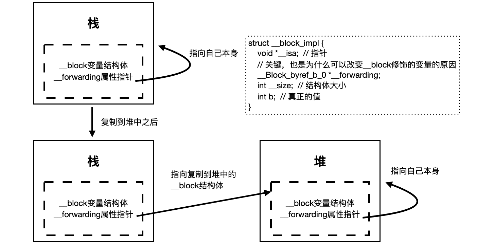

## 五.Block

### 5.1 Block介绍
**定义**：
Block是将**函数**以及其**执行上下文**封装起来的**对象**。block的调用就是函数的调用.

*注意，说block是对象是因为它在编译之后，也有`isa`指针属性*

代码示例:
```c
int multiplier = 2;
int (^Block)(int) = ^int (int num) {
    return num * multiplier;
};
int x = Block(6);  // 12

/// block回调方法
- (void)clickHandle:(void (^)(NSInteger type))handle;
/// block别名，可以作为属性、参数
typedef void (^ClickBlock) (NSInteger type);
/// block属性
@property (nonatomic, copy) ClickBlock handle;
@property (nonatomic, copy) void (^actionWithPapameterBlock)(int args);
@property (nonatomic, copy) NSString* (^actionToReturnStirng)(void);
```

### 5.2 Block截获变量
Block的截获变量的类型：
- 局部变量 (1.基本数据类型，2.对象数据类型)
- 静态局部变量
- 全局变量
- 静态全局变量

**A.截获方式**
- 对于**基本数据**类型的局部变量，直接**截获其值**(值传递)!
- 对于**对象类型**的局部变量，**连同所有权修饰符**一起截获！
- 以**指针形式**截获局部静态变量
- **不截获**全局变量、静态全局变量(直接访问)

*所有权修饰符是指的`__weak`或者`__strong`等*

**注意：`self`是局部变量，不是全局变量**，`self`是一个隐私参数，熟悉C的都知道，他和`_cmd`构成方法的参数，`self`是动态的。

**B.下面代码的执行结果是？为什么？**
```c
int multiplier = 2;
int (^Block)(int) = ^int (int num) {
    return num * multiplier;
};
multiplier = 4;
NSLog(@"%d", Block(6));
```

答: 结果是12，理解Block对不同类型变量的捕获方式。

### 5.3 __block修饰符
当对变量进行赋值操作，无论变量是基本数据类型，还是对象类型，都需要添加`_block`修饰符.
但是对于下面三种情况，不需要添加`_block`修饰符：
- 静态局部变量(因为静态局部变量捕获的是指针)
- 全局变量(因为block不会捕获全局变量)
- 静态全局变量(因为block不会捕获静态全局变量)

**重点**：
`__block`修饰的变量，就会变成了对象，从编译后的C++文件可以发现，一个局部基础类型变量，加了`__block`之后，就会被封装成一个结构体struct类型，里面有isa指针属性，所以从这个角度说，变成了对象，

**A.一般什么情况下使用__block修饰符?**
答: 一般情况下，需要block对捕获变量进行**赋值**操作，就需要添加`__block`修饰符。

另外，在MRC下，`__block`也可以用于解决Block内的循环引用问题，MRC下`__block`不会增加修饰对象的引用计数。但是ARC下，`__block`修饰的对象，会有强引用，需要手动置为`nil`来解强引用，所以`__block`更多用于对于捕获变量的赋值操作。（这里可能会接着问，为什么`__block`修饰的变量就可以在Block内部进行赋值了？）

**B.下面代码是否需要添加__block修饰符?**
```c
NSMutableArray *arr = [NSMutableArray array];
void (^Block)(void) = ^{
    [arr addObject:@"name"];
};
Block();
```
答: 不需要，因为block中仅仅是对`NSMutableArray`的使用，并没有对数组变量进行赋值。

**C.下面代码是否需要添加__block修饰符?**
```c
NSMutableArray *arr = nil;
void (^Block)(void) = ^{
    arr = [NSMutableArray array];
};
Block();
```
答: 需要，因为block中是对`NSMutableArray`的赋值操作。

**D.下面代码的执行结果是？为什么？**
```c
__block int multiplier = 6;
int (^Block)(int) = ^int (int num) {
    return num * multiplier;
};
multiplier = 4;
NSLog(@"%d", Block(2));
```
答：是8，简述出来`__block`修饰符的原理即可。

### 5.4 Block的内存管理
从内存角度来说，有三种Block类型：
- 全局block：`_NSConcreteGlobalBlock`
- 栈内存上的block：`_NSConcreteStackBlock`
- 堆内存上的block：`_NSConcreteMallocBlock`

Block的Copy操作结果：

| Block类别 | 源 | Copy结果 |
|  ----  | ----  | ----  | 
| _NSConcreteGlobalBlock | 数据区 | 什么也不做| 
| _NSConcreteStackBlock | 栈 | 堆 |
| _NSConcreteMallocBlock | 堆 | 增加引用计数 | 

`__block`修饰的变量，就会变成了对象，从编译后的C++文件可以发现，一个局部基础类型变量，加了`__block`之后，就会被封装成一个结构体`struct`类型，里面有`isa`指针属性，所以从这个角度说，变成了对象，这个结构体关键有下面三个属性：
```c
struct _Block_byref_xx_xx {
  void * __isa;
  __Block_byref_xx_xx * __forwarding;
  xx xx;  // 被封装的变量
}
```

当Block在栈上的时候，`__forwarding`指向它自己。
当Block在栈上，经过copy之后，`__forwarding`指向堆上Block的`__block`变量。



**A.证明Block本质就是OC对象**
```objc
void (^myBlock)(void) = ^(void) {
};

NSLog(@"%@", [myBlock class]);
NSLog(@"%@", [[myBlock class] superclass]);
NSLog(@"%@", [[[myBlock class] superclass] superclass]);

// __NSGlobalBlock__
// NSBlock
// NSObject
```

### 5.5 Block的循环引用

**A.下面代码有什么问题吗？**
```c
_array = [NSMutableArray arrayWithObject:@"100"];
_strBlk = ^NSString* (NSString *num) {
  return [NSString stringWithFormat:@"helloc_%@", _array[0]];
};
_strBlk(@"hello");
```
答：会产生循环引用，因为当前类持有block一般使用`copy`关键字，所以类是强持有的strBlk。而block捕获对象变量时，会将其所有权符号(属性关键字)一起捕获，而array一般是用`strong`修饰的，造成block强引用了self，造成了自循环。

**B.下面代码有什么问题吗？**
```c
__block Person *blockPerson = self;
_blk = ^int (int num) {
  return num * blockPerson.age;  // age = 10
};
_blk(3);
```

答：在MRC下，上面代码不会有任何问题，不会产生循环引用。在ARC下，上面代码会产生循环引用，引起内存泄漏。
Person对象持有Block，Block持有`__block`变量，`__block`变量持有对象。在使用`__block`情况下，解决方案是：
```c
__block Person *blockPerson = self;
_blk = ^int (int num) {
  int res =  num * blockPerson.age;  // age = 10
  blockPerson = nil;
  return res;
};
_blk(3);
```
*但是上面代码的缺点就是：如果永远不调用`_blk()`，那么循环引用将一直存在。所以使用`__weak`更好*

**C.为什么Block容易产生循环引用？**
答：大概有2方面，一是很多时候，我们会使用`copy`修饰block，而当block被`copy`时，会对block中用到的对象产生强引用。二是当对象block中又用到了对象的其他属性，极易产生自我循环引用。

**D.怎样理解Block捕获变量的特性？**
答：对于**基本数据**类型的局部变量，直接**截获其值**；对于**对象类型**的局部变量，**连同所有权修饰符**一起截获；对于局部静态变量，是以**指针形式**截获。而全局变量和静态全局变量，Block将不会截获。
*所有权修饰符是指的`__weak`或者`__strong`等*

**E.简述对__block修饰符的理解？**
答：在开发中，`__block`常用于block内部无法修改外部局部变量的问题。当一个局部变量被`__block`修饰后，编译器会把它包装成一个结构体对象，然后我们的这个局部变量放到了这个结构体对象的内部。这时再修改局部变量的值，底层就变成了通过这个结构体的`__forwading`指针来修改。
需要注意的是：当`__block`修饰对象类型时：
当`__block`对象在栈上时，不会对指向的对象产生强引用。
当`__block`对象`copy`到堆上时，会根据这个对象的修饰符是`__strong`,`__weak`,`__unsafe_unretained`做出相应的操作形成强引用（retain）或者弱引用。（ARC会`retain`，MRC不会）。