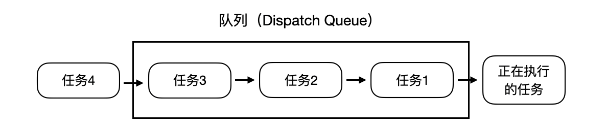
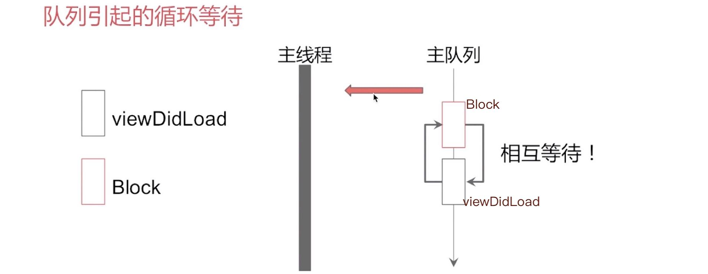
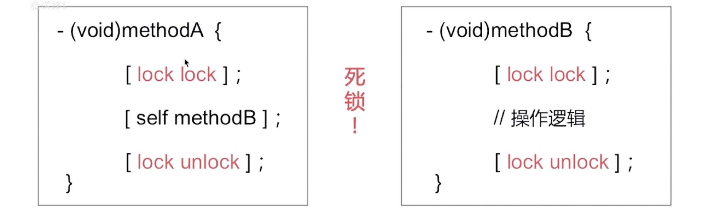

## 六.多线程

### 6.1 GCD

GCD非常不错的总结：
https://www.jianshu.com/p/2d57c72016c6

GCD关于死锁的总结：
https://www.jianshu.com/p/6b9373e04f59

1.基本概念：
**队列Queue**：负责调度任务
- **串行队列Serial**：一个接一个的调度任务
- **并发队列Concurrent**：多个任务同时调度

两种队列都遵循`FIFO`原则，也就是先进先出原则。(First In First Out)



2.线程和队列：
串行与并行针对的是**队列**。
同步与异步针对的是**线程**。
最大的区别在于，同步线程要阻塞当前线程，必须要等待同步线程中的任务执行完，返回以后，才能继续执行下一任务；而异步线程则是不用等待。

GCD **核心概念**：将任务添加到队列，指定任务执行的方法

- 任务 Task
  - 使用block封装
  - block 就是一个提前准备好的代码块，在需要的时候执行

- 队列 Queue（负责调度任务）
  - 串行队列 Serial：一个接一个的调度任务
  - 并发队列 Concurrent：可以同时调度多个任务

- 任务执行函数（任务都需要在线程中执行！)
  - 同步执行 sync：当前指令不完成，不会执行下个指令
  - 异步执行 async：当前指令不完成，同样可以执行下一条指令

3.GCD API
```c
// 全局队列，一个特殊的并行队列
dispatch_get_global_queue
// 主队列，在主线程中运行，因为主线程只有一个，所以这是一个特殊的串行队列
dispatch_get_main_queue

// 自己创建串行队列
dispatch_queue_create("com.demo.serialQueue", DISPATCH_QUEUE_SERIAL)
// 自己创建并行队列
dispatch_queue_create("com.demo.concurrentQueue", DISPATCH_QUEUE_CONCURRENT)

dispatch_sync(..., ^(block)) // 同步线程 
dispatch_async(..., ^(block)) // 异步线程
```

4.注意点：
- **异步执行（async）** 虽然具有开启新线程的能力，但是并不一定开启新线程。这跟任务所指定的队列类型有关
- **并发队列** (concurrent)的并发功能只有在异步（`dispatch_async`）方法下才有效
- 所有放在主队列中的任务，都会放到主线程中执行，主队列是一个串行队列，获取:`dispatch_get_main_queue()`
- **同步执行(sync)** 不具备开启新线程的能力

**A.同步/异步和串行/并发**
```c
/// 同步分配一个任务 到 串行队列
dispatch_sync(serial_quue, ^{ /* 任务 */ })
/// 异步分配一个任务 到 串行队列
dispatch_async(serial_quue, ^{ /* 任务 */ })
/// 同步分配一个任务 到 并发队列
dispatch_sync(concurrent_quue, ^{ /* 任务 */ })
/// 异步分配一个任务 到 并发队列
dispatch_async(concurrent_quue, ^{ /* 任务 */ })
```

**`dispatch_get_global_queue`是全局并发队列**
**`dispatch_get_main_queue`是全局串行队列**

**B.死锁**
死锁是**队列**引起的循环等待。所以死锁本质是队列引起的，而不是线程引起的循环等待。（注意，这个只是iOS里GCD的现象。）



*主队列上面的任务，都是需要在主线程main上执行的。*

**C.下面代码是否有问题？**
```c
- (void)viewDidLoad {
    dispatch_sync(dispatch_get_main_queue(), ^{
        [self doSomething];
    });
}
```
答: 有问题，会产生死锁。原因是当主队列执行到`viewDidLoad`方法里面时，需要执行里面的Block，而Block是同步任务，可主队列的性质是先进后出，所以Block需要等待`viewDidLoad`执行完才能执行，造成相互等待的死锁情况。
https://www.jianshu.com/p/bbabef8aa1fe

*但是如果上面代码不是main_queue，而是自定义的串行队列，就没问题。问题的关键是否在同一个队列执行同步任务*

所以，解决死锁的办法有2个角度，1是线程，2是队列。

**D.下面代码执行的结果是？**
```c
- (void)viewDidLoad {
    NSLog(@"1");
    dispatch_sync(dispatch_get_global_queue(0, 0), ^{
        NSLog(@"2");
        dispatch_sync(dispatch_get_global_queue(0, 0), ^{
            NSLog(@"3");
        });
        NSLog(@"4");
    });
    NSLog(@"5");
}
```
答：输出结果是12345。`dispatch_get_global_queue`是全局并发队列。只要是提交同步任务，无论同步到并发队列还是串行队列，都是在当前线程执行。所以"2"会在主线程执行，由于是`global_queue`是全局并发队列，所以可以顺次执行到"3".

任务按顺序执行的。按顺序执行的原因：虽然 并发队列 可以同时执行多个任务。但是因为本身不能创建新线程，只有当前线程这一个线程（同步任务 不具备开启新线程的能力），所以也就不存在并发。而且当前线程只有等待当前队列中正在执行的任务执行完毕之后，才能继续接着执行下面的操作（同步任务 需要等待队列的任务执行结束）。所以任务只能一个接一个按顺序执行，不能同时被执行。

这个问题的核心点：
*1.同步执行 + 并发队列：在当前线程中执行任务，不会开启新线程，执行完一个任务，再执行下一个任务。*
*2.同步执行不具备开启新线程的能力*

**E.下面代码会输出什么结果？**
```c
- (void)viewDidLoad {
    dispatch_async(dispatch_get_global_queue(0, 0), ^{
        NSLog(@"1");
        [self performSelector:@selector(printLog) withObject:nil afterDelay:0];
        NSLog(@"3");
    });
}
- (void)printLog { NSLog(@"2"); }
```
答: 会输出13，因为在GCD底层，分配这些异步线程，默认是没有开启runloop的，而`performSelector::`是依赖于runloop执行的，所以根本不会输出2.

**F.怎样利用GCD实现多读单写？**
使用`dispatch_barrier_async`栅栏：
```c
/// 定一个多读单写模型
@interface HWUser()
{
    /// 定义一个并发队列
    dispatch_queue_t userQueue;
    /// 用户数据中心，可能多个线程需要数据访问
    NSMutableDictionary *userInfo;
}
@end

@implementation HWUser
- (instancetype)init {
    if (self = [super init]) {
        // 通过宏定义 DISPATCH_QUEUE_CONCURRENT，创建一个并发队列
        userQueue = dispatch_queue_create("read_write_queue", DISPATCH_QUEUE_CONCURRENT);
        userInfo = [NSMutableDictionary dictionary];
    }
    return self;
}

/// 读数据
- (id)objWithKey:(NSString *)key {
    __block id obj;
    // 同步读取指定数据
    dispatch_sync(userQueue, ^{
        obj = [self->userInfo objectForKey:key];
    });
    return obj;
}

/// 写数据
- (void)setObj:(id)obj forKey:(NSString *)key {
    // 异步栅栏调用 设置数据
    dispatch_barrier_async(userQueue, ^{
        [self->userInfo setObject:obj forKey:key];
    });
}
@end
```

**G.怎样利用GCD实现ABC三个任务并发执行，完成后执行D？**
使用`dispatch_group_t`任务组：
```c
dispatch_group_t group = dispatch_group_create();

// 需要有一个并发队列，比如写成属性
userQueue = dispatch_queue_create("read_write_queue", DISPATCH_QUEUE_CONCURRENT);

for (NSInteger i = 0; i < 3; i++) {
    // 异步组分派带并发队列中
    dispatch_group_async(group, userQueue, ^{
        // 并发任务TODO...
    });
}

dispatch_group_notify(group, userQueue, ^{
    // 异步的几个任务，全部完成，回调到这里
});
```

**H.利用GCD快速迭代遍历？**
```objc
dispatch_queue_t queue = dispatch_get_global_queue(0, 0);
NSLog(@"apply---begin");

dispatch_apply(6, queue, ^(size_t index) {
    NSLog(@"%zd---%@",index, [NSThread currentThread]);
});

NSLog(@"apply---end");  // 遍历完，才会执行这句
```

了解即可，缺点是不好控制异步线程的数量。

### 6.2 NSOperation
**A.NSOperation有哪些优势和特点？**
添加任务依赖
任务执行状态的控制
最大并发量

**B.NSOperation任务状态有哪些？**
答：四种状态，分别是:`isReady`，`isExecuting`，`isFinished`，`isCancelled`
如果只重写了`main`方法，底层控制变更任务，执行完成状态，以及任务退出。
如果重写了`start`方法，将需要自行控制任务状态。
*其实从源码中，会很明显理解，为什么有上面的区别。*

**C.系统是怎样移除一个`isFinished=YES`的NSOperation的？**
答：从`NSOperation`的源码中可以发现，是通过KVO的方式移除的。

### 6.3 NSThread

**A.如何通过NSThread和Runloop，实现一个常驻线程？**
```objc
// 1.全局的，或者static的，目的是保持`NSThread`
@property (nonatomic, strong) NSThread *myThread;

// 2.初始化线程并启动
self.myThread = [[NSThread alloc] initWithTarget:self selector:@selector(run) object:nil];
self.myThread.name = @"myThread";
[self.myThread start];

// 3.启动RunLoop，子线程的RunLoop默认是停止的
- (void)run {
    // 只要往RunLoop中添加了 timer、source或者observer就会继续执行
    // 一个RunLoop通常必须包含一个输入源或者定时器来监听事件
    // 如果一个都没有，RunLoop启动后立即退出。
    @autoreleasepool {
        // 添加一个input source
        NSRunLoop *rl = [NSRunLoop currentRunLoop];
        [rl addPort:[NSMachPort port] forMode:NSDefaultRunLoopMode];
        [rl run];
// 2、添加一个定时器
// NSTimer *timer = [NSTimer timerWithTimeInterval:2.0 target:self selector:@selector(test) userInfo:nil repeats:YES];
// [[NSRunLoop currentRunLoop] addTimer:timer forMode:NSDefaultRunLoopMode];
// [[NSRunLoop currentRunLoop] run];
    }
}
```

这样`myThread`这个线程就会一直存在，当需要使用此线程在处理一些事情的时候就这么调用:
```objc
[self performSelector:@selector(act) onThread:self.thread withObject:nil waitUntilDone:NO];

- (void)act {
    NSLog(@"111");
    NSLog(@"%@", [NSThread currentThread]);
}
```

**B.简述NSThread？**
`NSThread`是OC提供面向对象操作线程的技术之一，简单方便，可以直接操作线程对象，不过需要自己控制线程的生命周期。开发中偶尔使用`NSThread`，比如经常使用`[NSThread currentThread]`来显示当前的线程信息。使用`NSThread`来实现一个常驻线程等。

### 6.4 多线程和锁

**A.在iOS中，大概都有哪些锁？**
答：有`@synchronized`，`atomic`，`OSSpinLock`，`NSRecursiveLock`，`NSLock`，`dispathch_semaphore_t`

@synchronized 同步锁
NSLock 对象锁
NSRecursiveLock 递归锁
NSConditionLock 条件锁
pthread_mutex 互斥锁（C语言）
dispatch_semaphore 信号量实现加锁（GCD）
OSSpinLock 自旋锁

**B.@synchronized**
`@synchronized`一般在创建单例对象的时候使用，保证在多线程情况下，对象是唯一的。需要注意的是：`@synchronized`是几种iOS多线程同步机制中最慢的一个，同时也是最方便的一个。

```c
/// 添加元素，线程安全的
- (void)increment {
    @synchronized (self) {
        [self.array addObject:element];
    }
}
```

**C.atomic**
`atomic`是修饰属性的关键字，对被修饰的对象进行原子操作（不负责使用）。怎么理解不负责使用：
```c
@property (atomic) NSMutableArray *array;
self.array = [NSMutableArray array];  // 线程安全
[self.array addObject:obj];  // 线程不安全
```

**D.OSSpinLock**
自旋锁，循环等待询问，不释放当前资源。用于轻量级数据访问，简单的int值，+1/-1操作。我自己没有使用过自旋锁，但是从阅读runtime源码中，发现ARC对引用计数的+1和-1操作，用到了自旋锁。

**E.NSLock**

A.下面的代码，有什么问题？


答：会导致死锁，因为在方法A中，先加锁，紧接着执行到了方法B，再次加锁，会因为重入的原因（多次获取加锁），导致死锁。解决这类问题的办法是递归锁。

*同一个线程中，如果想要多次获得一个锁，只能使用递归锁，否则会造成死锁。*
 
**注意：**
`[NSLock lock]`和`[NSLock unlock]`的必须成对调用，也必须在同一个线程中成对调用。

**F.NSRecursiveLock**
`NSRecursiveLock`递归锁，这个锁可以被同一线程多次请求,而不会引起死锁。这主要是用在循环或递归操作中。

**G.dispatch_semaphore_t**
`dispatch_semaphore_t`是GCD里面的信号量。

**F.iOS系统为我们提供了几种多线程技术以及它们的特点？**
答：iOS系统为我们提供了三种多线程技术，分别是GCD，`NSThread`和`NSOperation`，GCD适用于线程同步，包括子线程的分派，包括实现多读单写，单例等功能；对于`NSOperation`，由于它的特点是方便对任务的状态进行控制，包括添加依赖，移除依赖等,一些第三方框架，比如`AFNetworking`和`SDWebimage`等大量使用了`NSOperation`。对于轻量级的`NSThread`，往往会使用它的几个类方法，比如`[NSThread currentThread]`，也会使用`NSThread`结合Runloop实现一个常驻线程。
