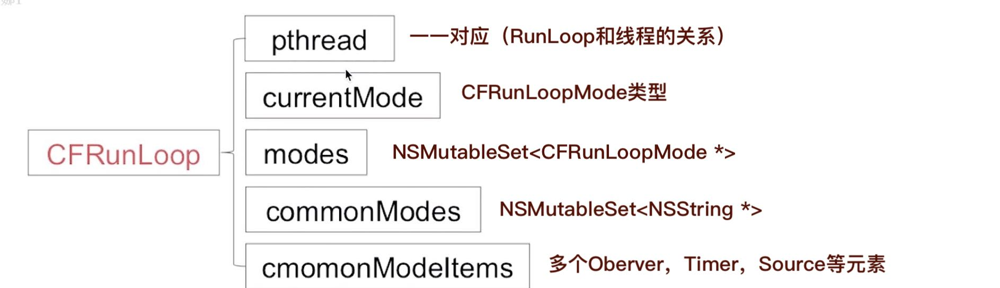
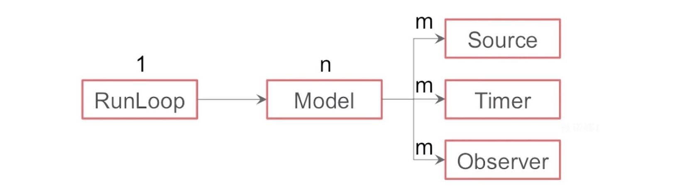
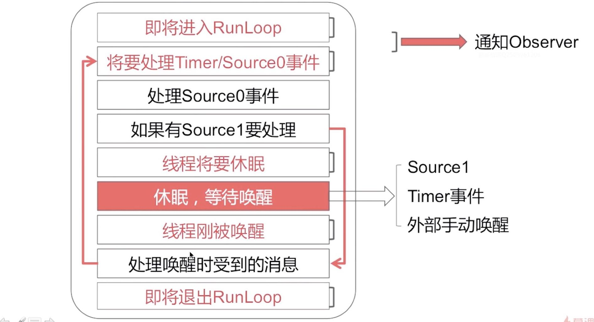
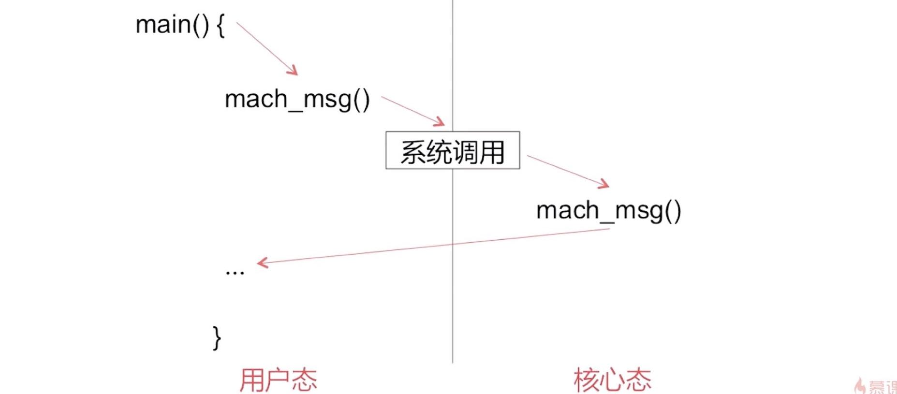

## 七.Runloop

https://www.cnblogs.com/kenshincui/p/6823841.html
https://zhuanlan.zhihu.com/p/63184073

### 7.1 概念
**A.什么是Runloop？**
Runloop是通过内部维护的**事件循环**来对**事件/消息进行管理**的一个**对象**。**事件循环**可以达到没有事件需要处理时，可以休眠以避免CPU资源占用，有事件需要处理时，立刻被唤醒。这种有事做事，没事休息的机制其实就是`用户态`和`内核态`的互相转化。

*1.`CFRunloop`的源码显示内部是一个do-while循环，但是不同于我们写的循环，它在休眠时几乎不会占用系统资源，当然这是系统内核负责实现的，也是RunLopp的核心.*
*2.`用户态`和`内核态`在Linux和Unix系统中，是基本概念，是操作系统的两种运行级别，他们的权限不一样，由于系统的资源是有限的，比如网络、内存等，所以为了优化性能，降低电量消耗，提高资源利用率，Unix底层就这么设计了。*

**B.为什么App的main函数可以保持不退出？**
答：因为在main函数里面，会调用`UIApplicationMain()`函数，在这个函数内部，会启用一个主线程运行循环Runloop，Runloop是对事件循环的一个维护机制，可以不停的接受消息和处理消息，没有消息时会进入等待休眠状态。这里其实就是`用户态`和`内核态`的互相转化。

### 7.2 数据结构
`NSRunLoop`是`CFRunLoop`的封装，提供了面向对象的API，`CFRunLoop`的源码是开源的。



1.一个RunLoop对象（`CFRunLoop`）中包含若干个运行模式（`CFRunLoopMode`）。而每一个运行模式下又包含若干个输入源（`CFRunLoopSource`）、定时源（`CFRunLoopTimer`）、观察者（`CFRunLoopObserver`）。

2.每次 RunLoop 启动时，只能指定其中一个运行模式（`CFRunLoopMode`），这个运行模式（`CFRunLoopMode`）被称作当前运行模式（`currentMode`）

3.如果需要切换运行模式（`CFRunLoopMode`），只能退出当前RunLoop，再重新指定一个运行模式（`CFRunLoopMode`）进入！这样做主要是为了分隔开不同组的输入源（`CFRunLoopSource`）、定时源（`CFRunLoopTimer`）、观察者（`CFRunLoopObserver`），让其互不影响。

4.**CFRunLoopSource**分为`source0`和`scource1`两种类型，区别是`source0`需要手动唤醒线程，`scource1`具备唤醒线程的能力。比如屏幕上点击按钮，从调用栈，就能看出来，这种点击事件，就是`source0`。

各个数据结构之间的关系(一对多)：


`commonMode`的数据类型是`NSRunLoopCommonModes`，`commonMode`不是实际存在的一种Mode，它是同步Source/Timer/Observer到多个Mode中的一种技术解决方案。

### 7.3 事件循环机制


RunLoop的状态改变，都会通知观察者Observer。

**A.当一个处于休眠状态的RunLoop，有哪些方式唤醒？**
有三种方式：1是有Source1要处理，2是Timer事件，3是外部手动唤醒

RunLoop的核心：


**B.RunLoop的运行模式有哪些？**
系统默认定义了多种运行模式（`CFRunLoopModeR`），如下：
1.`NSDefaultRunLoopMode`：App的默认运行模式，通常主线程是在这个运行模式下运行
2.`UITrackingRunLoopMode`：跟踪用户交互事件（比如滑动页面时）
3.`kCFRunLoopCommonModes`：伪模式，不是一种真正的运行模式，而是一种标记模式，意思就是可以在打上**CommonModes标记**的模式下运行。

*`NSDefaultRunLoopMode`和`UITrackingRunLoopMode`都已被标记了CommonModes*

**C.RunLoop的事件源怎么理解？**
`CFRunLoopSource`是事件源，`CFRunLoopSource`有两种分类方法：

第一种按照官方文档来分类：
 - Port-Based Sources（基于端口）
 - Custom Input Sources（自定义）
 - Cocoa Perform Selector Sources

第二种按照函数调用栈来分类：
 - Source0 ：非基于Port，比如按钮的点击事件
 - Source1：基于Port，通过内核和其他线程通信，接收、分发系统事件

**D.RunLoop的观察者怎么理解？**
`CFRunLoopObserver`是观察者，用来监听RunLoop的状态改变。`CFRunLoopObserver`可以监听的状态改变有以下几种：
```objc
typedef CF_OPTIONS(CFOptionFlags, CFRunLoopActivity) {
    kCFRunLoopEntry = (1UL << 0),               // 即将进入Loop：1
    kCFRunLoopBeforeTimers = (1UL << 1),        // 即将处理Timer：2    
    kCFRunLoopBeforeSources = (1UL << 2),       // 即将处理Source：4
    kCFRunLoopBeforeWaiting = (1UL << 5),       // 即将进入休眠：32
    kCFRunLoopAfterWaiting = (1UL << 6),        // 即将从休眠中唤醒：64
    kCFRunLoopExit = (1UL << 7),                // 即将从Loop中退出：128
    kCFRunLoopAllActivities = 0x0FFFFFFFU       // 监听全部状态改变  
};
```

### 7.4 Runloop与NSTimer

**A1.为什么滑动UITableView的时候，广告Banner会不滚动了？**
**A2.滑动UITableView的时候，我们的定时器还生效吗？**
答：我们默认创建的`NSTimer`，是默认添加到当前RunLoop的`kCFRunLoopDefaultMode`模式下，而滑动UITableView的时候，RunLoop的模式将会切换到`UITracnkingRunMode`上，造成`kCFRunLoopDefaultMode`模式下的timer、Oberver无法回调。

**B.RunLoop和NSTimer的示例代码？**
```objc
- (void)viewDidLoad {
    // 定义一个定时器，约定两秒之后调用self的run方法
    NSTimer *timer = [NSTimer timerWithTimeInterval:2.0 target:self selector:@selector(run) userInfo:nil repeats:YES];
    // 将定时器添加到当前RunLoop的NSDefaultRunLoopMode下
    [[NSRunLoop currentRunLoop] addTimer:timer forMode:NSDefaultRunLoopMode];
}

- (void)run {
    NSLog(@"---run");
}
```

上面的代码，运行后，不对屏幕有任何操作的话，会稳定的每隔2秒调用run方法打印。但是当比如滚动`UIScrollView`时，定时器就会停止打印。原因是：
- 当我们不做任何操作的时候，RunLoop处于`NSDefaultRunLoopMode`下。
- 当滚动滚动`UIScrollView`时，RunLoop就结束`NSDefaultRunLoopMode`，切换到了`UITrackingRunLoopMode`模式下，这个模式下没有添加`NSTimer`，所以我们的`NSTimer`就不工作了。

解决办法可以是伪模式`NSRunLoopCommonModes`：
```objc
[[NSRunLoop currentRunLoop] addTimer:timer forMode:NSRunLoopCommonModes];
```

### 7.5 Runloop与多线程

**A.线程和RunLoop是什么关系？**
答：线程和RunLoop是一一对应的关系。自己创建线程默认是没有RunLoop的。

**B.怎么样实现一个常驻线程？**
答：经典三步骤即可：
1.创建一个子线程，并为该线程开启一个RunLoop
2.向该RunLoop种添加一个Port/Source等维护RunLoop的事件循环
3.启动该RunLoop
```c
@implementation HWRunLoop

static NSThread *thread = nil;
// 标记是否要继续事件循环
static BOOL runAlways = YES;

// 线程安全的方式，创建一个NSThread
+ (NSThread *)threadForDispatch {
    if (thread == nil) {
        @synchronized (self) {
            if (thread == nil) {
                thread = [[NSThread alloc] initWithTarget:self selector:@selector(run) object:nil];
                thread.name = @"com.xx.thread";
                [thread start];
            }
        }
    }
    return thread;
}

+ (void)run {
    // 创建一个Source
    CFRunLoopSourceContext context = {0, NULL, NULL, NULL, NULL, NULL, NULL, NULL, NULL, NULL};
    CFRunLoopSourceRef source = CFRunLoopSourceCreate(kCFAllocatorDefault, 0, &context);
    // 创建RunLoop，同时向RunLoop的DefaultMode下面添加Source
    CFRunLoopAddSource(CFRunLoopGetCurrent(), source, kCFRunLoopDefaultMode);
    // 如果可以运行
    while (runAlways) {
        @autoreleasepool {
            // 令当前RunLoop运行在DefaMode下面
            CFRunLoopRunInMode(kCFRunLoopDefaultMode, 1.0e10, true);
        }
    }
    // 某一个时机，静态变量改变，可以保证跳出RunLoop，线程退出
    CFRunLoopRemoveSource(CFRunLoopGetCurrent(), source, kCFRunLoopDefaultMode);
    CFRelease(source);
}

@end
```

### 7.6 RunLoop汇总
https://blog.csdn.net/ochenmengo/article/details/105217624

**A.怎么保证子线程数据回来更新UI的时候，不打断用户的滑动操作？**

在用户进行滑动的过程中,当前的RunLoop运行在`UITrackingRunLoopMode`模式下,
而我们一般对网络请求是放在子线程中,子线程返回给主线程的数据要抛给主线程用来更新UI,
可以把这部分逻辑包装起来,提交到主线程的`default`模式下,这样的话,当用户滑动时,default模式下的任务不会执行,
当用户手停止时,mode就自动切换到了default模式下,就会处理子线程的数据了,这样就不会打断用户的滑动操作了

1、把子线程抛给主线程进行UI更新的逻辑，可以包装起来，提交到主线程的`NSDefaultRunLoopMode`模式下面。
2、因为用户滑动操作是在`UITrackingRunLoopMode`模式下进行的。
实例代码：
```c
[self.tableView performSelectorOnMainThread:@selector(setImage:) withObject:image waitUntilDone:NO modes:@[NSDefaultRunLoopMode]];
```

**B.利用RunLoop在滑动UITableView时不加载Cell的图片？**
思路1：使用`[UIImageView performSelector:]`
思路2: 监听当前RunLoop的运行模式，在非UI模式时，才执行设置图片的代码
