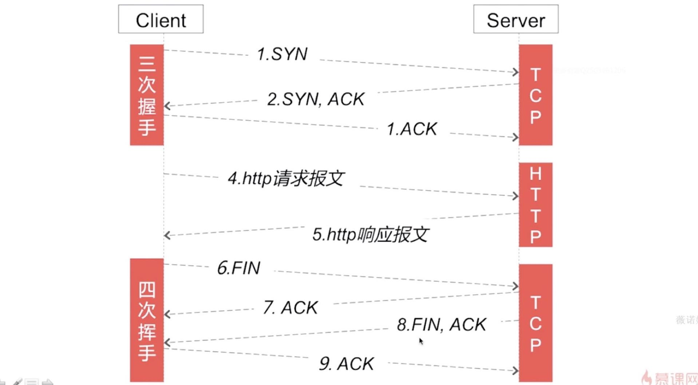
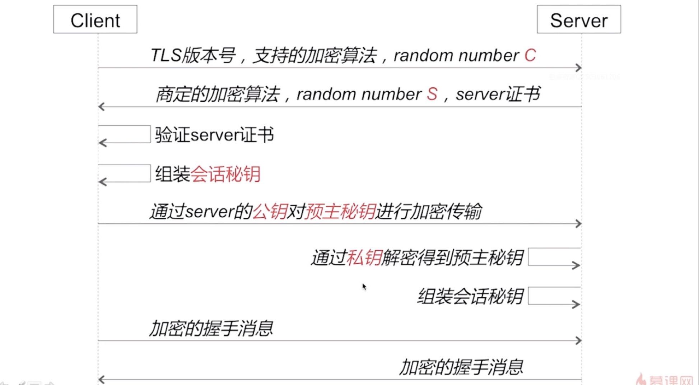
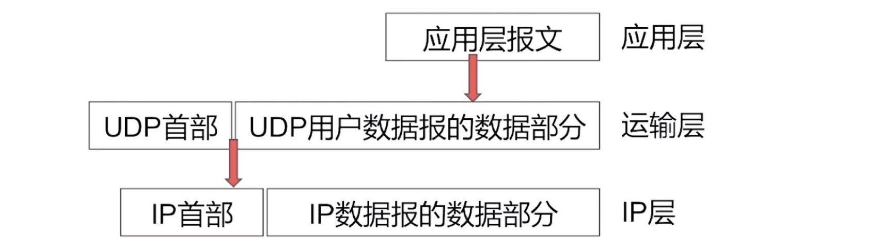
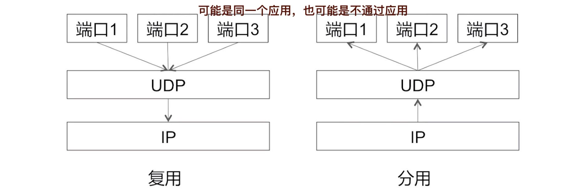
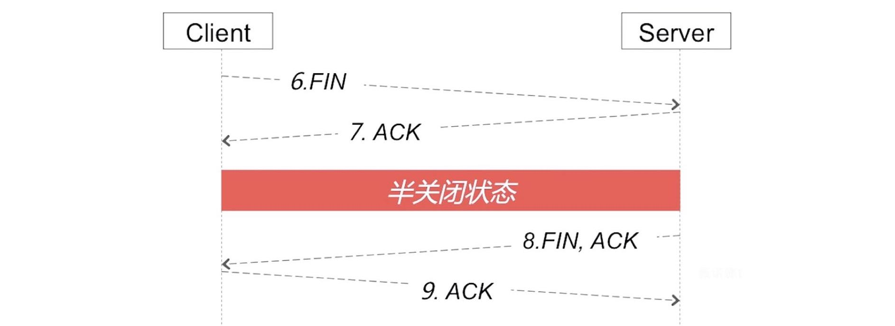
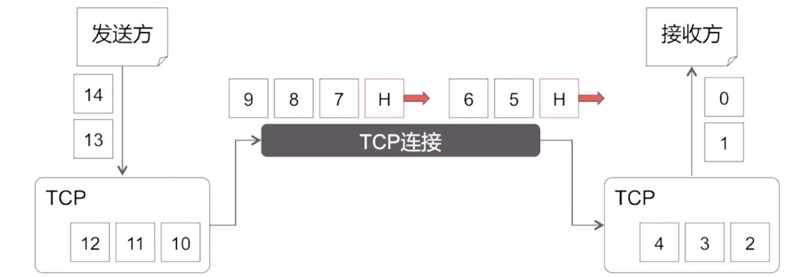
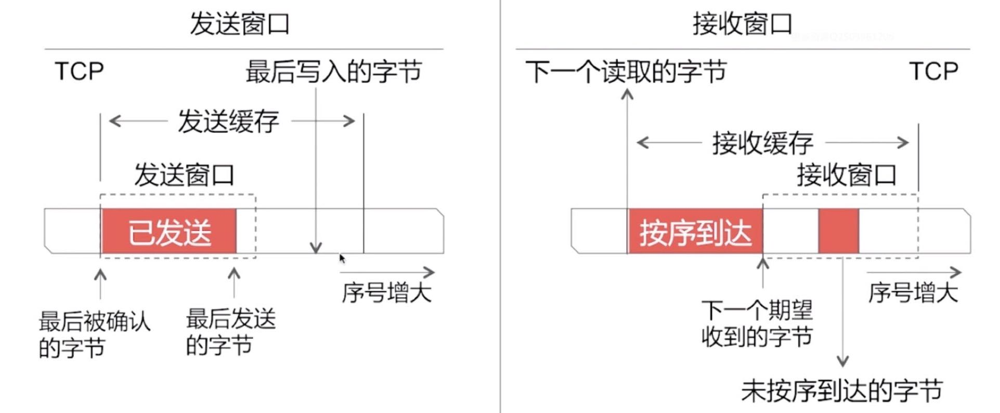
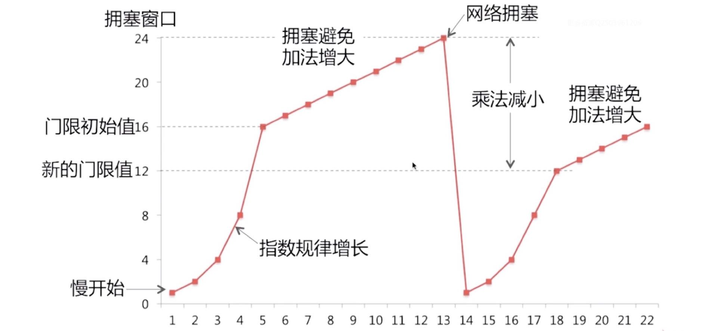
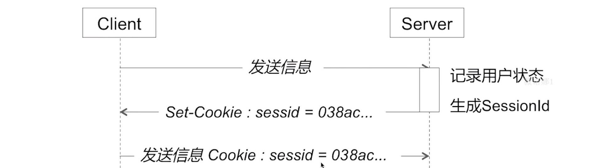

## 八.网络

### 8.1 HTTP协议

**A.你是怎么理解HTTP协议的？HTTP协议包含哪些内容？**
答：HTTP(HyperText Transfer Protocol)就是超文本传输协议，规定了在应用层的通信格式和通信规则，而TCP是传输层的目的端口和通信格式，IP则是网络层的地址和格式，mac则是链路层的地址和格式。
所以HTTP就在应用层规定了请求报头，请求体以及响应状态，响应报头，响应体等内容。

**B.HTTP的请求方式有哪些？**
1.`GET`:从服务器获取一段内容,不包含请求体
2.`POST`:使用客户端提供的数据更新实体
3.`HEAD`:获取响应的元数据而无需检索响应的全部内容
4.`PUT`:使用客户端提供的数据添加实体
5.`DELETE`:使用客户端提供吧的请求体来删除实体
6.`OPTIONS`:略

**C.GET和POST方式的区别？**
答：从基础角度来说：GET请求参数以`?`分割拼接到URL后面，POST请求参数在Body里面；GET参数长度限制2048个字符，POST一般没有该限制。
从语义角度来说(RFC官方文档)：GET是获取资源，安全的，幂等的，可缓存的；POST是处理资源，非安全的，非幂等的，不可缓存的。

*备注解释*：
- 安全性：不应该引起server端的任何状态变化。常见的安全性的方式：GET, HEAD, OPTIONS;
- 幂等性：同一个请求方法执行多次和执行一次的效果完全相同 GET PUT，DELETE
- 可缓存性：请求是否可以被缓存(GET, HEAD)

**D.常见网络状态的含义？**

|  分类  | 含义描述  |
|  ----  | ----  |
| 1xx  | 服务器收到请求，需求请求者继续操作 |
| 2xx  | 成功 |
| 3xx  | 重定向，需要进一步的操作以完成请求 |
| 4xx  | 客户的错误，请求包含语法错误或者无法完成的请求 |
| 5xx  | 服务器错误，服务器在处理请求过程中发生了错误 |

**E.三次握手和四次挥手？**

详细讲解：https://zhuanlan.zhihu.com/p/86426969

备注：
- `ACK`: Acknowledge character，确认字符
- `SYN`: Synchronize Sequence Numbers 同步序列编号
- `FIN` Finish character，结束字符

三次握手（Three-way Handshake）其实就是指建立一个TCP连接时，需要客户端和服务器总共发送3个包。进行三次握手的主要作用就是为了确认双方的接收能力和发送能力是否正常、并同步一些准信信息，比如双方的序列号和确认号，交换TCP窗口大小等信息。

**重要**：HTTP请求是建立在**TCP通道**上的。

三次握手：
- 客户端发送一个同步报文。
- 服务端收到以后，发送给客户端一个同步确认报文。
- 客户端收到以后，向服务端发送一个确认报文。

中间进行收发数据

四次挥手：
- 客户端发送一个终止报文。
- 服务端收到以后，发送给客户端一个确认报文；
- 此时，由客户端到服务端的连接断开了。但是，服务端还**可能**向客户端发送数据。
- 还需服务端向客户端发送终止报文。
- 客户端向服务端发送确认报文。

**F1.HTTP的特点是什么？**
HTTP是一个属于应用层的面向对象的协议，HTTP协议一共有五大特点：1、支持客户端/服务器模式；2、简单快速；3、灵活；4、无连接；5、无状态。

**无连接**：无连接的含义是限制每次连接只处理一个请求。服务器处理完客户的请求，并收到客户的应答后，即断开连接。采用这种方式可以节省传输时间。早期这么做的原因是请求资源少，追求快。后来通过`Connection: Keep-Alive`实现长连接

**F2.HTTP的无连接和无状态两个特点是什么含义以及他们的解决方案？**
**无连接**是指HTTP有一个建立连接和释放连接的过程，也就是每次连接只能处理一个请求。可以通过**HTTP持久连接**方案，来解决无连接。
**无状态**同一个用户发送多次HTTP请求，服务端是不知道是同一个用户的。可以通过Cookie和Session方案来解决无状态。

**G.HTTP持久连接的Header关键字段是什么？**
- `Connection : keep-alive` 客户端期许采用持久连接
- `time: 20` 持久连接需要持续多长时间, 20S内如果再次发起同一个域名或者IP的请求,可以复用TCP通道
- `max: 10`最多可以支持多少个HTTP请求和响应对

**H.一个TCP上有多个HTTP请求，怎么判断前一个请求是否结束？**
有2个办法判断，一是服务器返回头部文字段里，一般会有`Content-length: 1024`字段，也就是响应数据的大小，客户端可以通过接受数据大小的比对，来判断请求是否结束。二是POST请求时,Server端返回往往是多次响应返回给这些数据的,可以通过头部字段`chunked`来判断，最后一个数据块会发送一个
空的`chunked`，可以以此来判断请求结束。

*chunked: 大块，块编码*

**G.Charles查尔斯小瓶子(网络调试代理)抓包原理是怎样的？**
Charles是利用了HTTP的中间人攻击漏洞来进行实现的，当客户端发送请求时,中间人会拦截住,然后假冒客户端的身份,去向server请求, server会返回结果给中间人,然后中间人再把结果返回给客户端,中间人可以篡改我们请求的参数,包括server返回的数据也可以篡改。

### 8.2 HTTPS与网络安全

**A.HTTP和HTTPS的区别是什么？**
HTTPS = HTTP + SSL/TLS,多出的 SSL/TLS,就是安全模块。总结: HTTPS是安全的HTTP,他的安全,是由SSL/TLS这个插在应用层之下，传输层上面的协议来保障的

SSL“Secure Socket Layer安全套接层”协议，TLS“Transport Layer Security安全传输层”协议，都属于是加密协议，在其网络数据传输中起到保护隐私和数据的完整性。

**B.HTTPS连接建立流程是怎么样的？**

1.客户端向Server端发报文,包含客户端支持的TLS版本,客户端支持的加密算法,还有一个随机数C
2.Server返回给客户端一个握手消息,也包括最终决定的加密算法(客户端提供N中,Server选择一个),随机数S和Server的证书
3.客户端收到响应内容后，首先进行证书的公钥验证,来判定当前server是否合法
4.客户端组装会话秘钥(用随机数C+S+客户端产生的预主秘钥三个组装合 )
5.客户端会发送报文,通过Server的公钥对预主秘钥进行加密传输
6.server端通过私钥解密得到预主秘钥
7.server端组装会话秘钥(用随机数C+S+私钥解密得到的预主秘钥三个组装合成)
8.客户端向Server端发送加密的握手消息
9.Server端返回给客户端一个加密的握手消息,来验证安全通道是否已经验证完成

备注:
会话秘钥 = 随机数S + 随机数C + 预主秘钥
会话秘钥是对称加密的秘钥
公钥和私钥是非对称加密

**B1.HTTPS怎么防止中间人攻击？比如防止中间人拿到秘钥？**
答：进行数字证书的校验，服务器首先生成公私钥，将公钥提供给相关机构（CA），CA将公钥放入数字证书并将数字证书颁布给服务器，此时服务器就不是简单的把公钥给客户端，而是给客户端一个数字证书，数字证书中加入了一些数字签名的机制，保证了数字证书一定是服务器给客户端的。中间人发送的伪造证书，不能够获得CA的认证的。

**C.HTTPS中使用了哪些加密手段,为什么使用这些?**
主要使用了对称加密和非对称加密：
- 1.连接建立过程使用非对称加密,保证安全
    - 注意：非对称加密很耗时! 因为加密和解密使用的手段不一样
- 2.数据传输过程是使用的对称加密,减少耗时所带来的性能损耗

**D.什么是非对称加密?**
非对称加密是指使用公钥和私钥来加密加密的算法。公钥（Public Key）与私钥（Private Key）是通过一种算法得到的一个密钥对，如果用公钥进行加密，就要用私钥进行解密；反之，用私钥加密，就要用公钥进行解密，由于私钥是保存在本地的，所以非对称加密相对于对称加密是安全的，缺点就是加密和加密相对于对称加密比较耗时。常见的非对称加密算法有：RSA。

*备注，所以HTTPS建立连接使用非对称加密保证安全，而数据传输使用对称加密保证效率*
*备注，对称加密就是加密和解密使用同一个秘钥*

### 8.3 TCP和UDP
https://zhuanlan.zhihu.com/p/108822858
https://www.cnblogs.com/liangyc/p/11628148.html

TCP: 传输控制协议
UDP: 用户数据报协议

**A.UDP协议是什么,特点是什么?**
UDP（User Datagram Protocol）叫做用户数据报协议，是一种无连接的传输层协议，它具有无连接、尽最大努力交付、面向报文的特点，可以支持一对多，一多一，多对一和多对多的通信方式。
特点的含义：
- **无连接**：是指发送UDP数据报时,不需要事先建立好连接,也不需要释放连接。
- **尽最大努力交付**: 是指有限发送数据，而不保证可靠的传输
- **面向报文**: 是指 既不合并,也不拆分数据，它会将应用层数报直接拼接UDP首部,组成UDP数报,然后再在IP层拼接上IP首部,直接向外传送

*不拆分不合并是不像TCP那样，数据很小就等待后面数合并传输，数据很大就拆分传输*

**B.UDP在功能上的特点是什么?**
UDP在功能是有 复用分用、差错检测等特点。复用是指不同端口出来的数据，可以通过同一个UDP数据报，再经过IP层。分用是指IP层接收了IP数据报数据，将数据拆分成UDP数据报，每个UDP数据报都包含有原端口和目的端口，根据目的端口进行分发数据。

*注：计算机数据传输是通过网络套接字(socket)。网络套接字(socket)是IP地址与端口的组合。*

**差错检测**是指，发送端UDP会对数据报文有一些特殊的格式设计，包含了校验位，所以接收方在收到数据报时，按照校验流程就可以知道数据是否有错误，但是需要注意的是，对于错误的数据，接收端是没有恢复能力的。

**C.TCP协议是什么,特点是什么?**
TCP（Transmission Control Protocol）叫做传输控制协议，是一种具有面向连接的，可靠传输的，面向字节流，流量控制、拥塞控制等特点的通信协议，并且TCP连接是一对一的通信。

特点的含义：
- **面向连接**：数据传输开始前需要建立连接,结束后要释放连接
- **可靠传输**：保证报文无差错,不丢失,不重复,按序到达
- **面向字节流**：发送方发送给TCP的字节，会被拆分成不同的字节进行发送，而不是有多少发送多少，由TCP决定。

**D.为什么是三次握手?**
答：网络传输是复杂和不稳定的，客户端和服务端通信前要进行连接，“3次握手”的作用就是双方都能明确自己和对方的收、发能力是正常的。接收方接到包之后，可以得到一些结论，但是发送方是没有任何头绪的，我怎么知道我有没有发出去，而对方有没有接收到呢？从这个过程可以得出来，最少是需要三次握手过程的。

在三次握手的过程中，客户端和服务器总共发送3次包，并同步一些通信信息，比如双方的序列号和确认号，交换TCP窗口大小等信息。

基于此原则，就可以避免很多问题，比如超时连接问题，过期连接问题等。

**E.为什么是四次挥手?**
答：四次挥手的本质原因是因为TCP建立的连接是全双工的，全双工就是说，一条通道，它能同时发送和接收数据，而只有经历了四次挥手，才能关闭接收数据的能力和发送数据的能力！比如具体过程中，C端发送FIN报文，S段接收并回复ACK报文，此时C端关闭了发送通道，但是还能接收，处于半关闭状态。经过S端发送FIN报文，C端接收并相应ACK报文，双方的连接通道才彻底关闭释放。

**F.TCP是怎样保证可靠传输的？**
答：TCP的可靠传输，在协议层面是依靠停止等待协议、滑动窗口协议等来保证的。比如停止等待协议最重要的超时重传机制，如果一个已经发送的报文段在超时时间内没有收到确认，那么就重传这个报文段。类似的，还有确认丢失、确定迟到等机制，共同保证了TCP的可靠传输。

**G.面向字节流的图示？**

发送方发送给TCP的字节，会被拆分成不同的字节进行发送，而不是有多少发送多少，由TCP决定。

**H.TCP特点中的流量控制(滑动窗口协议)描述？**

由于接收方的接收窗口&接收缓存，没有那么大；此时，通过由接收方向TCP报文首部字段中更改窗口值，发送方解析出来后，调整发送窗口大小，从而达到流量控制。
简单理解就是：接收方通过告知发送方，自己当前缓存区的大小情况，让发送方减少或增大发送量。

**J.请简单描述TCP慢启动(拥塞避免)的特点？**

1、横轴代表交互次数、纵轴代表窗口值大小。
2、开始，先发送一个报文，如果没有发生网络拥塞；接着，发送两个报文，如果还没有发生网络拥塞，就以指数规律成倍发送报文。
3、增长到窗口门限值后，会采用拥塞避免的策略，采用线性增长。
4、当增长到一定值时，发生了网络拥塞（rg.发送的报文连续三个ACK都没收到），采用拥塞避免乘法减小的策略，来恢复到只发送一个报文。 同时，把拥塞窗口门限值降为原来的一半。
5、此时，从新的门限值位置开启拥塞避免的策略，采用线性增长；而不会重新慢开始（快恢复、快重传）。

**K.TCP和UDP有什么区别？**
TCP是面向连接的，并且支持可靠传输，面向字节流，包括TCP提供了流量控制和拥塞控制。
UDP是无连接的，只简单的提供了复用/分用、差错检测基本功能。

### 8.4 DNS解析

**A.了解DNS解析吗？**
DNS解析是域名到IP地址的映射过程，DNS解析请求采用UDP数据报，并且是明文传输。具体的过程是：
- 客户端通过DNS协议向DNS服务器进行域名解析。
- DNS服务器返回解析出来的IP地址。
- 客户端根据IP地址发送网络请求。

**B.DNS解析查询方式有哪些？**
DNS解析查询方式有两种：递归查询、迭代查询。
1.递归查询：层层帮客户端询问其他人，我去给你问一下
  - Client -> 本地DNS -> 根域DNS -> 顶级DNS -> 权威DNS

2.迭代查询：告诉客户端谁可能知道(下面的顺序是随机的)
  - Client -> 本地DNS -> 顶级DNS -> 权限DNS -> 根域DNS

**C.DNS解析存在哪些常见问题？**
常见的两大问题：DNS劫持问题、DNS解析转发问题。（其他问题比如域名缓存问题、解析延迟问题、域名更新问题、域名转发问题等）

**D.DNS劫持问题？以及怎么解决**
答：因为DNS请求采用UDP数据报文，且是明文传输。很容易被劫持，导致域名解析到错误的IP地址。
解决方案比如：
1.httpDNS
首先DNS解析请求是使用UPD协议向DNS服务器的53端口进行请求，我们可以变成使用HTTP协议向DNS服务器的80端口进行请求。

2.长连接
建立一个长连Server（自己专门的代理服务器）

3.直接使用IP，不使用域名

**E.DNS劫持和HTTP的关系是怎么样的？**
答：DNS劫持和HTTP没有关系，原因在于DNS解析发送在HTTP建立连接之前。而且DNS解析请求使用UPD数据报，端口号是53。

### 8.5 Session和Cookie
Session和Cookie都是为了解决HTTP的无状态特点的。
无状态: 在多次发送HTTP请求的时候,如果是同一个用户的话,对于server端,它是不知道这是同一个用户的。

`Cookie`是用来区分用户的, 它会记录用户状态,保存在客户端
`Session`也是用来区分用户的, 它会记录用户状态,保存在Server端
二者的联系：Session需要依赖Cookie机制。

`Session`的工作流程：

### 8.6 Socket

**Socket定义**：
网络上两个程序通过一个双向通信连接实现数据交互，这种双向通信的连接叫做Socket（套接字）

**Socket特性**：
Socket可以支持不同的传输协议（TCP或UDP）。socket通信分为**server端**和**client端**，开发过程中分别对应着服务器和客户端。当连接上服务器 后，socket就会启动一个while或for无限循环，不断的异步监听socket动静

**socket通信传输的都是字节流**，传输时没有包的概念的。至于我们经常说的包的概念，是我们制定了一定的规则形成的。常用规则有两种，一 种是制定特定的分隔符（delimiter）来分割每个包，此时必须保证每条信息体中不包含该分隔符。第二种是指定每条消息体的长度，比如，在每条消息体 之前插入一个4字节长度的无符号整形来表明后面的消息体长度（一般包体长度限制在8k大小内，遇到消息体过大的信息时，一般采用分包发送和拼包解析）。其 中第二种方式更常见一些。

基于TCP链接的socket通信中，经常会涉及粘包、分包、解包的问题：

**粘包：** 使用TCP长连接就会引入粘包的问题，粘包是指发送方发送的若干包数据到接收方接收时粘成一包，从接收缓冲区看，后一包数据的头紧接 着前一包数据 的尾。粘包可能由发送方造成，也可能由接收方造成。TCP为提高传输效率，发送方往往要收集到足够多的数据后才发送一包数据，造成多个数据包的粘连。如果 接收进程不及时接收数据，已收到的数据就放在系统接收缓冲区，用户进程读取数据时就可能同时读到多个数据包。
粘包一般的解决办法是制定通讯协议，由协议来规定如何分包解包。

**分包：** 常用分包的逻辑是先发一个长度，然后紧接着是数据包内容，这样就可以把每个包分开。

**解包：** 由于我们应用层数据包既可以传命令也可以传数据，因而针对每个包我们进行解包，分出命令和数据分别处理，因而每个Socket服务对象都需要解包。解包过程中，才会出现我们常见的包头、信息体长度、信息体。

**A.Socket与HTTP的区别?**
虽然说Socket和HTTP都是基于TCP, 但通常情况下Socket连接就是TCP连接, 一旦建立了Socket连接, 双方就可以相互发送数据, 直到双方连接断开为止.

但在实际应用中，客户端到服务器之间的通信防火墙默认会关闭长时间处于非活跃状态的连接, 从而导致Socket连接断连，因此需要通过轮询告诉网络，该Socket连接处于活跃状态。

而HTTP刚刚也说了, 它的连接方式是请求 -> 响应, 不仅要在请求的时候需要先建立好连接, 而且需要客户端向服务器发送请求后, 服务器才能回复数据.
