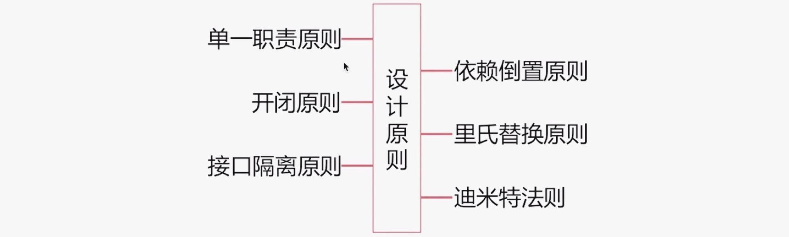

## 九.设计模式

### 9.0 六大设计原则
设计模式所遵从的六大设计原则：


1.单一职责原则：通俗地讲就是一个类只做一件事，比如：
- `CALayer`负责动画和视图的显示；`UIView`负责事件传递和事件响应

2.开闭原则：对修改关闭，对扩展开放。要考虑到后续的扩展性，而不是在原有的基础上来回修改.
3.接口隔离原则：使用多个专门的协议来做接口隔离、而不是一个庞大臃肿的协议.协议中的方法也应尽量少。
- 比如:`UITableviewDelegate`和`UITableViewDataSource`

4.依赖倒置原则：抽象不应该依赖于具体实现、具体实现可以依赖于抽象。调用接口感觉不到内部是如何操作的.
5.里氏替换原则：父类可以被子类无缝替换，且原有的功能不受任何影响.比如KVO。
6.迪米特法则：一个对象应当对其他对象尽可能少的了解，实现高聚合、低耦合.

### 9.1 责任链

某一个类，它有一个成员变量，其类型是这个类本身。就是责任链模式。

**主要思想**：对象引用了同一类型的另一个对象，形成一条链。链中的每个对象实现了相同的方法，处理对链中第一个对象发起的同一请求，如果一个对象不知道如何处理，就把请求传给下一个响应器。代码示例如下：
```swift
// 是可以写成`(Bool) -> Void`的，不过加了参数名，好理解而已
typealias CompletionBlock = (_ handled: Bool) -> Void
typealias ResultBlock = (_ handler: BusinessObject?, _ handled: Bool) -> Void

class BusinessObject {
    /// 下一个响应者(响应链构成的关键)
    var next: BusinessObject?

    // 响应者的处理方法(责任链入口方法)，使用闭包是因为处理内容可能是异步的。
    func handle(result: ResultBlock) {
        let com = { (handled: Bool) in
            // 当前业务处理掉了，上抛结果
            if handled {
                result(self, handled)
            } else {
                // 沿着责任链，指派给下一个业务处理
                if let nextBusiness = self.next {
                    nextBusiness.handle(result: result)
                } else {
                    result(nil, false)
                }
            }
        }
        // 当前业务进行处理
        self.handleBusiness(completion: com)
    }

    // 各个业务在该方法当中做实际业务处理
    func handleBusiness(completion: CompletionBlock) {
        // 业务处理， 网络请求，等等
    }
}
```

### 9.2 桥接模式
桥接模式的目的是将抽象部分与它的实现部分分离开来，使其能够独立变化。又可以称为接口模式。比如一样的Cell，却来自不同的数据源，我们定义CellModel抽象数据模型类，然后不用接口去返回具体的子类模型。
优点：
1、分离抽象接口及其实现部分。提高了比继承更好的解决方案。
2、桥接模式提高了系统的可扩充性，在两个变化维度中任意扩展一个维度，都不需要修改原有系统。
缺点：
1、增加了设计难度，因为需要开发者针对抽象进行设计与编程。
2、桥接模式要求正确识别出系统中两个独立变化的维度，因此其使用范围具有一定的局限性。

备注：桥接模式有时类似于多继承方案，但是多继承方案违背了类的单一职责原则（即一个类只有一个变化的原因），复用性比较差，而且多继承结构中类的个数非常庞大，桥接模式是比多继承方案更好的解决方法。

### 9.3 适配器
适配器模式(Adapter Pattern)：将一个接口转换成客户希望的另一个接口，适配器模式使接口不兼容的那些类可以一起工作，也叫**包装器**(Wrapper)。适配器模式既可以作为类结构型模式，也可以作为对象结构型模式。

代码示例：
```swift
// 适配对象
class Target {
    func operation() {}
}

class CoolTarget {
    /// 被适配对象
    var target: Target?
    /// 对原有方法进行包装
    func operation() {
        // 额外处理
        self.target?.operation()
        // 额外处理
    }
}
```

### 9.4 单例模式
单例模式(SingletonPattern)：单例模式确保某一个类只有一个实例，而且自行实例化并向整个系统提供这个实例，这个类称为单例类，它提供全局访问的方法。

代码示例：
```swift
// OC代码：
static HWUserTool *_singleton = nil;
+ (instancetype)sharedUserTool {
    return [[self alloc] init];
}

+ (instancetype)allocWithZone:(struct _NSZone *)zone {
    if (_singleton == nil) {
        static dispatch_once_t onceToken;
        dispatch_once(&onceToken, ^{
            _singleton = [super allocWithZone:zone];
        });
    }
    return _singleton;
}

- (instancetype)init {
    static dispatch_once_t onceToken;
    dispatch_once(&onceToken, ^{
        _singleton = [super init];
        [_singleton Initialization];
    });
    return _singleton;
}

- (id)copy {
    return _singleton;
}

- (id)mutableCopy {
    return _singleton;
}

// Swift代码
class HWNetworking {
    /// For singleton pattern
    public static let shared = HWNetworking()
    private init() {}
}
```

### 9.5 命令模式
命令模式(CommandPattern)：行为参数化的一种模式，作用就是降低代码重合度。
（比如微博里面各个页面都会涉及到转发评论赞，如果我们把转发评论赞分别进行封装，以行为参数化的形式封装起来，当用户点击按钮的时候，再进行触发，降低系统的重合度。）
iOS例子：https://www.cnblogs.com/goodboy-heyang/p/5037786.html

个人觉得：命令模式的关键在于，所有的操作封装成类似命令一样的流程，可以知道命令的状态、命令的回滚等。

### 9.6 装饰器模式
装饰模式（Decorator Pattern）是指在不改变现有对象结构的情况下，动态地给该对象增加一些职责（即增加其额外功能）的模式。是继承的替代方案，属于结构型模式。

在`Object-C`里有两种非常常见的实现模式：**分类**(Category)和**委托**(Delegation)。

1.**分类** `Category`
分类是一种非常强大的机制，它允许你在一个已存在的类里添加新方法，而不需要去为他添加一个子类。新方法在编译的时候添加，它能像这个类的扩展方法一样正常执行。一个装饰器跟类的定义稍微有点不同的就是，因为装饰器不能被实例化，它只是一个扩展。
*提示：除了你自己类的扩展，你还可在任何`Cocoa`类里的扩展添加方法。*

2.**委托** `Delegation`
另外一种装饰器的设计模式是，委托 (Delegation)，它是一种机制，一个对象代表另外一个对象或者其相互合作。例子，当你使用`UITableView`的时候，其中一个方法是你必需要执行的，`tableView:numberOfRowsInSection:`。
你可能并不期望`UITableView`知道每个`section`中有多少行，这是程序的特性。因此，计算每个`section`有多少行的工作就交给了`UITableView`的委托 (delegate)。它允许`UITableView`类不依赖它显示的数据。

### 9.7 工厂模式
工厂模式是创建型模式，它的作用是创建对象。具体来说，常见的工厂模式包括简单工厂模式，工厂方法模式和抽象工厂模式三种。

1.简单工厂模式（Simple Factory Pattern）：
工厂类通常包含一个静态方法（类方法），由该方法根据输入类型负责创建具体的产品（对象）。
```swift
let xyj = Factory.createBookWith(.xiYouJi)  // 西游记书
```

缺点是：
- 工厂类只有一个，且静态的工厂方法无法由子类继承，所以工厂的扩展受到限制。
- 工厂方法里除了创建对象的代码，还有大量的判断逻辑（if-else）混在里面，方法会变得越来越臃肿。

2.工厂方法模式（Factory Method Pattern）：
工厂方法模式在简单工厂模式的基础上演变为抽象出一个工厂父类，然后用不同的工厂子类来生成各自的产品。虽然可扩展性都增强了,但是问题也来了，比如工厂类比较多.
```swift
let xyj = XYJFactory.createBook()
```

3.抽象工厂模式（Abstract Factory Pattern）
在工厂方法模式的基础上，每个抽象产品派生多个具体产品类，每个抽象工厂派生多个具体工厂类，每个具体工厂负责多个（一系列）具体产品的实例创建。
```objc
id<FruitProtocol> factory = [AbstractFactory initWithType:FactoryTypeApple];
[factory createProduct];
```

4.在iOS中，`NSNumber`即可以看做是工厂类

**A.UI事件传递机制是怎样实现的？你对其中运用到的设计模式是怎样理解的？**
Responder Chain 使得交互事件可以通过链表依次传递来被处理（或忽略）消息。
与用户交互的对象（如Application, Window, View, ViewController）都是 NSResponder/UIResponder 的子类。
首先确定 first responder (触摸事件采用 Hit-Test)，随后 responder 决定是否处理事件或通过 nextResponder 继续传递。
这个响应链大部分情况下是 View 的继承链，Root UIView 的 next responder 是 UIViewController，VC 的下一个是 UIWindow，最后是 UIApplocation 的 delegate 且为 UIResponder 的子类；当然也可以通过 setNextResponder: 来改变它。
