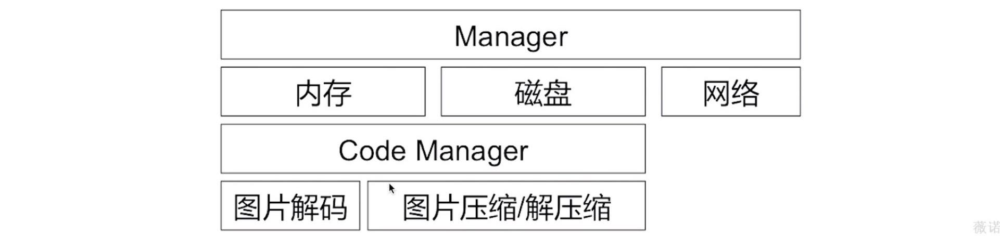
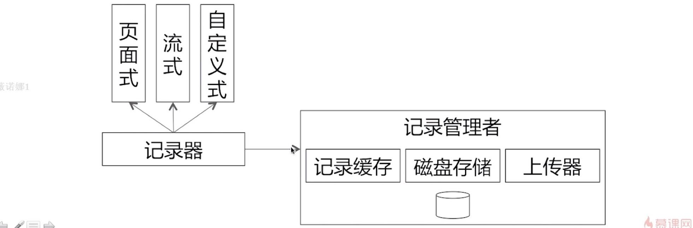
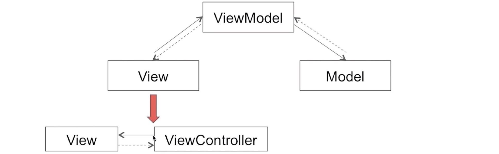
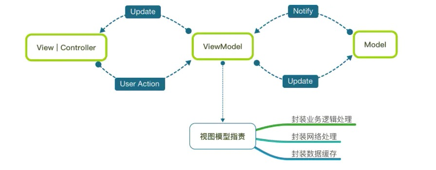
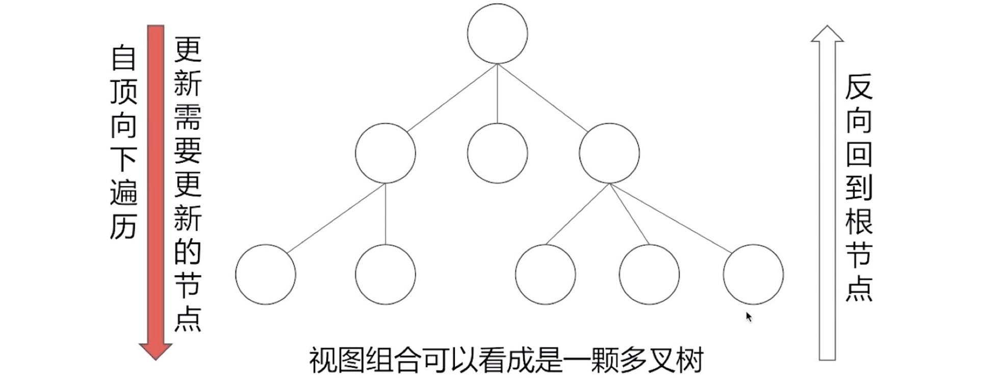
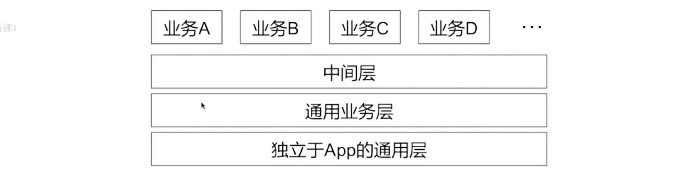

## 十.框架&架构

### 10.1 图片缓存
**A.怎样设计一个图片缓存框架？**

首页有一个管理者`Manager`用于协调和调度框架内的各个子模块.
内存模块：
1.因为内存的空间有限，我们针对不同尺寸size的图片，给出不同的方案，比如10K以下的50个，100kb以下20个等。
2.内存淘汰的策略，采取`LRU`（Least Recently Used最不经常使用），其实淘汰策略跟架构设计有关系，比如使用队列(先进先出)
关于`LRU`的讲解：https://xiaozhuanlan.com/topic/6371042589
3.磁盘模块考虑 存储方式（文件系统还是数据库），移除策略、大小限制，30天未使用淘汰等。
4.网络模块，考虑请求最大的并发量、请求超时、请求优先级等。
5.解码模块，考虑图片解码的时机，避免在主线程解压缩、解码，避免卡顿

**B.图片通过什么方式进行读写？过程是怎样的？**
答：以图片URL的单向Hash值作为Key，来写到图片存储框架中，这里面牵涉到多级缓存。查找的过程是先从内存中查找，再从磁盘中查找，再从网络下载。

**C.什么是LRU算法？**
LRU (Least Recently Used) 是一个置换算法，最不经常使用，最少最近使用等，简单来说，就是让最近被访问的对象的访问优先级提高，最少使用的对象能够被淘汰，尽可能的为可能被访问的对象服务，加快访问的速度和效率。

通常的`LRU`采用`HashTable`和双链表来实现，`HashTable`用来满足获取缓存的时候`O(1)`, 双链表用来满足淘汰机制和更新机制的`O(1)`。

**D.什么是单向哈希算法？**
**单向散列函数**，又称单向Hash函数、杂凑函数，就是把任意长度的输入消息串变化成固定长的输出串且由输出串难以得到输入串的一种函数。这个输出串称为该消息的散列值。一般用于产生消息摘要，密钥加密等.
比如：
MD5（Message Digest Algorithm 5）：是RSA数据安全公司开发的一种单向散列算法，MD5被广泛使用，可以用来把不同长度的数据块进行暗码运算成一个128位的数值。

### 10.2 阅读时长统计
整体架构思路如下：

1.为何要有不同类型的记录器？你的考虑是什么？
答：基于不同分类场景提供的关于记录的封装和适配

2.记录的数据由于某种原因丢失，你是怎么样的？
答：可以尽量降低丢失，比如1.定时写磁盘，2.记录条数限制，比如每10条一写磁盘。3.App的生命周期内写磁盘。

3.关于延迟上传的具体场景有哪些？
答：比如前后台切换，比如记录内容大小来上传，比如WiFi网络下上传。

### 10.3 复杂页面架构

**A.MVVM架构思想**

**1.MVVM概念：**
在传统的MVC架构中，对于复杂业务的模块，往往造成Controller非常臃肿。而MVVM就是在MVC的基本上进行优化改进的架构模型，它的大体思路是：

1.从Controller分离出业务处理的逻辑到ViewModel层，减少Controller的臃肿
2.View和Model的数据流通过ViewModel层进行处理和转换

很多时候，为了view和viewModel数据交互更优雅（也就是双向绑定），一般会配合RAC响应式编程来实现MVVM。

**2.你在项目中是怎么使用MVVM的？**
我在项目开发过程中，会根据业务的复杂情况，工期的长度来合理安排架构模式，例如光猪圈App里面有个圈子模块，类似朋友圈，这个模块就借鉴了MVVM关于ViewModel的思想。
根据我开发多年的经验，我已经有了自己的一套开发架构，不管是MVC还是MVVM，我一般会变成MVC+T，或者MVVM+T，这里面的T就是Tool类，它大大减少View和Controller里面的代码，比如富文本、枚举判断、权限判断、个别网络请求等。提高了代码的复用率，和View和ViewModel里面代码的可读性。

**3.MVVM的关系和职责？**
View ：UI界面的创建及根据传递的Model来更新视图的逻辑 。
Controller ：负责控制器本身的生命周期，协调各个部分的绑定关系以及必要的逻辑处理。 
ViewModel ：网络请求、返回数据逻辑和业务逻辑的转换。
Model ：用来将数据模型化，使数据查看更清晰，使用更方便。

**4.MVVM的核心是双向绑定？**
绑定的意思就是讲两个对象建立关联，其中一个改变另一个自动跟着变。假设Model与View绑定就意味着Model改变时View自动跟着变，不需要手动赋值那一步：即响应式。

实现双向绑定的方式有很多，比如KVO、通知等。比如使用通知：
1.Controller持有View和ViewMode，VM持有Model属性，C或V接收VM发送Model改变的通知
2.当网络请求等造成Model改变时，M发送通知改变了V，这就是M绑定V。
3.当View通过点击需要改变Model时，由于中间Controller持有关系，回调给VM去改变Model。这就是V绑定M。

**5.MVVM结合RAC的核心原理是？**
首先MVVM的核心是双向绑定，即View和Model互相关联，自动改变，不需要手动赋值那一步，也就是实现响应式效果。所以响应式编程RAC能很好的结合MVVM，它可以简单的概括为：

`ViewModel`中创建好请求的信号`RACSignal`, `Controller`中订阅这个信号，在`ViewModel`完成请求后订阅者调用`sendNext:`方法，`Controller`里面订阅时写的block就收到回调了。

**6.MVVM的缺点？**
1.数据绑定使得 Bug 很难被调试。特别是使用了RAC。
2.对于过大的项目，数据绑定需要花费更多的内存。
3.对于团队开发中，受限于每个人对于业务和技术理解的差异，造成代码容易混乱

----

**B.ReactNative数据流思想**

RN就是React Native，使用React来搭建Android和iOS原生App，可以和原生App进行混合开发，开发语言是JS和H5。之前有关注，为此还特意学过一段时间的前端开发，但是随着Flutter，uniapp，Weex等框架的兴起，RN社区也是不如之前了。
我最近在调研uniapp，Weex这2个前端框架，发现对于安卓体验还可以，苹果偶尔有兼容性造成闪退的情况，但是的确比原生开发快很多。
而且我也比较喜欢VUE。所以比较看好基于VUE的框架。

Flutter我也进行了调研和尝试，在实际项目中进行了局部使用，不敢全部使用，怕App Store的审核规则发送变化，从效果来看，安卓体验还可以，苹果体验一般，而且Flutter从开发角度来说，还是原生开发。还不如uniapp，react native那么灵活。

**C.AsyncDisplayKit预排版的思想**
`AsyncDisplayKit`或者`Texture`是一个用于保持 iOS 界面流畅的框架。

造成App页面卡顿的原因有很多，总结一句话基本上就是：
CPU或GPU消耗过大，导致在一次同步信号之间没有准备完成，没有内容提交，导致掉帧的问题。

ASDK从三方面进行了优化：
**1.布局**
iOS自带的Autolayout在布局性能上存在瓶颈，并且只能在主线程进行计算。ASDK有一套自己的布局方式和缓存方式。

**2.渲染**
对于大量文本，图片等的渲染，UIKit组件只能在主线程并且可能会造成GPU绘制的资源紧张。ASDK使用了一些方法，比如图层的预混合等，并且**异步**的在后台绘制图层，不阻塞主线程的运行。

**3.系统对象创建和销毁**
UIKit组件封装了CALayer图层的对象，在创建、调整、销毁的时候，都会在主线程消耗资源。ASDK自己设计了一套Node机制，来避免主线程这方面的开销。

### 10.4 客户端整体架构

1.业务之间如何解耦通信？
答：`openURL`、依赖注入等。
https://zhuanlan.zhihu.com/p/100244328

备注：依赖注入的简单理解就是：
本来我接受各种参数来构造一个对象，现在只接受一个参数——已经实例化的对象。
也就是说我对对象的『依赖』是注入进来的，而和它的构造方式解耦了。构造它这个『控制』操作也交给了第三方，也就是控制反转。
