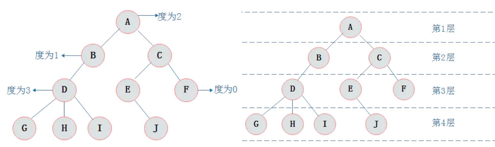

## 11.数据结构


如何系统地学习数据结构与算法？
https://zhuanlan.zhihu.com/p/137041568

字节跳动数据结构面试必备
https://www.jianshu.com/p/042052edeedd

## 一.线性表
**线性表**(linear list)，全名为**线性存储结构**。使用线性表存储数据的方式可以这样理解，即“把所有数据用一根线儿串起来，再存储到物理空间中”。

### 1.1 数组
**数组**（Array）是有序的元素序列，内存是连续的。

### 1.2 栈
栈（stack），是先进后出的数据结构，类似瓶子。有出栈入栈的概念。
限定仅在一端进行插入和删除操作的线性表。这一端被称为栈顶，相对地，把另一端称为栈底。向一个栈插入新元素又称作进栈、入栈或压栈

### 1.3 队列
队列（queue）是一种特殊的线性表，只允许在表的前端（front）进行删除操作，而在表的后端（rear）进行插入操作。
队列的特点是先进先出。（FIFO—first in first out）

队列的分类：
- 普通队列
- 阻塞队列
- 并发队列
- 双端队列
- 循环队列

**双端队列**：Double-ended queue，简称为Deque，特殊的队列，头部和尾部都支持元素插入和获取。

**阻塞队列**：阻塞队列指的是在元素操作时（添加或删除），如果没有成功，会阻塞等待执行。例如，当添加元素时，如果队列元素已满，队列会阻塞等待直到有空位时再插入。队空时，取数据会被阻塞拒绝。

**循环队列**：首尾相连形成环的队列。

**并发队列**：基于数组的循环队列+CAS原子操作，可以实现无锁并发队列

CAS原子操作：
https://blog.csdn.net/qq_28822933/article/details/83341633

图解队列：
https://baijiahao.baidu.com/s?id=1620332578191354701

### 1.4 链表
链表是一种存储单元上非连续、非顺序的数据结构，数据元素的逻辑顺序是通过每个节点的指针实现的。

链表的分类：
- 单链表
- 循环链表
- 双向链表
- 双向循环链表

**单向链表**(单链表)是链表的一种，它由节点组成，每个节点都包含下一个节点的指针，下图就是一个单链表：


**双向链表**(双链表)是链表的一种。双链表也是由节点组成，它的每个数据结点中都有两个指针，分别指向直接前节点和直接后节点。


**双向循环链表**跟双向链表一样，不过它的最后一个结点指向头结点，形成一个环。从循环链表中的任何一个结点出发都能找到任何其他结点。

## 二.散列表

https://blog.51cto.com/15054039/2563092

### 2.1 散列函数
**散列函数**，又叫**哈希函数**，（Hashing）就是将数据元素的关键字`K`作为自变量，通过一定的函数关系，计算出的值，即为该元素的存储地址。表示为：
`Addr = f(key)`

因此散列函数就是数据存储的位置和它的关键字之间建立一个确定的对应关系`f(key)`，使每个关键字和结构中一个唯一的存储位置相对应。

应用：
- 加密（比如MD5，不过MD5是单向哈希函数）
- 散列表

### 2.2 冲突解决
**哈希冲突**是不可避免的，因为键的数目总是比索引的数目多，不管是多么高明的算法都不可能解决这个问题。就算键的数目比索引的数目少，必有一个输出串对应多个输入串，冲突还是会发生。

哈希冲突的解决办法：
A.闭散列法(开放寻址法)：
 - 线性探测
 - 二次探测
 - 双散列法

B.开散列法：
 - 链表法
 - 其他

**开放寻址法**：
就是在发生冲突后，通过某种探测技术，去依次探查其他单元，直到探查到不冲突为止，将元素添加进去。
假如是在index的位置发生哈希冲突，那么通常有一下几种探测方式：
- 线性探测法（线性探测再散列）
  向后依次探测index+1，index+2…位置，看是否冲突，直到不冲突为止，将元素添加进去。

- 平方探测法
  不探测index的后一个位置，而是探测`2^i`位置，比如探测`2^0`位置上时发生冲突，接着探测`2^1`位置，依此类推，直至冲突解决

**链表法**：
链表法就是在发生冲突的地址处，挂一个单向链表，然后所有在该位置冲突的数据，都插入这个链表中。插入数据的方式有多种，可以从链表的尾部向头部依次插入数据，也可以从头部向尾部依次插入数据，也可以依据某种规则在链表的中间插入数据，总之保证链表中的数据的有序性。

例：已知一组关键字为(19，14，23，01，68，20，84，27，55，11，10，79)，则按哈希函数 H(key) = key MOD13 (%取余)和链表法处理冲突构造所得的哈希表为：


**双散列法**：
在发生哈希冲突后，使用另外一个哈希算法产生一个新的地址，直到不发生冲突为止。这个应该很好理解。

### 2.3 哈希表
**散列表**（Hash table，也叫**哈希表**），是根据关键码值(Key-Value)而直接进行访问的数据结构。也就是说，它通过把关键码值映射到表中一个位置来访问记录，以加快查找的速度。这个映射函数叫做**散列函数**(哈希函数)，存放记录的数组叫做**散列表**。

给定表`M`，存在函数`f(key)`，对任意给定的关键字值`key`，代入函数后若能得到包含该关键字的记录在表中的地址，则称表`M`为**哈希(Hash）表**，函数`f(key)`为**哈希(Hash) 函数**。

### 2.4 位图

**位图** 就是`bitmap`的缩写，是用每一位来存放数的状态的结构，适用于大规模的数据。比如海量数据处理，索引，数据压缩等方面。

位图的结构类似于哈希表，位图就是用每一位的0或1来表示一个数的状态。例如，我们现在有一个文件，这个文件中有数字1,3,5.我们就可以把第1位、第3位、第5位的状态设置为1，其余位为0。


*利用位图的思想，就很容易解决：从40亿个无符号整型数据中，查某个数字是否在这40亿数据中了*

### 2.5 布隆过滤器
**布隆过滤器**（Bloom Filter）是一个很长的二进制向量和一系列随机映射函数。布隆过滤器可以用于检索一个元素是否在一个集合中。核心思想是位图的思想。布隆过滤器广泛应用于网页黑名单系统、垃圾邮件过滤系统、爬虫网址判重系统等

比如下面的题目：
如果一个黑名单网站包含100亿个黑名单网页，每个网页最多占64B，设计一个系统，判断当前的URL是否在这个黑名单当中，要求额外空间不超过30GB，允许误差率为万分之一。

### 2.6 动态扩容

装载因子越大，也就是散列表中的元素占比越来越大，空闲位置越来越小，那么散列冲突的概率也就越来越大。假如采用开放寻址法，则寻址次数将会很多；采用链表法，则链表将会很长。解决这类问题多多直观方法就是对散列表进行扩容。

当装载因子大于某个值时，散列表可以申请一个更大的散列表，然后将数据都搬移到这个新的散列表中。

扩容思路一：在装载因子到达阈值进行扩容时需要将所有数据都进行迁移。
扩容思路二：扩容时，不都进行迁移，而是当有新数据插入的时候，我们将新数据插入到新的散列表中，然后从老的散列表中取出一个数据插入到新的散列表中。之后重复上面的过程。

## 三.二叉树

### 3.1 树的基本概念
https://www.jianshu.com/p/bf73c8d50dc2

1.树是很多**结点**构成
2.结点拥有的子树数目称为结点的**度**
3.树中结点的最大层次数称为树的**深度**或**高度**。



**A.二叉树的基本概念和特点**
二叉树是n(n>=0)个结点的有限集合，该集合或者为空集（称为空二叉树），或者由一个根结点和两棵互不相交的、分别称为根结点的左子树和右子树组成。

1）每个结点最多有两颗子树，所以二叉树中不存在度大于2的结点。
2）左子树和右子树是有顺序的，次序不能任意颠倒。
3）即使树中某结点只有一棵子树，也要区分它是左子树还是右子树。


**B.满二叉树**
在一棵二叉树中。如果所有分支结点都存在左子树和右子树，并且所有叶子都在同一层上，这样的二叉树称为`满二叉树`。


**C.完全二叉树**
对一颗具有n个结点的二叉树按层编号，如果编号为i(1<=i<=n)的结点与同样深度的满二叉树中编号为i的结点在二叉树中位置完全相同，则这棵二叉树称为`完全二叉树`

注：**满二叉树一定是完全二叉树**，但反过来不一定成立。


方便理解的一种辨别方式：
如果二叉树中除去最后一层节点为满二叉树，且最后一层的结点依次从左到右分布，则此二叉树被称为完全二叉树。

**D.二叉树的遍历**

前序遍历（先根遍历）：根左右。
后序遍历（后根遍历）：左右根。
中序遍历（中根遍历）：左根右。
层次遍历：一层一层自左向右。

### 3.1 二叉查找树

数据结构中，线性表分为无序线性表和有序线性表。
**无序线性表**的数据是杂乱无序的，所以在插入和删除时，没有什么必须遵守的规则，可以插入在数据尾部或者删除在数据尾部。但是在查找的时候，需要遍历整个数据表，导致无序线性表的查找效率低。
**有序线性表**的数据则相反，查找数据时的时候因为数据是有序的，可以用二分法、插值法、斐波那契查找法来实现。但是，当进行插入和删除操作时，需要维护表中数据的有序性，会耗费大量的时间。
那么，我们希望找到一种数据结构，既可以有较高的插入和删除效率，并且具备较高的查找效率，因此，二叉排序树应运而生。

**二叉排序树**（Binary Sort Tree），又称**二叉查找树**（Binary Search Tree），也称**二叉搜索树**。是具有下列性质的二叉树：

> （1）若左子树不空，则左子树上所有结点的值均小于或等于它的根结点的值；
> （2）若右子树不空，则右子树上所有结点的值均大于或等于它的根结点的值；
> （3）左、右子树也分别为二叉排序树；

https://www.jianshu.com/p/bbe133625c73

### 3.2 平衡二叉树
https://zhuanlan.zhihu.com/p/56066942

平衡二叉树，是一种二叉排序树，其中每个节点的左子树和右子树相差的高度不超过1。它是一种高度平衡的二叉排序树。高度平衡：意思是说，要么它是一颗空树，要么它的左子树和右子树都是平衡二叉树。

> 平衡二叉树一定是二查排序树
> 平衡二叉树 又叫 平衡二叉查找树，又叫 AVL树

平衡二叉树的难点是 删除和增加节点后，需要修正，让树保持平衡，也就是平衡二叉树的旋转。

### 3.3 红黑树
https://blog.csdn.net/qq_36610462/article/details/83277524
https://zhuanlan.zhihu.com/p/79980618

红黑树，Red-Black Tree 「RBT」是一个自平衡的二叉查找树(BST)，树上的每个节点都遵循下面的规则:

1.每个节点都有红色或黑色
2.根节点始终是黑色
3.没有两个相邻的红色节点（红色节点不能有红色父节点或红色子节点，并没有说不能出现连续的黑色节点）
4.从节点（包括根）到其任何后代NULL节点(叶子结点下方挂的两个空节点，并且认为他们是黑色的)的每条路径都具有相同数量的黑色节点
5.每个红色节点的两个子节点都是黑色(含义同3)

典型的红黑树：


由于红黑色的规则和特点，所以插入和删除时，可能需要`recolor`和 `rotation`。

- `recolor` (重新标记黑色或红色)
- `rotation` (旋转，这是树达到平衡的关键)(左旋转/右旋转)


https://blog.csdn.net/wtyvhreal/article/details/46442091

https://zhuanlan.zhihu.com/p/27700617


----


## 11.算法

二分查找 （OC从对象查找方法过程中，排序好的方法列表，采用二分查找法）

### 11.1 字符串反转
给定字符串`123,456`，要求反转输出：
```swift
// 1.C函数办法，
void char_reverse(char* cha) {
    // 指向第一个字符
    char* begin = cha;
    // 指向最后一个字符
    char* end = cha + strlen(cha) - 1;

    while (begin < end) {
        // 交换前后两个字符，同时移动指针
        char temp = *begin;
        *(begin++) = *end;
        *(end--) = temp;
    }
}

char ch[] = "123,456";
char_reverse(ch);
printf("%s", ch);

// 2.OC，OC就倒叙遍历字符，然后拼接成新的字符串即可
// 3.Swift，从`MutableCollection`集合源码中，可以看出来，跟C语言方式很像
public mutating func reverse() {
    if isEmpty { return }
    var f = startIndex
    var l = index(before: endIndex)
    while f < l {
    swapAt(f, l)
    formIndex(after: &f)
    formIndex(before: &l)
}
```

### 11.2 链表反转

核心思想就是：定义临时变量，指向当前节点，定义新的链表头，遍历老链表，插入到新链表的头部，不过代码实现时，也发现由于Swift的`Optional`的存在，导致有一些问号可能会看起来有些奇怪。
```swift
/// 定义链表的节点
class Node {
    var data: Int
    var next: Node? = nil
}

/// 传入链表的头节点，返回反转后的链表头节点
func reverseList(_ head: Node?) -> Node? {
    // 定义遍历指针，初始化为头节点
    var point = head
    // 反转后链表的头部
    var newHead: Node? = nil

    // 遍历链表
    while point != nil {
        // 记录下一个节点
        let temp = point?.next
        // 当前节点的next指向新链表的头部
        point?.next = newHead
        // 更改新链表头部为当前节点
        newHead = point
        // 移动p指针
        point = temp
    }
    return newHead!
}
```

*注意，链表反转还有递归法，但是相比迭代遍历法，递归虽然代码少，但是空间复杂度高*

### 11.3 有序数组合并

1.思路一是定义2个索引指针，挨个比较2个数组的元素，谁小，填加谁，并移动它数组的索引值，最后将某个较长数组的剩余部分添加完
2.思路二是自己写的，每次都是比较索引0的位置，代码如下：

```swift
func merge(_ a: [Int], _ b: [Int]) -> [Int] {
    var a = a, b = b  // 提升为可变数组
    var newArray: [Int] = []  // 合并后的数组

    while true {
        if a.isEmpty && b.isEmpty { break }

        if a.isEmpty {
            newArray.append(b[0])
            b.removeFirst()
            continue
        }

        if b.isEmpty {
            newArray.append(a[0])
            a.removeFirst()
            continue
        }

        if a[0] > b[0] {
            newArray.append(b[0])
            b.removeFirst()
        } else {
            newArray.append(a[0])
            a.removeFirst()
        }
    }

    return newArray
}
```

# 11.4 Hash算法
**哈希**（Hash）也称为散列，就是把任意长度的输入，通过散列算法，变换成固定长度的输出，这个输出值就是散列值。

**哈希表**（Hash table，也叫**散列表**），是根据关键码值(Key value)而直接进行访问的数据结构。也就是说，它通过把关键码值映射到表中一个位置来访问记录，以加快查找的速度。这个映射函数叫做**散列函数**(哈希函数)，存放记录的数组叫做**散列表**(哈希表)。

所以，哈希算法并不是一种固定的算法，而是符合上面描述的，都可以是哈希算法，比如一个例子，字符a对应的ASCII码是97，这就可以看成一个哈希函数。比如下面的例子：

**1.在一个字符串找到第一个只出现一次的字符？**
```swift
let str = "ababcddf"  // 第一个出现一次字符是c
var dic: [Int: Int] = [:]  // 定义临时数据map

for i in str {
    if let val = dic[i.hashValue] {
        dic[i.hashValue] = val + 1
    } else {
        dic[i.hashValue] = 1
    }
}

for i in str {
    if dic[i.hashValue] == 1 {
        print(i)  // 输出字符C
        break
    }
}
// -----------------
for i in str {  // 自定义哈希映射的办法，不用系统的`hashValue`
    let hashVal = i.asciiValue ?? -1  // 自定义Hash值，??是因为可能有ASCII之外的字符
    if let val = dic[hashVal] {
        dic[hashVal] = val + 1
    } else {
        dic[hashVal] = 1
    }
}
```

### 11.5 查找两个子视图的共同父视图


思路很简单，分别遍历拿到两个子视图的所有父视图数组，然后倒叙遍历两个数组，找到第一个不相等的索引时，停止遍历，遍历条件注意防止越界，那么已遍历的元素，全部是共同的父视图。

### 11.6 从无序数组中，查找中位数
思路一，基本排序算法+中位数；思路二，利用快排思想（分治思想）。

**快速排序**使用分治的思想，通过一趟排序将待排序列分割成两部分，其中一部分记录的关键字均比另一部分记录的关键字小。之后分别对这两部分记录继续进行排序，以达到整个序列有序的目的。
快速排序的三个步骤：

(1)选择基准：在待排序列中，按照某种方式挑出一个元素，作为 "基准"（pivot）
(2)分割操作：以该基准在序列中的实际位置，把序列分成两个子序列。此时，在基准左边的元素都比该基准小，在基准右边的元素都比基准大
(3)递归地对两个序列进行快速排序，直到序列为空或者只有一个元素。

https://blog.csdn.net/chunbo4007/article/details/100677701
https://www.jianshu.com/p/d39c98ce315b


押题，必会：
1.系统的UI事件传递机制是怎么样的？
2.KVO的实现原理是怎样的？
3.Runtime的消息传递机制和消息转发流程
4.当一个obj废弃的时候，指向它的weak指针为何会自动置为nil
5.Block的实质是怎么的？使用Block为何容易产生循环引用？
6.怎么使用GCD实现高效的多度单写逻辑？
7.RunLoop为何能做到有事做事，没事休息？
8.怎么解决DNS劫持？
9.分别说说什么是桥接模式、责任链模式？
10.怎么设计一个图片缓存框架？
RAC的信号订阅是什么意思？
ASDK的实现原理是怎么样的？

