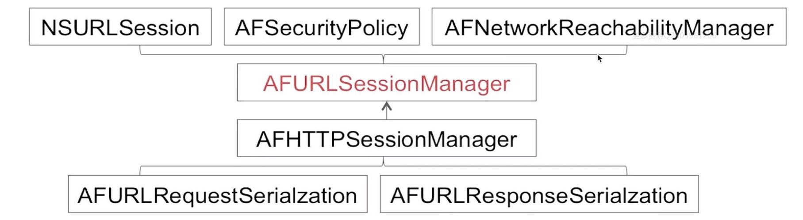
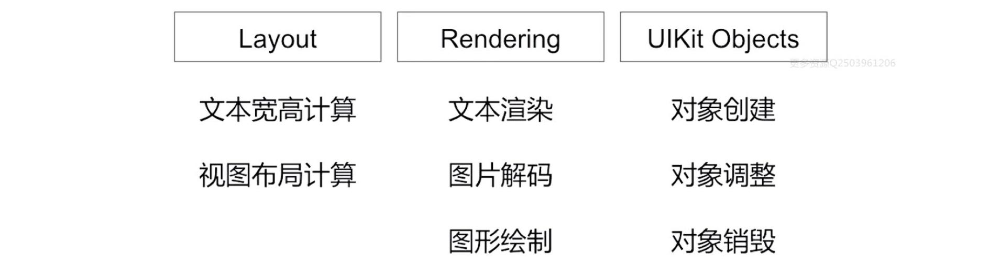
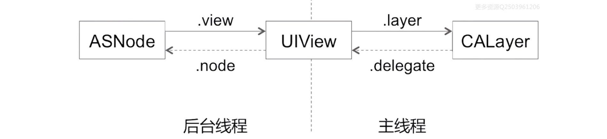

## 十二.第三方库

### 12.1 AFNetworking
整体框架图：


主要类的关系图：


**A.下面类使用了什么设计模式？**
```objc
AFHTTPSessionManager *manager = [AFHTTPSessionManager manager];
```

答：使用了工厂模式，从源码里可以得知，没有使用单例模式。`AFHTTPSessionManager`是`AFURLSessionManager`的子类，为了便利使用HTTP请求。当一个baseURL提供时，用相对路径构造GET/POST等便利的方法来创建请求。

**B.AF里面GCD单例的使用？**
```objc
+ (instancetype)defaultInstance {
    static AFImageDownloader *sharedInstance = nil;
    static dispatch_once_t onceToken;
    dispatch_once(&onceToken, ^{
        sharedInstance = [[self alloc] init];
    });
    return sharedInstance;
}
```
通过`dispatch_once`来保证多线程调用时，只有一个实例被创建。

**C.AF里面使用GCD进行并行读串行写？**
```objc
// 注意是并行队列
self.requestHeaderModificationQueue = dispatch_queue_create("requestHeaderModificationQueue", DISPATCH_QUEUE_CONCURRENT);

// 串行写，注意barrier block的具体执行时机
dispatch_barrier_sync(self.requestHeaderModificationQueue, ^{
    [self.mutableHTTPRequestHeaders setValue:value forKey:field];
});

// 并行读，注意和上面写操作同时执行时的执行顺序
NSDictionary __block *value;
dispatch_sync(self.requestHeaderModificationQueue, ^{
    value = [NSDictionary dictionaryWithDictionary:self.mutableHTTPRequestHeaders];
});
```
`dispatch_sync`与`dispatch_barrier_sync`栅栏技术配合解决并行读串行写问题。
GCD使用barrier栅栏技术来处理并行读串行写问题的具体用法。

**D.AF里面`weakSelf`与`strongSelf`的用法？**
```objc
__weak __typeof(self)weakSelf = self;
AFStatusCallback callback = ^(AFStatus status) {
    __strong __typeof(weakSelf)strongSelf = weakSelf;
    // TODO...
};
```
`weakSelf`避免循环引用，`strongSelf`保证block内部执行过程中`self`不会被释放。

**E.AFURLSessionManager与NSURLSession的关系，每次都需要新建mananger吗？**
manager与session是1对1的关系，AF会在manager初始化的时候创建对应的NSURLSession。同样，AF也在注释中写明了可以提供一个配置好的manager单例来全局复用。

而复用session可以带来什么好处呢？

iOS9之后，session就开始支持http2.0。而http2.0的一个特点就是多路复用。所以这里复用session其实就是在利用http2.0的多路复用特点，减少访问同一个服务器时，重新建立tcp连接的耗时和资源。

**F.AFSecurityPolicy如何避免中间人攻击？**
中间人攻击，大体就是黑客通过截获服务器返回的证书，并伪造成自己的证书，通常我们使用的Charles/Fiddler等工具实际上就可以看成中间人攻击。

解决方案其实也很简单，就是`SSL Pinning`。`AFSecurityPolicy`的`AFSSLPinningMode`就是相关设置项。

`SSL Pinning`的原理就是需要将服务器的公钥打包到客户端中，TLS验证时，会将服务器的证书和本地的证书做一个对比，一致的话才允许验证通过。
```objc
typedef NS_ENUM(NSUInteger, AFSSLPinningMode) {
    AFSSLPinningModeNone,
    AFSSLPinningModePublicKey,    // 只验证证书中的公钥
    AFSSLPinningModeCertificate,    // 验证证书所有字段，包括有效期之内
};
```
由于数字证书存在有效期，内置到客户端后就存在失效后导致验证失败的问题，所以可以考虑设置为`AFSSLPinningModePublicKey`的模式，这样的话，只要保证证书续期后，证书中的公钥不变，就能够通过验证了。

### 12.2 SDWebImageView
架构简图：


SD加载图片的流程：
1.先从要请求的图片URL，生成对应的Key，从内存缓存查找、从磁盘缓存、从网络下载。当然

https://www.jianshu.com/p/c69a6e6df3bf
https://www.jianshu.com/p/ff9095de1753

**A.`SDImageCache`是怎么做数据管理的?**
`SDImageCache`分两个部分，一个是内存层面的，一个是硬盘层面的。
内存层面的相当是个缓存器，以`Key-Value`的形式存储图片。当内存不够的时候会清除所有缓存图片。
用搜索文件系统的方式做管理，文件替换方式是以时间为单位，剔除时间大于一周的图片文件。
当`SDWebImageManager`向`SDImageCache`要资源时，先搜索内存层面的数据，如果有直接返回，没有的话去访问磁盘，将图片从磁盘读取出来，然后做`Decoder`，将图片对象放到内存层面做备份，再返回调用层。

**B.SDWebImage缓存图片的名称是怎么确定的?**
如果单纯使用文件名保存，重名的几率很高！所以SDWebImage使用了MD5的散列函数，对完整的URL进行MD5，得到了一个32个字符长度的字符串，作为文件名。
MD5是单向哈希算法，单向哈希算法就是从结果很难逆推回原来的值。

### 12.3 Reactive Cocoa
RAC：函数响应式编程框架。对应的Swift库是`RxSwift`。

`RACSignal`信号代表一连串的状态，在状态改变时，对应的订阅者`RACSubscriber`就会收到通知执行响应的指令。

### 12.4 AsyncDisplayKit
最新库已经是`Texture`了。是一个提升iOS渲染性能的框架。主要处理了一下问题(减轻主线程压力，把很多事情放在子线程)：


基本原理：


是对`UIView`的封装；针对ASNode的修改和提交，会对其进行封装并提交到一个全局容器当中，ASDK也在RunLoop中注册了一个Observer，当RunLoop进入休眠前，ASDK执行该loop内提交的所有任务。
