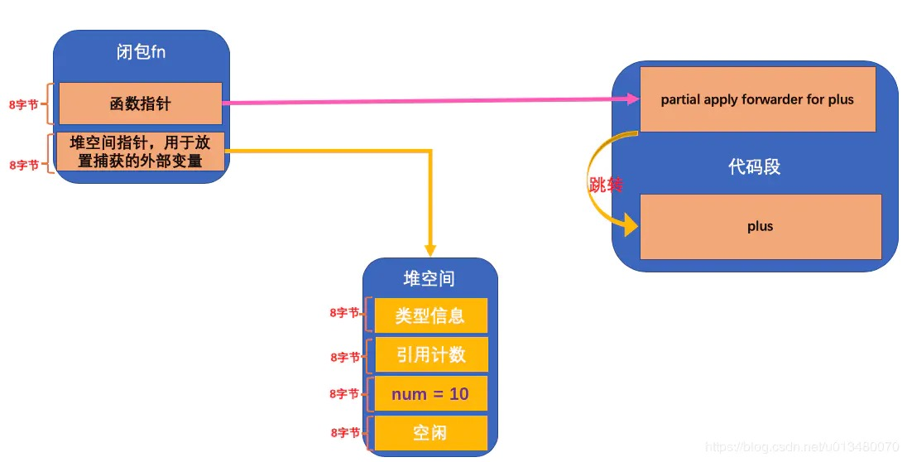
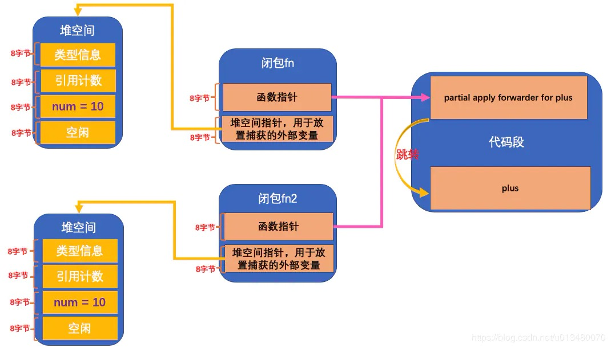

## 0.Swift

Swift里面的内存管理方案
https://blog.csdn.net/ShmilyCoder/article/details/103810581

**1.Swift 比 Objective-C 有什么优势？**
Swift 更加安全，它是类型安全的语言，项目使用Swift重构之后，崩溃情况减少86%，极光数据。
Swift 泛型、结构体、枚举都很强大，语法简洁，使用Swift编写的项目，代码量比OC减少了1/3，大大提高了开发效率。
Swift相比OC不好的地方：
1.Swift反射功能很弱，不像OC有runtime，所以Swift的字典转模型，目前还比较弱。(虽然有`Codable`协议)
2.Swift打出来的包，比OC的包大了将近一半，因为要支持iOS10

**2.dynamic framework 和 static framework 的区别是什么？**

静态库和动态库是相对编译期和运行期的：静态库在程序编译时会被链接到目标代码中，程序运行时将不再更改静态库；而动态库在程序编译时并不会被链接到目标代码中，只是在程序运行时才被载入。
不同点：
静态库在链接时，会被完整的复制到可执行文件中，如果多个App都使用了同一个静态库，那么每个App都会拷贝一份，缺点是浪费内存.
动态库不会复制，只有一份，程序运行时动态加载到内存中，系统只会加载一次，多个程序共用一份，节约了内存.
共同点：
静态库和动态库都是闭源库,只能拿来满足某个功能的使用,不会暴露内部具体的代码信息.

**3.Swift的静态派发**
OC 中的方法都是动态派发(方法调用),Swift 中的方法分为静态派发和动态派发.
**动态派发**:指的是方法在运行时才找具体实现.Swift 中的动态派发和 OC 中的动态派发是一样的.
**静态派发**:静态派发是指在运行时调用方法不需要查表,直接跳转到方法的代码中执行.
静态派发的特点:
静态派发更高效,因为静态派发免去了查表操作.
静态派发的条件是方法内部的代码必须对编译器透明,且在运行时不能被更改,这样编译器才能帮助我们.
Swift中的**值类型**不能被继承,也就是说值类型的方法实现不能被修改或者被复写,因此值类型的方法满足静态派发.

**4.说说Swift为什么将String,Array,Dictionary设计成值类型？**
值类型相比引用类型,最大的优势在于内存使用的高效.值类型在栈上操作,引用类型在堆上操作.栈上的操作仅仅是单个指针的上下移动,而堆上的操作则牵涉到合并、移位、重新链接等.这也是Swift性能高的一个原因之一。
String,Array,Dictionary设计成值类型,也是为了线程安全考虑.通过Swift的`let`设置,使得这些数据达到了真正意义上的“不变”,它也从根本上解决了多线程中内存访问和操作顺序的问题.这也是Swift是安全的一个原因之一。

**5.什么是函数式编程？**
OOP面向对象的编程思想, 我们将要解决的一个个问题, 抽象成一个个类, 通过给类定义属性和方法, 让类帮助我们解决需要处理的问题.(即命令式编程, 给对象下一个个命令).
函数式编程的主要思想是把运算过程尽量写成一系列嵌套的函数调用.所以相对于OOP而言，函数成了第一等公民：函数和其他数据类型一样,可以作为参数,可以赋值给其他变量,可以作为返回值.

**6.Swift里`mutating`关键字的使用？**
在Swift中，`struct`和`enum`是值类型，并且可以定义自己的方法，但是默认情况下，实例方法中是不可以修改值类型的属性。为了能够在实例方法中修改属性值，可以在方法定义前添加关键字`mutating`。加了`mutating`之后，就可以修改属性值了。
通过将Swift代码编译为`sil`代码之后，可以得出下面的结论：
添加`mutating`修饰后：
- 我们的值类型前面加上了`inout`修饰
- 使用前后方法内的`self`分别是`let`和`var`
- 所以`mutating`的本质就是`inout`

Swift编译过程：
https://www.jianshu.com/p/e917bf0e8a7d

**7.Swift里`inout`关键字的使用？**
`inout`是Swift中的关键字，可以放置于参数类型前，冒号之后。使用 `inout` 之后，函数体内部可以直接更改参数值，而且改变会保留：
```swift
func swap<P>(_ a: inout P, _ b: inout P) {}
swap(&a, &b)
```

https://www.jianshu.com/p/b348c07ca42a

**8.Swift里`inout`关键字的注意事项？**
1.使用`inout`关键字的函数，在调用时需要在该参数前加上&符号
2.使用`inout`的参数在传入时必须为变量，不能为常量
3.使用`inout`的参数不能有默认值，不能为可变参数
4.使用`inout`的参数不等同与函数返回值，是一种使参数的作用域超出函数体的方式
5.多个使用`inout`的参数不能同时传入一个变量，因为拷入拷出的顺序不定，那么最终值也不能确定(就是可能发生内存溢出)

`inout`的本质：
- 使用`inout`修饰的参数，在函数体内部都是`var`可变类型的
- 在修改的时候，都是修改的其**内存中的数据**

**9.关键字`@autoclosure`的作用？**
自动闭包，将参数自动封装为闭包参数:
```swift
assert { expensive() != 42 } // 尾随闭包
assert(expensive() != 42) // @autoclosure 自动封装闭包
```

https://www.jianshu.com/p/68b5b6b9111a

**10.swift中,如何阻止方法,属性,下标被子类改写?**
在类的定义中使用 `final` 关键字声明类、属性、方法和下标。`final`声明的类不能被继承，`final`声明的属性、方法和下标不能被重写。
如果只是限制一个方法或属性被重写,只需要在该方法或者属性前加一个`final`.
如果需要限制整个类无法被继承, 那么可以在类名之前加一个`final`。

**11.`struct`与`class`的区别？**
1.struct是值类型，class是引用类型，所以造成：struct是深拷贝；class是浅拷贝。
2.变量赋值方式不同：struct是值拷贝；class是引用拷贝。
3.swift的可变内容和不可变内容用`var`和`let`来区别，如果初始为let的变量再去修改会发生编译错误。struct遵循这一特性；class不存在这样的问题。
4.struct 的function要去改变 property 的值的时候要加上`mutating`，而 class不用。
5.struct不可以继承，class可以继承。
6.struct比class更轻量：struct分配在栈中，class分配在堆中。

**12.OC的`Block`与Swift的`Closur`闭包的区别？**
相同点：都可以作为参数，都可以捕获局部变量；
Block的本质是封装了函数以及函数调用环境的OC对象`NSBlock`。
Swift的闭包是一个函数和它捕获的变量/常量环境的组合。可以把闭包想象成是一个类的实例对象：内存在堆空间，捕获的变量/常量是对象的成员(存储属性)，组成闭包的函数就是类的内部定义的方法。(其实Block就是这么做的)
Swift里面的闭包更加灵活，有尾随闭包，自动闭包可供选择，简洁且高效；

当Swift的闭包作为方法参数，并且该闭包可能在函数返回后才被调用，也就是闭包逃离了函数的作用域时，需要使用逃逸闭包:`@escaping`

**13.Swift中闭包表达式的种类？**
**尾随闭包**:当且仅当最后一个参数是闭包表达式的时候,可以独立于参数之外，属于结构优化；
**自动闭包**:当且仅当参数类型是()->T的时候，且用`@autoclosure`修饰，该参数会自动生成闭包表达式，达到延迟执行的效果，属于性能优化；

**14.defer、guard的作用？**
`defer`语句块中的代码, 会在当前作用域结束前调用,无论函数是否会抛出错误。每当一个作用域结束就进行该作用域`defer`执行。 如果有多个`defer`, 那么后加入的先执行.
`guard`:过滤器，拦截器
`guard`和`if`类似, 不同的是, `guard`总是有一个`else`语句, 如果表达式是假或者值绑定失败的时候, 会执行`else`语句, 且在`else`语句中一定要停止函数调用.

**15.Swift闭包Closure的本质？**
https://www.jianshu.com/p/c85c3de2b676

首先，下面代码的输出结果是？
```swift
typealias Fn = (Int) -> Int
func getFn() -> Fn {
    var num = 0 // 这里num是一个局部变量
    func plus(_ i: Int) -> Int {  // 内部的函数
        num += i  // 捕获了外层的局部变量
        return num
    }
    return plus
}
var fn = getFn()
print(fn(1))  // 1
print(fn(2))  // 3
print(fn(3))  // 6
print(fn(4))  // 10
```
分析如下：

- `plus`函数内部所捕获的那个外层函数局部变量`num`，实际上是把它的值存储到了堆上动态申请的一段内存空间上.
- 动态申请的内存大小是`24`字节，实际获得的内存大小是`32`字节，前`16`个字节存放类型描述信息和引用计数信息，接下来的`8`个字节用来存放`num`的值，剩下的暂时空闲。
- `getFn`函数每调用一次，就会动态申请一段新的堆内存来存放全新的`num`值。
- 变量`var fn`，内存大小是`16`个字节，而内存里指向的就是堆空间Closure的地址。

内存结构图：


当使用2个变量`var fn2`时，他们的内存结构是：


为了便于理解，可以这样思考（而且Closure的内存布局也是和类对象几乎一样的：`共享方法，各自管理自己的成员变量`）：
```swift
// 在调用`var fn = getFn()`时
// 可以理解为函数`getFn()`内部合成了一个对象，并返回这个对象
class Closure {
    var num: Int = 0  // 对象的成员，就是捕获的变量

    // 对象的方法，就是闭包的函数
    func plus(_ i: Int) -> Int {
        self.num += i
        return self.num
    }
}
fn.plus(1)
```

**16.请问闭包对于外界变量的捕获，到底发生在什么时候？**
```swift
typealias Fn = (Int) -> Int
func getFn() -> Fn {
    var num = 0 // 这里num是一个局部变量
    func plus(_ i: Int) -> Int {  // 内部的函数
        num += i  // 捕获了外层的局部变量
        return num
    }
    num = 10  // 改变num的值
    return plus
}

var fnx = getFn()
print(fnx(1))   // 11
print(fnx(2))   // 13
```

从结果可以知道，虽然调用是在`var fnx = getFn()`，但是合成闭包，是在`return plus`，所以真正捕获变量，是在`return plus`代码行。

需要注意的是，如果`return {$0}`，也就是返回一个无关的固定内容，编译器是不会合成闭包的。

**17.异常`throw`和`throws`的区别是？**
函数内部通过`throw`抛出自定义`Error`，可能抛出`Error`的函数必须加上`throws`。(`throw`有点类似`return`)
```swift
func divide(a: Int, b: Int) throws -> Int {
    if b == 0 { throw ZeroError("0不能作为除数") }
    return a / b
}
```

**18.为什么数组索引越界会崩溃，而字典用下标取值时 key 没有对应值的话返回的是 nil 不会崩溃？**
```swift
struct Array<Element> {
    subscript(index: Int) -> Element
}

struct Dictionary<Key: Hashable, Value> {
    subscript(key: Key) -> Value?
}
```

1 数组索引访问的是一段连续地址,越界访问也能访问到内存,但这段内存不一定可用,所以会引起`Crash`.
2 字典的`key`并没有对应确定的内存地址,所以是安全的.

**19.给集合中元素是字符串的类型增加一个扩展方法，应该怎么声明？**
```swift
使用 where 子句, 限制 Element 为 String
extension Array where Element == String {
    var isStringElement:Bool {
        return true
    }
}
["1", "2"].isStringElement
```

**20.一个函数的参数类型只要是数字（Int、Float）都可以，要怎么表示。**
```swift
// Int、Float 都有一个协议  泛型+where
func myMethod<T>(_ value: T) where T: Numeric {
    print(value + 1)
} 
// 或者`ExpressibleByIntegerLiteral`协议也行
```

**21.一个类型表示选项，可以同时表示有几个选项选中（类似`UIViewAnimationOptions`），用什么类型表示？**
在OC里面，使用位移枚举表示多种状态，比如：
```objc
typedef NS_OPTIONS(NSUInteger, ActionType) {
    ActionTypeUp    = 1 << 0, //  0001  1
    ActionTypeDown  = 1 << 1, //  0010  2
    ActionTypeRight = 1 << 2, //  0100  4
};
```

由于`OptionSet`要求有一个不可失败的`init(rawValue:)`构造器,所以在Swift里面使用`struct`实现：
```swift
struct SomeOption: OptionSet {
    let rawValue: Int
    static let option1 = SomeOption(rawValue: 1 << 0)
    static let option2 =  SomeOption(rawValue:1 << 1)
    static let option3 =  SomeOption(rawValue:1 << 2)
}
let options: SomeOption = [.option1, .option2]
```


