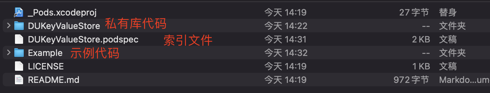
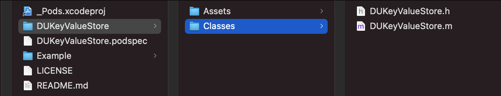
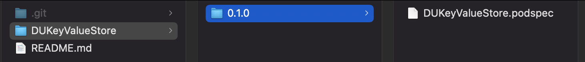

## 私有库

### 1.创建索引库
搭建私有库之前必须要先创建索引库

1.1 首先检查当前电脑的索引库
```shell
pod repo
```

1.2 在 `gitlab` 上创建一个新的库，这个库用来保存私有库的`podspec`文件，所以我们一般起名字最好是 `xxxSpec` 用以区分这个库的作用。

> 比如在Gitlab上，正确的目录下`ios/platform`，直接页面创建新`project`，起名为`PlatformSpec`.

1.3 创建本地索引库，最简单的办法就是直接将上一步创建好的`project`进行`Clone`下拉即可。

1.4 将本地索引库，添加到pod索引里面：
```shell
pod repo add XXXSpec 刚才创建的远程索引库的gitlab的地址

# 例如:

pod repo add DUPlatformSpec https://gitlab.wdabuliu.com/ios/platform/duplatformspec.git
```

1.5 执行完毕后，再次执行下面的命令，查看本地pod索引库的列表：
```shell
pod repo
```

### 2.创建本地私有库

注意！这个库是存代码的，不要和刚才的索引库混淆了！
2.1 本地库名称：
```shell
# 先CD到合适目录
pod lib create 私有库名称
# 比如：
pod lib create DUKeyValueStore
```

> 回车之后，需要回答几个问题，比如项目语言等，完了会自动打开创建好的项目，项目的目录结构如下：



将`Classes`文件夹下面的`ReplaceMe.m`文件删除掉，替换成你要上传私有库的代码



此时，更新一下这个工程的pod库即可看到新添加的文件
```shell
pod install
```

2.2 在Gitlab上创建同名的项目，并拉取到本地，将本地创建的工程文件，拖进去即可，处理一下`gitignore`还有`README.md`.

让`gitignore`重新生效：
```shell
git rm -r --cached .
git add .
git commit -m 'init project'
```

**2.3 编写`podspec`文件**

省略


2.4 将本地pod代码和项目写好之后，推送到远程gitlab
比如编译一下，项目的最低iOS版本等。再`pod install`等。推送代码使用命令或者GUI都可以。
```shell
git status -- 查看当前git存了什么文件
git add . -- 将所有文件缓存到待提交文件区域
git commit -m "上传工程" -- 提交文件，写上备注
git remote add origin 远程仓库地址 -- 添加要推送的远程仓库地址
git push -u origin master -- 将代码推送到远程仓库的master分支
```

2.5 进行本地文件校验

先`cd`到`xx.podspec`所在文件夹下:

最开始的验证命令是这样的
```shell
pod lib lint --allow-warnings
```

因为我依赖了其他的第三方库，所以我必须要将其他第三方库的索引库地址也得写上，就变成了这个样子
```shell
pod lib lint --sources="cocoapods库地址,私有库远程地址" --allow-warnings
```

但是这个第三方私有库又依赖了其他的库，所以还要对这个命令进行加工，之后变成了这个样子
```shell
pod lib lint --sources="cocoapods库地址,私有库远程地址" --use-libraries --allow-warnings
```

直接执行的举例：
```
➜  DUKeyValueStore git:(main) ✗ pod lib lint --allow-warnings

 -> DUKeyValueStore (0.1.0)
    - WARN  | description: The description is equal to the summary.
    - WARN  | [iOS] file patterns: The `public_header_files` pattern did not match any file.
    - NOTE  | xcodebuild:  note: Using new build system
    - NOTE  | xcodebuild:  note: Using codesigning identity override: -
    - NOTE  | xcodebuild:  note: Build preparation complete
    - NOTE  | [iOS] xcodebuild:  note: Planning
    - NOTE  | [iOS] xcodebuild:  note: Building targets in parallel
    - NOTE  | [iOS] xcodebuild:  Pods.xcodeproj: warning: The iOS Simulator deployment target 'IPHONEOS_DEPLOYMENT_TARGET' is set to 8.0, but the range of supported deployment target versions is 9.0 to 15.0.99. (in target 'FMDB' from project 'Pods')

DUKeyValueStore passed validation.
➜  DUKeyValueStore git:(main) ✗ 
```

**pod lib lint参数解析：**
- `--sources`：需要引⽤的spec，默认只依赖master，如果当前pod依赖了私有库，需要将其对应的spec包含进来，不然会报找不到对应库的问题。参数可以是本地spec的名称，也可以是git地址。

- `--allow-warnings`：有警告会通过不了，如果警告是⽆关紧要的，可以加上，让检测通过。

- `--verbose`：打印详细的检验过程

- `--use-libraries`：⼯程或者依赖⾥⾯了静态库(*.a⽂件)或者是framework

- `pod lib lint` 表示在本地校验索引文件

- `pod spec lint` 表示在本地和远程都校验索引文件

**2.6 打Tag**
验证通过之后，别忘了添加tag，这里添加的tag要跟刚才在spec文件里面写的版本号要一致，要一致，要一致！！

命令或者GUI都可以：
```shell
git tag 版本号（要跟spec文件里面写的版本号一致）
git push --tags
```

**2.7 进行远程文件校验**
tag打上去之后，进行远程校验，其实和本地校验一样，本地如何校验通过的，远程只需要把lib字段改成spec就可以了，例如：
```
pod spec lint --sources="cocoapods库地址,私有库远程地址" --use-libraries --allow-warnings

例如我的：
pod spec lint --sources="https://github.com/CocoaPods/Specs.git,git@ocean.wyzecam.com:wyze-app/wyzespec.git" --use-libraries --allow-warnings
```

或者：
```
pod spec lint --allow-warnings
```

**2.8 将spec文件推送到最开始创建的索引库**

所有验证通过之后，要将spec文件推送到最开始创建的远程索引库当中

```shell
pod repo push xxxSpec（本地索引库的名称）xxx.podspec

# 如果你的私有库依赖了其他的私有库，需要添加--use-libraries
pod repo push JAKSpec JASmartKit_iOS.podspec --allow-warnings --use-libraries --verbose
```

推送上去之后，在本地的索引库中的样子如下图:(先拉取)


这个时候验证一下私有库：
```shell
# 先更新一下pod库，不然找不到你刚上传的私有库
pod repo update
pod search 私有库
```

参考文章：
https://zhuanlan.zhihu.com/p/128452187
https://www.jianshu.com/p/72fe6e73366d


流程：
```
# 1，涉及Git命令
git add .
git commit -m '备注'
git push origin master
git tag 0.0.2
git push --tags

# 2.本地校验、远程校验
pod lib lint
pod spec lint 

# 3.上传最新索引
pod repo push xxxSpec（本地索引库的名称）xxx.podspec
```


