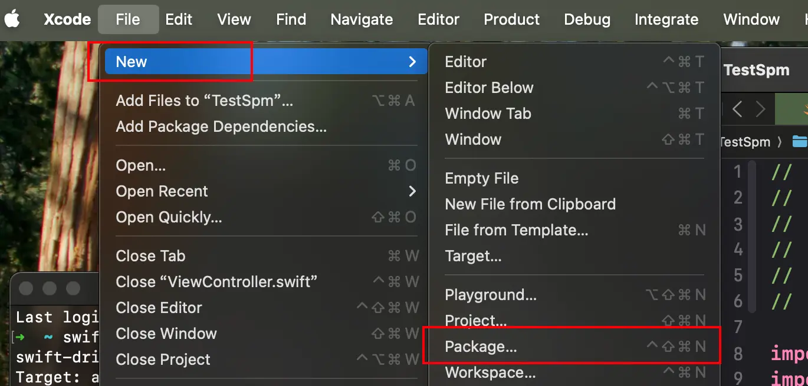

## 研究Swift Package Manager

## 1.创建本地SPM包

### 1.1 方案一：Xcode工具（推荐）

如下图



### 1.2 方案二：命令行工具

```sh
# 1. 创建 package 的目录，并 cd 进去
mkdir HWComponent && cd HWComponent

# 2. 初始化项目
swift package init --type framework
```

## 2.本地SPM包依赖

加入目前有2个本地SPM包：`A`和`B`，其中`B`依赖`A`，结构如下：

```
libs/
├── A/
│   ├── Package.swift  // A库的包定义
│   └── Sources/...
└── B/
    ├── Package.swift  // B库的包定义
    └── Sources/...
```

那么在B的`Package.swift`中，`dependencies`设置如下：
```swift
import PackageDescription

let package = Package(
    name: "B",
    platforms: [.iOS(.v13)],
    products: [
        .library(name: "B", targets: ["B"]),
    ],
    dependencies: [
        // 依赖本地 SPM 库
        .package(name: "A", path: "../A"),
    ],
    targets: [
        .target(name: "B",
                dependencies: [
                    // 声明对 别的库的依赖
                    .product(name: "A", package: "A")
                ],
                path: "Sources",
                resources: [.process("PrivacyInfo.xcprivacy")]),
    ],
    swiftLanguageVersions: [.v5]
)

```

> 在需要SPM包内容，特别是`dependencies`时，最好清除缓存: 在`Xcode`中：`File` > `Packages` > `Reset Package Caches`；防止出现因为缓存一直报错。


## 3.远端SPM包依赖

一个本地包`HWNetworking`，依赖远端SPM包，如`Alamofire`的示例：

```swift
import PackageDescription

let package = Package(
    name: "HWNetworking",
    platforms: [.iOS(.v14)],
    products: [
        .library(name: "HWNetworking", targets: ["HWNetworking"]),
    ],
    dependencies: [
        // 依赖 Alamofire 库
        .package(url: "https://github.com/Alamofire/Alamofire.git", from: .init(5, 10, 0)),
        // 依赖 SwiftyJSON 库
        .package(url: "https://github.com/SwiftyJSON/SwiftyJSON.git", from: "5.0.2"),
    ],
    targets: [
        .target(
            name: "HWNetworking",
            dependencies: [
                .product(name: "Alamofire", package: "Alamofire"),
                .product(name: "SwiftyJSON", package: "SwiftyJSON")
            ],
            path: "Sources",
            resources: [.process("PrivacyInfo.xcprivacy")]
        ),
    ],
    swiftLanguageVersions: [.v5]
)

```

